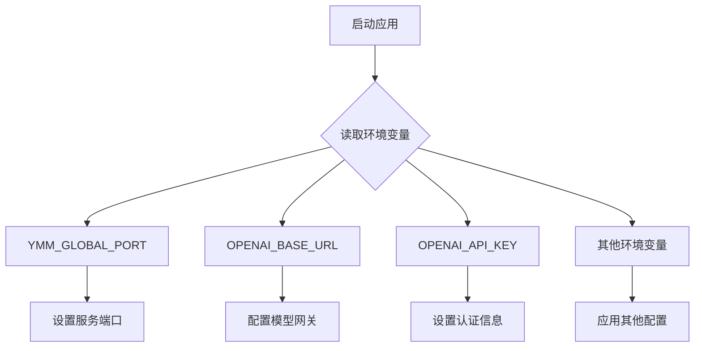
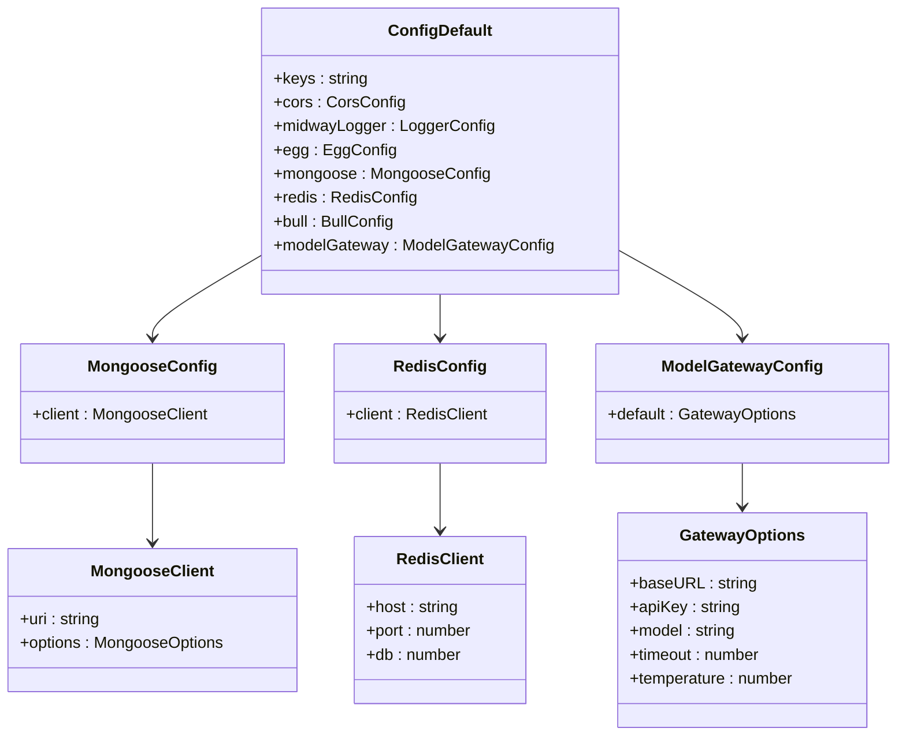
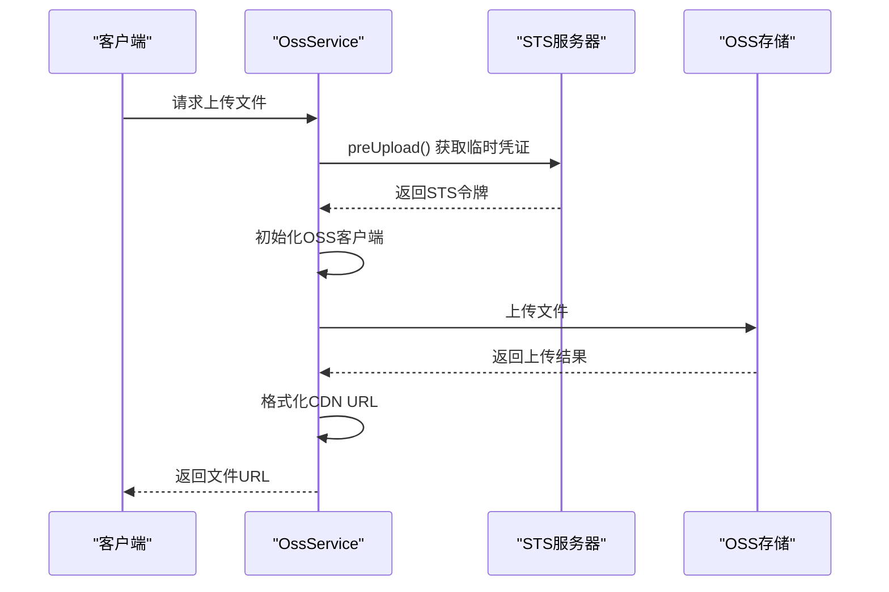
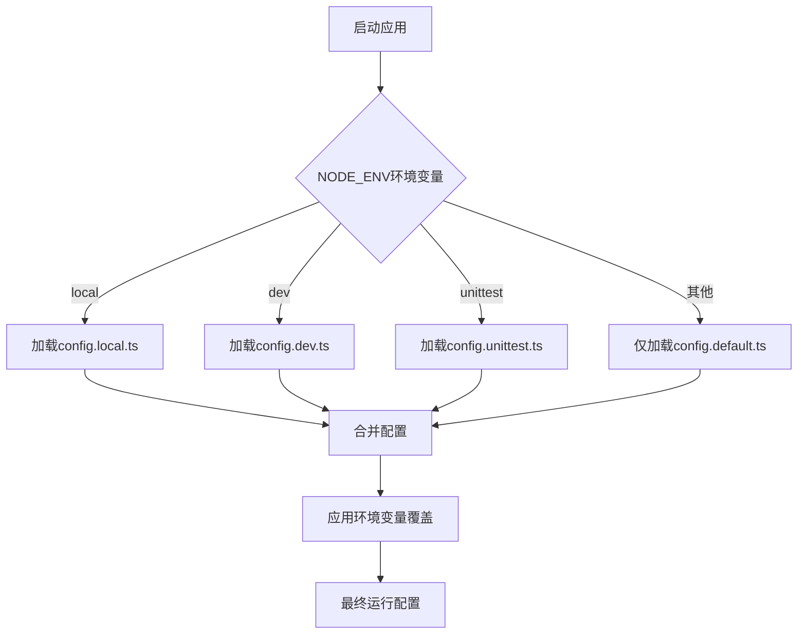

# 配置指南

<cite>
**本文档中引用的文件**  
- [config.default.ts](file://code-agent-backend/src/config/config.default.ts)
- [config.dev.ts](file://code-agent-backend/src/config/config.dev.ts)
- [config.local.ts](file://code-agent-backend/src/config/config.local.ts)
- [config.unittest.ts](file://code-agent-backend/src/config/config.unittest.ts)
- [plugin.ts](file://code-agent-backend/src/config/plugin.ts)
- [ossService.ts](file://code-agent-backend/src/service/oss/ossService.ts)
- [config.ts](file://code-agent-backend/src/service/oss/config.ts)
- [index.ts](file://code-agent-backend/src/service/oss/index.ts)
- [package.json](file://code-agent-backend/package.json)
- [start.sh](file://code-agent-backend/start.sh)
- [bootstrap.js](file://code-agent-backend/bootstrap.js)
- [AGENTS.md](file://fta-layout-design/AGENTS.md)
- [config.ts](file://fta-agent-core/src/config.ts)
</cite>

## 目录
1. [简介](#简介)
2. [环境变量配置](#环境变量配置)
3. [后端服务配置](#后端服务配置)
4. [OSS服务配置](#oss服务配置)
5. [配置文件层级与加载机制](#配置文件层级与加载机制)
6. [初学者配置步骤清单](#初学者配置步骤清单)
7. [生产环境最佳实践](#生产环境最佳实践)
8. [配置变更与服务重启](#配置变更与服务重启)
9. [故障排查](#故障排查)

## 简介
本配置指南系统性地介绍了项目的所有配置选项，涵盖环境变量、后端服务参数和特定服务（如OSS）的配置。文档旨在为开发者提供清晰的配置说明，包括每个配置项的作用、默认值和修改方法。同时为运维人员提供生产环境配置的最佳实践建议，特别是敏感信息的管理策略。

**Section sources**
- [config.default.ts](file://code-agent-backend/src/config/config.default.ts#L1-L241)

## 环境变量配置
项目通过环境变量实现灵活的运行时配置，主要环境变量包括：

- **YMM_GLOBAL_PORT**：服务监听端口，默认为7001。可通过`start.sh`脚本或直接设置环境变量修改。
- **OPENAI_BASE_URL**：模型网关的基础URL，用于指定AI服务提供商。
- **OPENAI_API_KEY**：AI服务的API密钥，用于身份验证。
- **OPENAI_MODEL**：指定使用的AI模型名称。
- **MODEL_TIMEOUT**：模型请求超时时间（毫秒）。
- **MODEL_TEMPERATURE**：模型生成的随机性参数。

这些环境变量在`config.default.ts`中通过`process.env`访问，并作为配置的动态输入。前端项目还使用`VITE_API_BASE_URL`、`VITE_REQUEST_TIMEOUT`等环境变量进行配置。



**Diagram sources**
- [config.default.ts](file://code-agent-backend/src/config/config.default.ts#L98)
- [config.default.ts](file://code-agent-backend/src/config/config.default.ts#L219-L225)
- [AGENTS.md](file://fta-layout-design/AGENTS.md#L25-L27)

**Section sources**
- [config.default.ts](file://code-agent-backend/src/config/config.default.ts#L98)
- [config.default.ts](file://code-agent-backend/src/config/config.default.ts#L219-L225)
- [AGENTS.md](file://fta-layout-design/AGENTS.md#L25-L27)

## 后端服务配置
后端服务的核心配置位于`src/config/`目录下的多个配置文件中，采用分环境配置策略。

### 数据库连接配置
MongoDB数据库连接配置在`config.default.ts`中定义，包含主从地址、数据库名称、认证信息和连接选项。开发环境通过`config.dev.ts`和`config.local.ts`覆盖默认配置，使用本地数据库地址和测试凭据。

### Redis设置
Redis配置包括主机地址、端口和数据库编号。默认配置指向预设的Redis实例，Bull队列系统也使用相同的Redis连接，但可配置独立的数据库和前缀。

### 模型网关配置
模型网关（modelGateway）配置了AI服务的连接参数，包括基础URL、API密钥、模型名称、超时和温度参数。这些配置支持通过环境变量动态覆盖，便于在不同环境间切换AI服务提供商。

### 其他服务配置
- **CORS**：配置跨域资源共享策略，允许特定的请求方法和头部。
- **安全配置**：在非生产环境禁用CSRF保护，便于开发调试。
- **日志配置**：定义日志格式、级别和输出路径，支持统一的日志格式化函数。
- **上传配置**：设置文件上传模式为流式上传，最大文件大小为10MB。



**Diagram sources**
- [config.default.ts](file://code-agent-backend/src/config/config.default.ts#L102-L117)
- [config.default.ts](file://code-agent-backend/src/config/config.default.ts#L153-L159)
- [config.default.ts](file://code-agent-backend/src/config/config.default.ts#L217-L228)

**Section sources**
- [config.default.ts](file://code-agent-backend/src/config/config.default.ts#L102-L239)
- [config.dev.ts](file://code-agent-backend/src/config/config.dev.ts#L1-L14)
- [config.local.ts](file://code-agent-backend/src/config/config.local.ts#L1-L20)

## OSS服务配置
OSS（对象存储服务）配置主要涉及文件上传和CDN加速。

### OSS凭证与端点
OSS服务通过调用外部接口获取临时安全令牌（STS），包括访问密钥ID、密钥、令牌、端点和存储桶名称。这些信息在运行时动态获取，避免在代码中硬编码敏感信息。

### 存储桶配置
系统支持多个业务类型的存储桶：
- **explore-biz**：用于探索业务的文件存储
- **fta-snapshot**：用于快照功能的文件存储

每个存储桶通过`OssService`类进行管理，支持文件上传和URL生成。

### CDN配置
配置了两个CDN地址：
- **HOST**：主服务地址 `https://www.ymm56.com`
- **FILE_CDN**：文件CDN地址 `https://imagecdn.ymm56.com`

上传后的文件URL会自动使用CDN地址进行加速。



**Diagram sources**
- [ossService.ts](file://code-agent-backend/src/service/oss/ossService.ts#L26-L139)
- [config.ts](file://code-agent-backend/src/service/oss/config.ts#L1-L3)
- [index.ts](file://code-agent-backend/src/service/oss/index.ts#L8-L22)

**Section sources**
- [ossService.ts](file://code-agent-backend/src/service/oss/ossService.ts#L1-L139)
- [config.ts](file://code-agent-backend/src/service/oss/config.ts#L1-L3)
- [index.ts](file://code-agent-backend/src/service/oss/index.ts#L1-L22)

## 配置文件层级与加载机制
项目采用多层级配置文件机制，通过环境变量`NODE_ENV`决定加载哪个配置文件。

### 配置文件优先级
配置文件按以下优先级加载，后加载的配置会覆盖先前的配置：
1. `config.default.ts`：默认配置，包含所有环境的通用设置
2. `config.{env}.ts`：环境特定配置，根据`NODE_ENV`加载（如`dev`、`local`、`unittest`）
3. 环境变量：最高优先级，可动态覆盖任何配置项

### 环境模式
- **local**：本地开发环境，使用本地数据库和端口7001
- **dev**：开发环境，使用开发数据库
- **unittest**：单元测试环境，禁用CSRF保护
- **默认**：生产环境配置

这种分层机制确保了配置的灵活性和安全性，允许在不同环境中使用不同的设置，同时保持核心配置的一致性。



**Diagram sources**
- [config.default.ts](file://code-agent-backend/src/config/config.default.ts#L14)
- [config.dev.ts](file://code-agent-backend/src/config/config.dev.ts#L1)
- [config.local.ts](file://code-agent-backend/src/config/config.local.ts#L1)
- [config.unittest.ts](file://code-agent-backend/src/config/config.unittest.ts#L1)

**Section sources**
- [config.default.ts](file://code-agent-backend/src/config/config.default.ts#L14-L240)
- [config.dev.ts](file://code-agent-backend/src/config/config.dev.ts#L1-L14)
- [config.local.ts](file://code-agent-backend/src/config/config.local.ts#L1-L20)
- [config.unittest.ts](file://code-agent-backend/src/config/config.unittest.ts#L1-L4)

## 初学者配置步骤清单
为帮助初学者快速上手，以下是配置项目的步骤清单：

1. **克隆项目仓库**
   ```bash
   git clone <repository-url>
   cd amh_code_agent
   ```

2. **安装依赖**
   ```bash
   cd code-agent-backend
   npm install
   ```

3. **配置环境变量**
   创建`.env`文件或直接设置环境变量：
   ```
   YMM_GLOBAL_PORT=7001
   OPENAI_BASE_URL=https://api.openai.com
   OPENAI_API_KEY=your-api-key
   OPENAI_MODEL=gpt-4
   ```

4. **启动开发服务器**
   ```bash
   npm run dev
   ```

5. **验证服务状态**
   访问 `http://localhost:7001` 确认服务正常运行。

6. **配置前端环境（如适用）**
   在`fta-layout-design`目录下配置VITE环境变量：
   ```
   VITE_API_BASE_URL=http://localhost:7001
   VITE_REQUEST_TIMEOUT=30000
   ```

此清单提供了从零开始配置项目的完整流程，确保初学者能够顺利搭建开发环境。

**Section sources**
- [package.json](file://code-agent-backend/package.json#L6-L17)
- [start.sh](file://code-agent-backend/start.sh#L1-L3)
- [bootstrap.js](file://code-agent-backend/bootstrap.js#L1-L6)
- [config.default.ts](file://code-agent-backend/src/config/config.default.ts#L98)
- [AGENTS.md](file://fta-layout-design/AGENTS.md#L25-L27)

## 生产环境最佳实践
为确保生产环境的稳定性和安全性，建议遵循以下最佳实践：

### 敏感信息管理
- **使用环境变量**：所有敏感信息（API密钥、数据库密码等）必须通过环境变量注入，禁止在代码中硬编码。
- **配置管理工具**：考虑使用专业的配置管理工具（如Vault、Consul）或云平台的密钥管理服务。
- **最小权限原则**：为数据库和OSS账户配置最小必要权限，避免使用管理员账户。

### 安全配置
- **启用CSRF保护**：在生产环境中必须启用CSRF保护，防止跨站请求伪造攻击。
- **HTTPS强制**：配置反向代理强制HTTPS，确保数据传输安全。
- **CORS策略**：严格限制CORS的`origin`，避免使用通配符。

### 性能优化
- **Redis连接池**：确保Redis连接配置合理，避免连接泄漏。
- **日志级别**：生产环境使用`warn`或`error`级别，减少日志输出对性能的影响。
- **文件上传限制**：根据业务需求调整文件大小限制，防止资源耗尽攻击。

### 高可用性
- **数据库主从**：使用MongoDB主从架构，确保数据高可用。
- **Redis哨兵**：配置Redis哨兵模式，实现自动故障转移。
- **负载均衡**：部署多个应用实例，通过负载均衡分发请求。

这些实践有助于构建一个安全、稳定、可扩展的生产环境。

**Section sources**
- [config.default.ts](file://code-agent-backend/src/config/config.default.ts#L146-L148)
- [config.default.ts](file://code-agent-backend/src/config/config.default.ts#L20-L39)
- [config.default.ts](file://code-agent-backend/src/config/config.default.ts#L106-L113)
- [config.default.ts](file://code-agent-backend/src/config/config.default.ts#L154-L158)

## 配置变更与服务重启
配置变更后，需要重启服务才能生效。以下是不同环境下的重启方法：

### 开发环境
在开发模式下，使用`npm run dev`命令启动应用，它会自动监听文件变化并重启服务。

### 生产环境
1. **直接重启**
   ```bash
   # 停止当前进程
   pkill -f bootstrap.js
   # 启动新实例
   npm start
   ```

2. **使用启动脚本**
   ```bash
   ./start.sh 7001
   ```

3. **通过PM2管理（推荐）**
   ```bash
   # 安装PM2
   npm install -g pm2
   # 启动应用
   pm2 start bootstrap.js --name "code-agent"
   # 重启应用
   pm2 restart code-agent
   # 查看状态
   pm2 status
   ```

### 配置热更新
部分配置（如环境变量）在应用运行时无法动态更新，必须重启服务。但对于某些配置，可以实现热更新机制：
- 使用配置中心服务，应用定期拉取最新配置
- 通过API接口触发配置重载
- 监听文件系统变化自动重载

对于本项目，建议采用重启方式确保配置完全生效。

**Section sources**
- [package.json](file://code-agent-backend/package.json#L6-L17)
- [start.sh](file://code-agent-backend/start.sh#L1-L3)
- [bootstrap.js](file://code-agent-backend/bootstrap.js#L1-L6)

## 故障排查
当配置出现问题时，可按以下步骤进行排查：

### 检查日志
查看应用日志文件，通常位于：
- Linux: `/data/ymmapplogs/fta-server/logs/`
- 其他: 项目根目录下的`logs/`文件夹

重点关注`error.log`和`app.log`文件。

### 验证环境变量
确认所有必需的环境变量已正确设置：
```bash
echo $YMM_GLOBAL_PORT
echo $OPENAI_BASE_URL
echo $OPENAI_API_KEY
```

### 测试数据库连接
手动测试MongoDB连接是否正常：
```bash
mongo "mongodb://dds-bp1ffb1e95127c741.mongodb.rds.aliyuncs.com:3717/fta" -u ftauser -p BOd8dsox@l0
```

### 检查OSS服务
验证OSS预上传接口是否可访问：
```bash
curl -X POST https://boss.amh-group.com/ps-admin-app/file/preUpload
```

### 端口冲突
检查端口是否被占用：
```bash
netstat -an | grep 7001
lsof -i :7001
```

### 依赖完整性
确保所有依赖已正确安装：
```bash
npm install
npm ls
```

通过系统性的排查，可以快速定位和解决配置相关的问题。

**Section sources**
- [config.default.ts](file://code-agent-backend/src/config/config.default.ts#L41-L43)
- [config.default.ts](file://code-agent-backend/src/config/config.default.ts#L106)
- [ossService.ts](file://code-agent-backend/src/service/oss/ossService.ts#L67-L73)
- [bootstrap.js](file://code-agent-backend/bootstrap.js#L1)