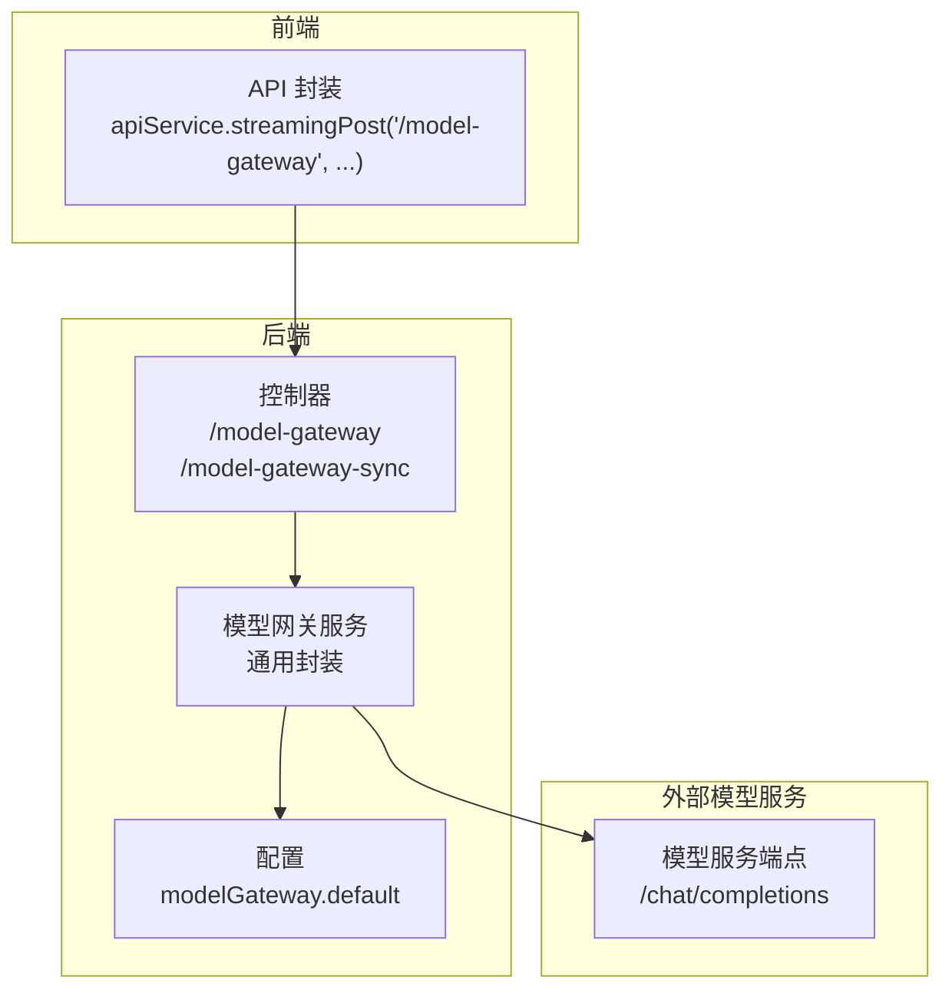
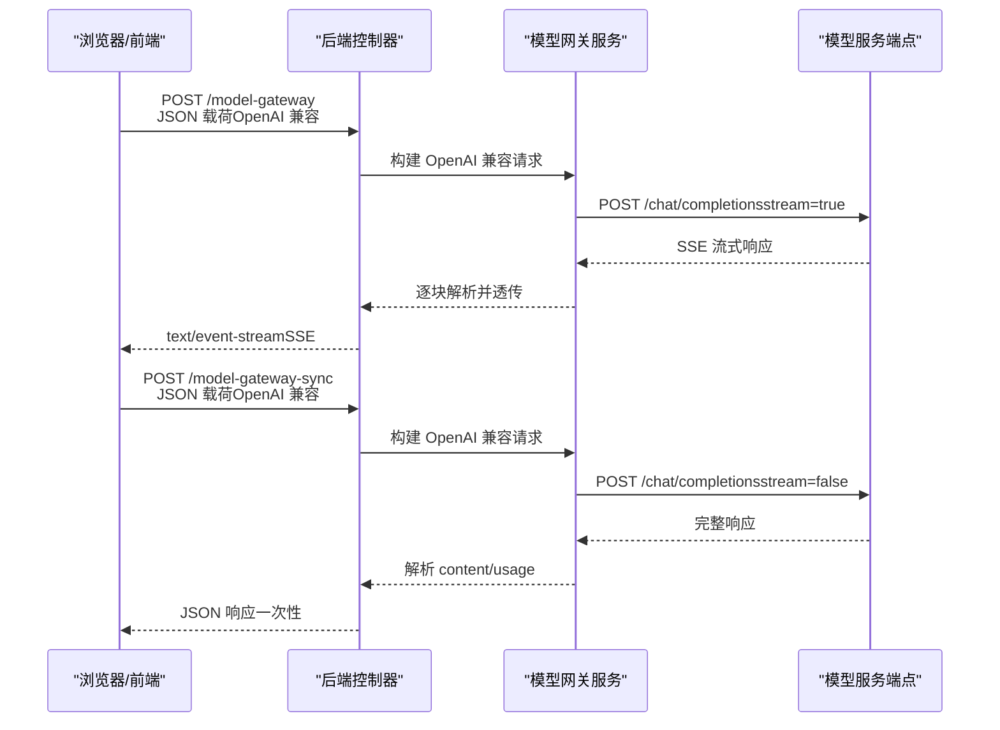
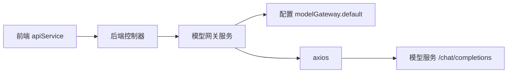

# API 使用方式

<cite>
**本文引用的文件**
- [home.ts](file://code-agent-backend/src/controller/home.ts)
- [model-gateway.ts](file://code-agent-backend/src/service/common/model-gateway.ts)
- [config.default.ts](file://code-agent-backend/src/config/config.default.ts)
- [apiService.ts](file://fta-layout-design/src/utils/apiService.ts)
- [frontend-workflow.ts](file://code-agent-backend/src/controller/code-agent/frontend-workflow.ts)
- [frontend-workflow.dto.ts](file://code-agent-backend/src/dto/code-agent/frontend-workflow.dto.ts)
- [frontend-workflow-api.md](file://code-agent-backend/docs/frontend-workflow-api.md)
- [frontend-workflow-service-usage.md](file://code-agent-backend/docs/frontend-workflow-service-usage.md)
</cite>

## 目录
1. [简介](#简介)
2. [项目结构](#项目结构)
3. [核心组件](#核心组件)
4. [架构总览](#架构总览)
5. [详细组件分析](#详细组件分析)
6. [依赖关系分析](#依赖关系分析)
7. [性能与稳定性建议](#性能与稳定性建议)
8. [故障排查指南](#故障排查指南)
9. [结论](#结论)
10. [附录](#附录)

## 简介
本文件面向前端与后端开发者，提供 LLM 模型网关的两类调用方式说明：
- 同步接口：/model-gateway-sync，一次性返回完整响应。
- 流式接口：/model-gateway，基于 SSE（Server-Sent Events）逐步推送增量内容。

同时覆盖以下关键点：
- POST 请求的 JSON 载荷结构，明确 OpenAI 兼容格式要求（messages 数组与 system prompt 必需性）。
- stream 参数的作用与 SSE 响应格式解析方法。
- 前端调用示例（含流式数据块解析与完整响应拼装）。
- 错误处理策略（网络中断重试、超时处理、后端错误透传）。
- usage 统计信息的获取方式与成本监控应用。

## 项目结构
围绕 LLM API 的调用，涉及后端控制器、通用模型网关服务、前端封装与配置文件。下图概览了关键文件与交互关系。

图表来源
- [home.ts](file://code-agent-backend/src/controller/home.ts#L148-L242)
- [model-gateway.ts](file://code-agent-backend/src/service/common/model-gateway.ts#L1-L436)
- [config.default.ts](file://code-agent-backend/src/config/config.default.ts#L214-L229)
- [apiService.ts](file://fta-layout-design/src/utils/apiService.ts#L850-L909)

章节来源
- [home.ts](file://code-agent-backend/src/controller/home.ts#L148-L242)
- [model-gateway.ts](file://code-agent-backend/src/service/common/model-gateway.ts#L1-L436)
- [config.default.ts](file://code-agent-backend/src/config/config.default.ts#L214-L229)
- [apiService.ts](file://fta-layout-design/src/utils/apiService.ts#L850-L909)

## 核心组件
- 后端控制器
  - /model-gateway：SSE 流式转发，将模型服务的流式响应原样透传给客户端。
  - /model-gateway-sync：同步请求，等待完整响应后一次性返回。
- 通用模型网关服务
  - 构建 OpenAI 兼容载荷（messages 数组），校验 system prompt 存在性。
  - 解析响应中的 content 与 usage，支持多种响应格式。
  - 支持同步与流式两种调用模式。
- 前端 API 封装
  - 提供 /model-gateway 的流式封装，便于前端统一处理 SSE。
- 配置
  - modelGateway.default：baseURL、apiKey、model、timeout、temperature 等默认参数。

章节来源
- [home.ts](file://code-agent-backend/src/controller/home.ts#L148-L242)
- [model-gateway.ts](file://code-agent-backend/src/service/common/model-gateway.ts#L1-L436)
- [config.default.ts](file://code-agent-backend/src/config/config.default.ts#L214-L229)
- [apiService.ts](file://fta-layout-design/src/utils/apiService.ts#L850-L909)

## 架构总览
下图展示了从浏览器到后端控制器再到模型服务的整体链路，以及两种调用模式的差异。

图表来源
- [home.ts](file://code-agent-backend/src/controller/home.ts#L148-L242)
- [model-gateway.ts](file://code-agent-backend/src/service/common/model-gateway.ts#L142-L259)

## 详细组件分析

### 同步接口：/model-gateway-sync
- 请求方式：POST
- 路径：/model-gateway-sync
- 功能：接收 OpenAI 兼容的 JSON 载荷，校验 messages 数组与 system prompt，调用模型服务，一次性返回完整响应。
- 关键行为
  - 规范化请求体（支持字符串或对象）。
  - 校验并提取 apiKey/baseURL/model，若缺失则抛错。
  - 构建 OpenAI 兼容载荷（stream=false），确保包含 system prompt。
  - 发送请求并返回 { success, data }。
- 错误处理
  - 捕获异常并返回 { success: false, error }，状态码透传后端响应状态。

章节来源
- [home.ts](file://code-agent-backend/src/controller/home.ts#L197-L242)

### 流式接口：/model-gateway
- 请求方式：POST
- 路径：/model-gateway
- 功能：接收 OpenAI 兼容的 JSON 载荷，设置 SSE 响应头，将模型服务的流式响应原样透传给客户端。
- 关键行为
  - 规范化请求体，提取 apiKey/baseURL/model。
  - 构建 OpenAI 兼容载荷（stream=true），确保包含 system prompt。
  - 以 text/event-stream 响应，将模型服务返回的每个数据块写入响应。
  - 捕获异常并通过 SSE 发送错误并结束连接。
- 错误处理
  - 通过 sendSSEError 发送 data: { error }，随后发送 data: [DONE] 结束流。

章节来源
- [home.ts](file://code-agent-backend/src/controller/home.ts#L148-L196)

### 通用模型网关服务（ModelGatewayService）
- 载荷构建
  - 默认使用 OpenAI 兼容格式，messages 数组包含 user 内容。
  - 支持自定义字段（如 max_tokens、top_p、temperature），并可传入自定义 payload。
- 响应解析
  - 提取 content：支持 choices.0.message.content、choices.0.text、messages 最后一条等常见格式。
  - 提取 usage：支持 usage、tokenUsage、meta.usage、data.0.usage 等路径。
- 流式解析
  - 从 SSE 数据块中解析 data: 行，支持 JSON 与纯文本混合。
  - 提取 delta/message/text 等字段，按增量文本输出。
- 错误处理
  - 统一捕获异常，返回 { success: false, error }，便于上层透传。

章节来源
- [model-gateway.ts](file://code-agent-backend/src/service/common/model-gateway.ts#L142-L259)
- [model-gateway.ts](file://code-agent-backend/src/service/common/model-gateway.ts#L261-L412)

### 前端调用封装（apiService）
- 提供 /model-gateway 的流式封装，便于前端统一处理 SSE。
- 前端可使用 fetch + ReadableStream 或 EventSource（需额外库支持）解析事件与数据。

章节来源
- [apiService.ts](file://fta-layout-design/src/utils/apiService.ts#L850-L909)

### 前端工作流接口（对比参考）
- 虽非模型网关，但展示了 SSE 事件类型与前端处理方式，有助于理解流式响应的消费模式。
- 事件类型包括：message、text、text_delta、stream_result、turn、complete、error 等。

章节来源
- [frontend-workflow.ts](file://code-agent-backend/src/controller/code-agent/frontend-workflow.ts#L83-L367)
- [frontend-workflow-api.md](file://code-agent-backend/docs/frontend-workflow-api.md#L1-L280)

## 依赖关系分析
- 控制器依赖
  - /model-gateway 与 /model-gateway-sync 依赖通用模型网关服务进行载荷构建与响应解析。
- 通用模型网关服务依赖
  - axios 发起 HTTP 请求，遵循 OpenAI /chat/completions 端点。
  - 配置中心提供 baseURL、apiKey、model、timeout 等默认值。
- 前端依赖
  - apiService.streamingPost 封装 /model-gateway 的流式调用。

图表来源
- [home.ts](file://code-agent-backend/src/controller/home.ts#L148-L242)
- [model-gateway.ts](file://code-agent-backend/src/service/common/model-gateway.ts#L1-L436)
- [config.default.ts](file://code-agent-backend/src/config/config.default.ts#L214-L229)
- [apiService.ts](file://fta-layout-design/src/utils/apiService.ts#L850-L909)

## 性能与稳定性建议
- 超时设置
  - 后端默认超时来自配置项 modelGateway.default.timeout；同步与流式分别使用不同默认上限，建议结合业务场景合理设置。
- 流式消费
  - 前端应按行解析 SSE，遇到 data: [DONE] 结束消费；对异常及时中断并释放资源。
- usage 统计
  - 若后端返回 usage 字段，可用于成本监控与配额统计；建议在前端或网关层缓存并汇总。
- 重试策略
  - 建议在前端实现指数退避重试，避免频繁抖动；对网络中断与超时进行区分处理。

[本节为通用建议，不直接分析具体文件]

## 故障排查指南
- 常见错误与定位
  - 缺少必要参数：当 apiKey 或 baseURL 未配置时，控制器会抛出错误提示。
  - messages 缺失或无 system prompt：控制器会校验并抛错，需确保 messages 非空且包含 system 角色的消息。
  - 流式连接异常：检查网络与代理设置，确认 SSE 响应头正确设置。
- 前端处理要点
  - 使用 fetch + ReadableStream 或 EventSource（需额外库）解析事件与数据。
  - 对 data: [DONE] 进行特殊处理，确保连接正常关闭。
- 后端错误透传
  - /model-gateway 在异常时通过 sendSSEError 发送 data: { error }，前端可据此展示错误信息。

章节来源
- [home.ts](file://code-agent-backend/src/controller/home.ts#L38-L114)
- [home.ts](file://code-agent-backend/src/controller/home.ts#L116-L196)

## 结论
- /model-gateway-sync 适合一次性获取完整响应的场景，简单稳定。
- /model-gateway 适合需要实时反馈的场景，前端需正确解析 SSE。
- OpenAI 兼容格式要求 messages 数组与 system prompt，后端会严格校验。
- usage 可用于成本监控，建议在前端或网关层进行采集与上报。
- 建议结合超时、重试与资源释放策略，提升整体稳定性与用户体验。

[本节为总结，不直接分析具体文件]

## 附录

### POST 请求 JSON 载荷结构（OpenAI 兼容）
- 必填字段
  - messages：数组，至少包含一条 system 角色消息（用于明确系统指令与上下文）。
- 常用可选字段
  - model：模型标识。
  - temperature、max_tokens、top_p：推理参数。
  - stream：true/false，决定是否流式。
- 示例结构（仅示意，不包含具体值）
  - {
      "model": "gpt-4",
      "messages": [
        { "role": "system", "content": "..." },
        { "role": "user", "content": "..." }
      ],
      "temperature": 0.2,
      "max_tokens": 1024,
      "top_p": 1,
      "stream": false
    }

章节来源
- [home.ts](file://code-agent-backend/src/controller/home.ts#L54-L84)
- [model-gateway.ts](file://code-agent-backend/src/service/common/model-gateway.ts#L142-L190)

### stream 参数与 SSE 响应格式
- stream=true
  - 后端设置 Content-Type: text/event-stream，并将模型服务的流式响应原样透传。
  - 前端按行解析，识别 event 与 data 行，遇到 data: [DONE] 结束。
- stream=false
  - 后端一次性返回 JSON 响应，包含完整 content 与可能的 usage。

章节来源
- [home.ts](file://code-agent-backend/src/controller/home.ts#L148-L196)
- [model-gateway.ts](file://code-agent-backend/src/service/common/model-gateway.ts#L301-L412)

### 前端调用示例（思路与步骤）
- 流式调用（SSE）
  - 使用 apiService.streamingPost('/model-gateway', data, config)。
  - 前端解析事件：遍历 data 行，提取 JSON 或纯文本，拼装完整响应。
  - 遇到 data: [DONE] 结束。
- 同步调用
  - 使用 apiService.post('/model-gateway-sync', data)。
  - 解析返回的 data 字段，读取 content 与 usage。

章节来源
- [apiService.ts](file://fta-layout-design/src/utils/apiService.ts#L850-L909)
- [frontend-workflow-api.md](file://code-agent-backend/docs/frontend-workflow-api.md#L139-L201)

### 错误处理策略
- 网络中断重试
  - 前端在连接断开或超时时进行指数退避重试，避免频繁抖动。
- 超时处理
  - 后端默认超时来自配置；前端可设置 fetch 超时并与后端超时策略协同。
- 后端错误透传
  - /model-gateway 在异常时通过 sendSSEError 发送 data: { error }，前端据此展示错误。

章节来源
- [home.ts](file://code-agent-backend/src/controller/home.ts#L116-L196)

### usage 统计信息与成本监控
- usage 提取
  - 通用模型网关服务支持从多种路径提取 usage，前端可直接使用返回的 usage 字段。
- 成本监控
  - 建议在前端或网关层记录每次请求的 usage，并按模型与时间维度进行聚合统计，用于成本核算与预算控制。

章节来源
- [model-gateway.ts](file://code-agent-backend/src/service/common/model-gateway.ts#L122-L136)