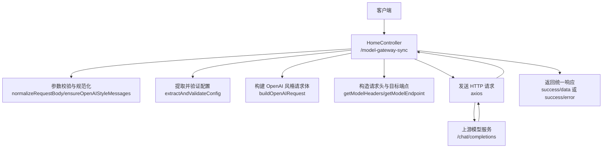
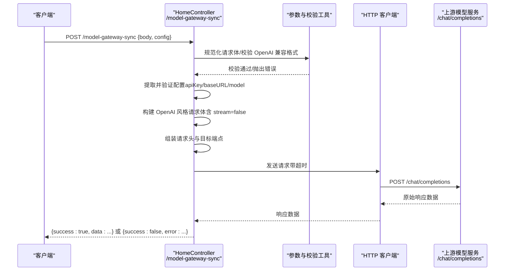
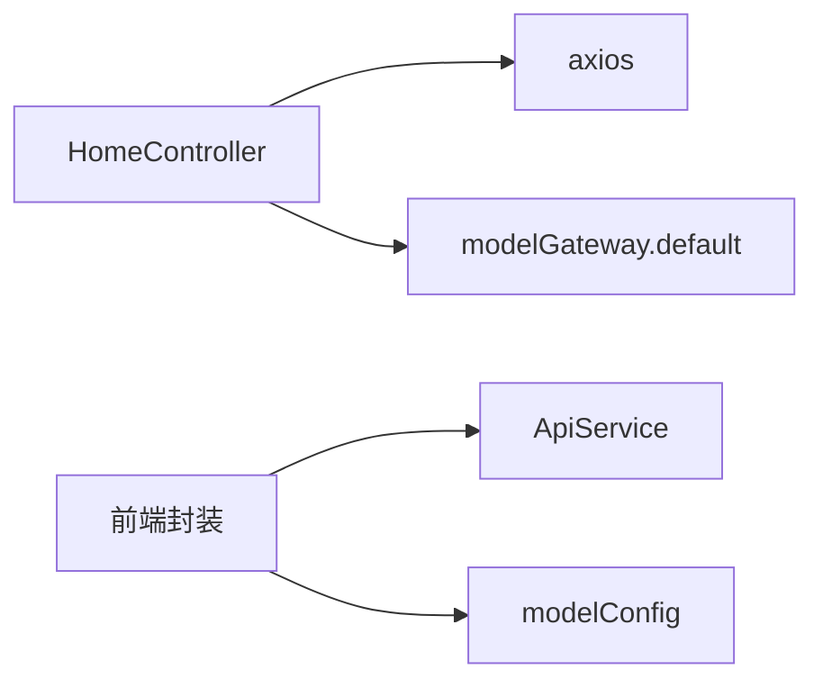

# 同步调用

<cite>
**本文档引用的文件**
- [home.ts](file://code-agent-backend/src/controller/home.ts)
- [model-gateway.ts](file://code-agent-backend/src/service/common/model-gateway.ts)
- [config.default.ts](file://code-agent-backend/src/config/config.default.ts)
- [modelGateway.ts](file://fta-layout-design/src/pages/EditorPage/utils/modelGateway.ts)
- [modelConfig.ts](file://fta-layout-design/src/utils/modelConfig.ts)
- [apiService.ts](file://fta-layout-design/src/utils/apiService.ts)
- [README.md](file://README.md)
</cite>

## 目录
1. [简介](#简介)
2. [项目结构](#项目结构)
3. [核心组件](#核心组件)
4. [架构总览](#架构总览)
5. [详细组件分析](#详细组件分析)
6. [依赖分析](#依赖分析)
7. [性能考虑](#性能考虑)
8. [故障排查指南](#故障排查指南)
9. [结论](#结论)
10. [附录](#附录)

## 简介
本文件面向使用方，系统化说明后端提供的 /model-gateway-sync 同步调用端点的使用方法。内容涵盖：
- POST 请求的 JSON 载荷结构与 OpenAI 兼容格式要求（特别是 system prompt 的必需性）
- requestBody 中 config 字段（apiKey/baseURL/model）对默认配置的覆盖规则
- 完整的 curl 示例与响应格式说明（success/data/error 字段）
- 同步调用的超时机制（默认 600 秒）与错误处理策略（网络错误、认证失败、模型服务不可用等）

## 项目结构
后端控制器负责接收 /model-gateway-sync 请求，进行参数规范化、OpenAI 兼容校验、请求头与目标端点组装，并将请求转发给上游模型服务，最终以统一的 JSON 响应返回。

图表来源
- [home.ts](file://code-agent-backend/src/controller/home.ts#L38-L114)
- [home.ts](file://code-agent-backend/src/controller/home.ts#L197-L243)

章节来源
- [home.ts](file://code-agent-backend/src/controller/home.ts#L1-L243)
- [README.md](file://README.md#L154-L160)

## 核心组件
- 同步端点控制器：负责接收请求、参数校验、OpenAI 兼容检查、请求头与目标端点组装、超时控制与统一响应封装。
- 模型网关配置：默认配置来源于后端配置文件，支持通过请求体覆盖。
- 前端调用封装：前端侧提供同步调用封装，便于集成与事件抽取。

章节来源
- [home.ts](file://code-agent-backend/src/controller/home.ts#L197-L243)
- [config.default.ts](file://code-agent-backend/src/config/config.default.ts#L214-L228)
- [modelGateway.ts](file://fta-layout-design/src/pages/EditorPage/utils/modelGateway.ts#L254-L294)

## 架构总览
下图展示 /model-gateway-sync 的端到端调用链路与关键处理步骤。

图表来源
- [home.ts](file://code-agent-backend/src/controller/home.ts#L197-L243)
- [home.ts](file://code-agent-backend/src/controller/home.ts#L38-L114)

## 详细组件分析

### 1) 请求与载荷规范
- 端点：POST /model-gateway-sync
- 请求体（JSON）：
  - body：原始请求体，将作为 OpenAI 风格载荷的一部分
  - config 字段（可选）：
    - apiKey：覆盖默认 apiKey
    - baseURL：覆盖默认 baseURL
    - model：覆盖默认 model
- OpenAI 兼容格式要求：
  - messages 数组必须存在且非空
  - 至少包含一个 role 为 system 的消息条目（system prompt 必须）
- stream 字段：
  - 同步调用强制设置 stream=false

章节来源
- [home.ts](file://code-agent-backend/src/controller/home.ts#L38-L114)
- [home.ts](file://code-agent-backend/src/controller/home.ts#L197-L243)

### 2) 配置覆盖规则
- 默认配置来源：后端配置文件中的 modelGateway.default
- 覆盖优先级：
  - requestBody.config.apiKey > 配置文件 apiKey
  - requestBody.config.baseURL > 配置文件 baseURL
  - requestBody.config.model > 配置文件 model
- 若未提供 apiKey 或 baseURL，将直接报错

章节来源
- [config.default.ts](file://code-agent-backend/src/config/config.default.ts#L214-L228)
- [home.ts](file://code-agent-backend/src/controller/home.ts#L84-L114)

### 3) 目标端点与请求头
- 目标端点：baseURL/chat/completions
- 请求头：
  - Content-Type: application/json
  - Authorization: Bearer <apiKey>
  - Accept: application/json
- 超时：默认 600 秒（可通过配置覆盖）

章节来源
- [home.ts](file://code-agent-backend/src/controller/home.ts#L17-L36)
- [home.ts](file://code-agent-backend/src/controller/home.ts#L197-L243)

### 4) 响应格式
- 成功响应：
  - success: true
  - data: 上游模型服务返回的原始 JSON
- 失败响应：
  - success: false
  - error: 上游返回的错误体或错误消息

章节来源
- [home.ts](file://code-agent-backend/src/controller/home.ts#L226-L241)

### 5) curl 示例
以下示例展示如何使用 curl 调用 /model-gateway-sync。请根据实际环境替换 baseURL、apiKey、model 与 messages 内容。

- 基本示例（使用默认配置）
  - curl -X POST http://localhost:7001/model-gateway-sync \
    -H "Content-Type: application/json" \
    -d '{
      "messages": [
        {"role": "system", "content": "你是一个有用的助手。"},
        {"role": "user", "content": "你好"}
      ],
      "temperature": 0.7,
      "max_tokens": 200
    }'

- 覆盖配置示例（通过 config 字段）
  - curl -X POST http://localhost:7001/model-gateway-sync \
    -H "Content-Type: application/json" \
    -d '{
      "config": {
        "apiKey": "YOUR_API_KEY",
        "baseURL": "https://api.openai.com/v1",
        "model": "gpt-4o"
      },
      "messages": [
        {"role": "system", "content": "你是一个有用的助手。"},
        {"role": "user", "content": "你好"}
      ],
      "temperature": 0.7,
      "max_tokens": 200
    }'

- 使用自定义字段（如 top_p）
  - curl -X POST http://localhost:7001/model-gateway-sync \
    -H "Content-Type: application/json" \
    -d '{
      "config": {
        "apiKey": "YOUR_API_KEY",
        "baseURL": "https://api.openai.com/v1",
        "model": "gpt-4o"
      },
      "messages": [
        {"role": "system", "content": "你是一个有用的助手。"},
        {"role": "user", "content": "你好"}
      ],
      "top_p": 0.9,
      "temperature": 0.7,
      "max_tokens": 200
    }'

章节来源
- [home.ts](file://code-agent-backend/src/controller/home.ts#L197-L243)
- [config.default.ts](file://code-agent-backend/src/config/config.default.ts#L214-L228)

### 6) 前端调用封装（参考）
前端提供了同步调用封装，便于在工作台中直接使用。其行为要点：
- 优先使用请求参数中的 apiKey/baseURL/model，若未提供则从本地存储读取
- 将请求体与覆盖参数合并后，调用 /model-gateway-sync
- 从返回的 data 字段中抽取事件（文本/待办等）

章节来源
- [modelGateway.ts](file://fta-layout-design/src/pages/EditorPage/utils/modelGateway.ts#L254-L294)
- [modelConfig.ts](file://fta-layout-design/src/utils/modelConfig.ts#L1-L57)
- [apiService.ts](file://fta-layout-design/src/utils/apiService.ts#L299-L305)

## 依赖分析
- 控制器依赖：
  - axios：发起 HTTP 请求
  - 配置：modelGateway.default（baseURL/apiKey/model/timeout 等）
- 前端依赖：
  - ApiService：封装 HTTP 请求（含超时与错误处理）
  - modelConfig：读取/保存本地模型配置

图表来源
- [home.ts](file://code-agent-backend/src/controller/home.ts#L1-L243)
- [config.default.ts](file://code-agent-backend/src/config/config.default.ts#L214-L228)
- [modelGateway.ts](file://fta-layout-design/src/pages/EditorPage/utils/modelGateway.ts#L254-L294)
- [apiService.ts](file://fta-layout-design/src/utils/apiService.ts#L299-L305)
- [modelConfig.ts](file://fta-layout-design/src/utils/modelConfig.ts#L1-L57)

## 性能考虑
- 超时：默认 600 秒，可在配置中调整。若上游模型服务响应较慢，建议适当提高超时时间。
- 响应体大小：尽量控制 messages 与 max_tokens，避免过长响应导致内存压力。
- 并发与重试：建议在客户端侧进行必要的重试与指数退避，避免瞬时抖动影响用户体验。

## 故障排查指南
- 常见错误与响应
  - 缺少必要配置（apiKey/baseURL）：返回 {success:false, error:"缺少必需的模型配置参数..."}
  - JSON 载荷无效：返回 {success:false, error:"Invalid JSON payload"}
  - messages 缺失或为空：返回 {success:false, error:"Model gateway expects an OpenAI-style payload with a non-empty messages array"}
  - 缺少 system prompt：返回 {success:false, error:"Model gateway requires the system prompt to be included as a system role message"}
  - 网络错误/超时：返回 {success:false, error:"..."}（具体取决于上游响应或客户端超时）
  - 认证失败：上游返回 401/403，控制器将返回 {success:false, error:...}
  - 模型服务不可用：上游返回非 200 或异常，控制器将返回 {success:false, error:...}

- 定位步骤
  - 确认 baseURL/apiKey/model 是否正确提供或已配置
  - 确认 messages 数组非空且包含 role 为 system 的条目
  - 检查网络连通性与上游服务状态
  - 查看后端日志（控制器会打印耗时与错误）

章节来源
- [home.ts](file://code-agent-backend/src/controller/home.ts#L38-L114)
- [home.ts](file://code-agent-backend/src/controller/home.ts#L197-L243)

## 结论
/model-gateway-sync 提供了与上游 OpenAI 兼容的同步调用能力，具备严格的 OpenAI 兼容格式校验与统一的响应封装。通过 requestBody.config 可灵活覆盖默认配置，满足多厂商、多模型的统一接入需求。建议在生产环境中合理设置超时与重试策略，并严格遵循 messages 的 OpenAI 兼容格式要求。

## 附录

### A. OpenAI 兼容 messages 格式要点
- messages 必须为数组且非空
- 至少包含一条 role 为 system 的消息
- 常见角色：system、user、assistant

章节来源
- [home.ts](file://code-agent-backend/src/controller/home.ts#L54-L64)

### B. 配置项说明
- modelGateway.default 字段
  - baseURL：上游模型服务基础 URL
  - apiKey：认证密钥
  - model：默认模型名称
  - timeout：请求超时（毫秒）
  - temperature/top_p/max_tokens：推理参数（可选）

章节来源
- [config.default.ts](file://code-agent-backend/src/config/config.default.ts#L214-L228)

### C. 前端调用封装要点
- 优先使用请求参数覆盖本地存储配置
- 调用 /model-gateway-sync 后，从 data 字段抽取事件（文本/待办等）

章节来源
- [modelGateway.ts](file://fta-layout-design/src/pages/EditorPage/utils/modelGateway.ts#L254-L294)
- [modelConfig.ts](file://fta-layout-design/src/utils/modelConfig.ts#L1-L57)