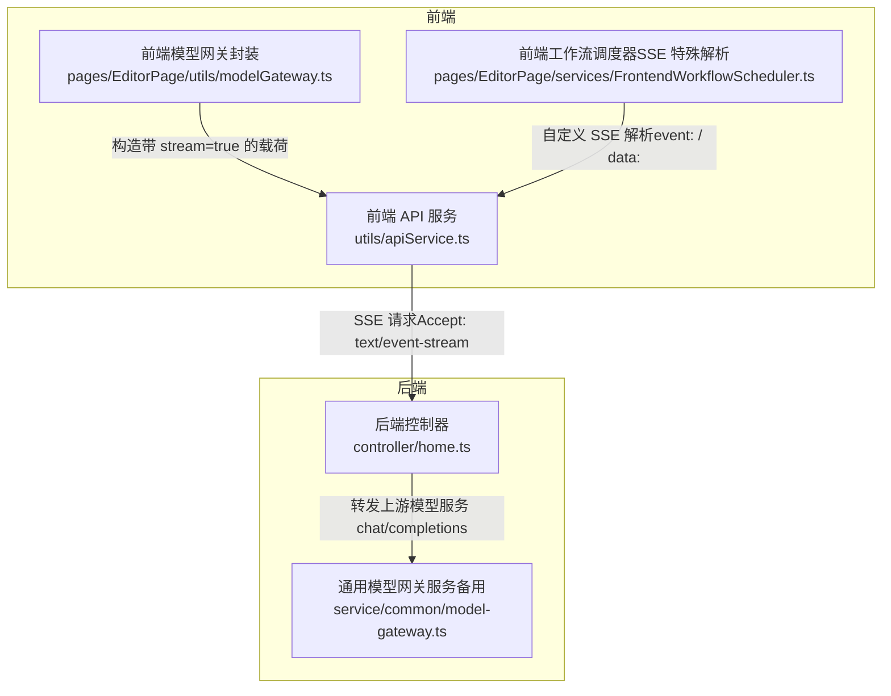
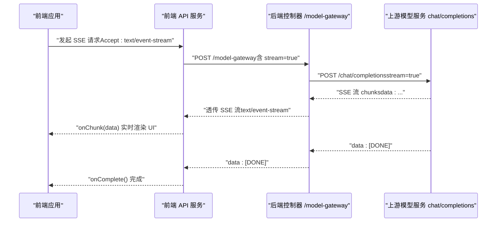
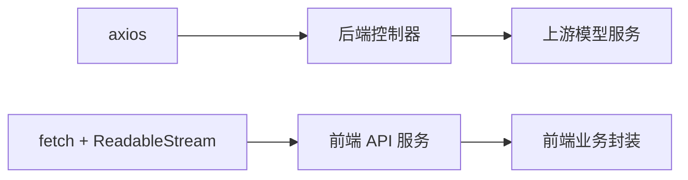
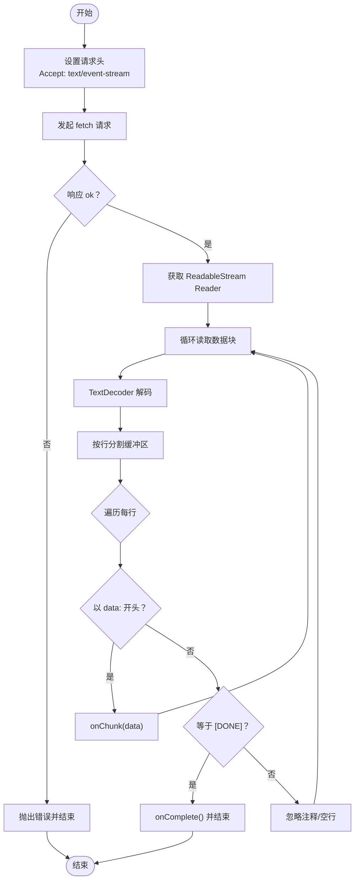

# 流式通信

<cite>
**本文引用的文件**
- [controller/home.ts](file://code-agent-backend/src/controller/home.ts)
- [service/common/model-gateway.ts](file://code-agent-backend/src/service/common/model-gateway.ts)
- [utils/apiService.ts](file://fta-layout-design/src/utils/apiService.ts)
- [pages/EditorPage/utils/modelGateway.ts](file://fta-layout-design/src/pages/EditorPage/utils/modelGateway.ts)
- [pages/EditorPage/services/FrontendWorkflowScheduler.ts](file://fta-layout-design/src/pages/EditorPage/services/FrontendWorkflowScheduler.ts)
- [pages/EditorPage/utils/requirementDoc.ts](file://fta-layout-design/src/pages/EditorPage/utils/requirementDoc.ts)
</cite>

## 目录
1. [简介](#简介)
2. [项目结构](#项目结构)
3. [核心组件](#核心组件)
4. [架构总览](#架构总览)
5. [详细组件分析](#详细组件分析)
6. [依赖关系分析](#依赖关系分析)
7. [性能考量](#性能考量)
8. [故障排查指南](#故障排查指南)
9. [结论](#结论)
10. [附录](#附录)

## 简介
本文件面向前端与后端开发者，系统性阐述 /model-gateway 端点的 Server-Sent Events（SSE）流式通信机制，覆盖以下关键主题：
- 如何通过请求头 Accept: text/event-stream 启用 SSE 流式响应
- 请求载荷中 stream 参数的作用与传递路径
- SSE 响应格式解析：data: [chunk] 与 data: [DONE] 的语义
- 前端 JavaScript 示例：使用 fetch API 或 EventSource 处理流式数据块并实时更新 UI
- 超时设置（600 秒）与连接保持机制
- 传输中断时的错误处理与重试策略建议

## 项目结构
该能力横跨后端控制器与前端 API 服务层，形成“后端代理 -> 前端流式读取”的完整链路。核心文件如下：
- 后端控制器负责规范化请求、转发到上游模型服务，并以 text/event-stream 输出
- 前端 API 服务封装 fetch + ReadableStream 的 SSE 读取逻辑
- 前端业务工具将 SSE 数据块解析为业务事件（如文本、待办）

图表来源
- [controller/home.ts](file://code-agent-backend/src/controller/home.ts#L148-L195)
- [utils/apiService.ts](file://fta-layout-design/src/utils/apiService.ts#L152-L305)
- [pages/EditorPage/utils/modelGateway.ts](file://fta-layout-design/src/pages/EditorPage/utils/modelGateway.ts#L204-L252)
- [pages/EditorPage/services/FrontendWorkflowScheduler.ts](file://fta-layout-design/src/pages/EditorPage/services/FrontendWorkflowScheduler.ts#L130-L215)
- [service/common/model-gateway.ts](file://code-agent-backend/src/service/common/model-gateway.ts#L304-L412)

章节来源
- [controller/home.ts](file://code-agent-backend/src/controller/home.ts#L148-L195)
- [utils/apiService.ts](file://fta-layout-design/src/utils/apiService.ts#L152-L305)
- [pages/EditorPage/utils/modelGateway.ts](file://fta-layout-design/src/pages/EditorPage/utils/modelGateway.ts#L204-L252)
- [pages/EditorPage/services/FrontendWorkflowScheduler.ts](file://fta-layout-design/src/pages/EditorPage/services/FrontendWorkflowScheduler.ts#L130-L215)
- [service/common/model-gateway.ts](file://code-agent-backend/src/service/common/model-gateway.ts#L304-L412)

## 核心组件
- 后端控制器 /model-gateway
  - 设置响应头 Content-Type: text/event-stream、Cache-Control: no-cache、Connection: keep-alive
  - 将请求体规范化为 OpenAI 风格载荷，注入 stream: true
  - 以 responseType: 'stream' 调用上游模型服务 chat/completions，边读边写回客户端
  - 超时默认 600 秒（600_000 ms），避免长尾请求被中间件过早断开
- 前端 API 服务
  - 通过 fetch 发送 Accept: text/event-stream，使用 ReadableStream 逐块解码
  - 按 SSE 行协议解析 data: 行，忽略注释行与空行，遇到 [DONE] 结束
  - 超时控制：AbortController + timeout，统一抛出 ApiError
- 前端业务封装
  - 将 SSE 数据块解析为业务事件（文本、待办等），并提供 onChunk/onComplete 回调
  - 对于特殊事件格式（event: / data:），提供自定义解析流程

章节来源
- [controller/home.ts](file://code-agent-backend/src/controller/home.ts#L148-L195)
- [utils/apiService.ts](file://fta-layout-design/src/utils/apiService.ts#L152-L305)
- [pages/EditorPage/utils/modelGateway.ts](file://fta-layout-design/src/pages/EditorPage/utils/modelGateway.ts#L204-L252)
- [pages/EditorPage/services/FrontendWorkflowScheduler.ts](file://fta-layout-design/src/pages/EditorPage/services/FrontendWorkflowScheduler.ts#L130-L215)

## 架构总览
/model-gateway 的端到端流式通信序列如下：

图表来源
- [controller/home.ts](file://code-agent-backend/src/controller/home.ts#L148-L195)
- [utils/apiService.ts](file://fta-layout-design/src/utils/apiService.ts#L152-L305)

## 详细组件分析

### 后端控制器：/model-gateway 的 SSE 实现
- 请求头与连接保持
  - 响应头设置 Content-Type: text/event-stream、Cache-Control: no-cache、Connection: keep-alive
  - 通过 keep-alive 保持连接，避免浏览器自动关闭
- 请求体规范化与 stream 注入
  - 规范化字符串或对象请求体，确保包含 OpenAI 风格 messages 数组
  - 注入 stream: true，要求上游模型服务返回 SSE 流
- 上游转发与流式透传
  - 以 responseType: 'stream' 调用上游 chat/completions
  - 监听 data 事件，将原始字节块写回客户端；end 事件触发后结束响应
- 超时与错误处理
  - 超时默认 600 秒（600_000 ms），防止长时间无数据导致连接中断
  - 捕获异常并发送 SSE 错误事件（data: { error }），随后 data: [DONE] 结束

章节来源
- [controller/home.ts](file://code-agent-backend/src/controller/home.ts#L148-L195)

### 前端 API 服务：SSE 流式读取与解析
- 请求头与超时
  - 显式设置 Accept: text/event-stream、Cache-Control: no-cache
  - 使用 AbortController + timeout 控制请求生命周期，统一抛出 ApiError
- 流式读取与缓冲
  - 使用 response.body.getReader() 逐块读取，TextDecoder 解码为字符串
  - 采用行级缓冲（按 \n 分割），保留最后一行不完整的片段
- SSE 协议解析
  - 忽略以 : 开头的注释行与空行
  - 提取以 data: 开头的行作为数据块，回调 onChunk
  - 遇到 data: [DONE] 时触发 onComplete 并结束读取
- 错误处理
  - 对 AbortError 抛出 408 超时错误
  - 对其他错误抛出 500 错误，便于上层 UI 展示

章节来源
- [utils/apiService.ts](file://fta-layout-design/src/utils/apiService.ts#L152-L305)

### 前端业务封装：将 SSE 数据映射为业务事件
- 流式调用入口
  - 在请求载荷中显式设置 stream: true，确保后端开启 SSE
  - onChunk 回调中解析 JSON 数据块，提取文本与待办等事件类型
- 同步调用入口
  - 提供同步接口，适用于不需要流式体验的场景
- 特殊事件格式（event: / data:）
  - 对于需要 event: 与 data: 配对的场景，提供自定义解析流程（如工作流调度器）

章节来源
- [pages/EditorPage/utils/modelGateway.ts](file://fta-layout-design/src/pages/EditorPage/utils/modelGateway.ts#L204-L252)
- [pages/EditorPage/services/FrontendWorkflowScheduler.ts](file://fta-layout-design/src/pages/EditorPage/services/FrontendWorkflowScheduler.ts#L130-L215)

### SSE 响应格式与 [DONE] 语义
- data: [chunk]
  - 每个数据块对应一次增量输出，前端将其解析为业务事件（如文本、待办）
- data: [DONE]
  - 标识流结束，前端 onComplete 回调触发，UI 停止等待
- 注释行与空行
  - 以 : 开头的行视为注释，前端忽略
  - 空行与空白行同样忽略，保证健壮性

章节来源
- [utils/apiService.ts](file://fta-layout-design/src/utils/apiService.ts#L251-L305)
- [pages/EditorPage/utils/requirementDoc.ts](file://fta-layout-design/src/pages/EditorPage/utils/requirementDoc.ts#L43-L91)

### 超时与连接保持机制
- 后端超时
  - axios 调用设置 timeout: 600_000 ms（600 秒），避免长尾请求被中间件过早断开
- 前端超时
  - AbortController + setTimeout 控制请求生命周期，超时抛出 408
- 连接保持
  - 后端响应头 Connection: keep-alive，前端使用 ReadableStream 保持读取
  - SSE 协议天然支持长连接，data: [DONE] 作为结束信号

章节来源
- [controller/home.ts](file://code-agent-backend/src/controller/home.ts#L148-L195)
- [utils/apiService.ts](file://fta-layout-design/src/utils/apiService.ts#L152-L305)

### 传输中断与重试策略（建议）
- 前端侧
  - 使用 AbortController 管理请求生命周期，支持主动取消
  - 在 onError 回调中判断错误类型（如 AbortError），决定是否进行重试
  - 对于网络波动，可在 UI 层提示用户重试或自动退避重试
- 后端侧
  - 保持上游模型服务稳定，避免频繁断连
  - 对上游错误进行降级处理，必要时返回 SSE 错误事件（data: { error }），再发送 [DONE]

章节来源
- [utils/apiService.ts](file://fta-layout-design/src/utils/apiService.ts#L251-L305)
- [controller/home.ts](file://code-agent-backend/src/controller/home.ts#L116-L131)

## 依赖关系分析
- 后端
  - 控制器依赖 axios 进行上游转发，依赖内置上下文写入响应头与数据块
- 前端
  - API 服务依赖 fetch + ReadableStream，统一错误处理与超时控制
  - 业务封装依赖 API 服务提供的流式方法，将数据块映射为业务事件

图表来源
- [controller/home.ts](file://code-agent-backend/src/controller/home.ts#L148-L195)
- [utils/apiService.ts](file://fta-layout-design/src/utils/apiService.ts#L152-L305)

## 性能考量
- 流式传输
  - 采用 SSE 与 ReadableStream，降低首字节延迟，提升交互体验
- 缓冲与解析
  - 行级缓冲减少多次回调开销，避免过度拆分数据块
- 超时与连接
  - 600 秒超时适合长文本生成场景；前端 AbortController 保障可控取消
- 错误快速反馈
  - SSE 错误事件与 [DONE] 结束，便于前端及时停止等待并提示用户

## 故障排查指南
- 常见问题
  - 未设置 Accept: text/event-stream：前端无法获得流式响应
  - 请求体缺少 OpenAI 风格 messages：后端校验失败
  - 未注入 stream: true：后端未开启 SSE
  - 超时 408：网络不稳定或上游响应慢，建议重试或检查上游服务
  - 未收到 [DONE]：上游未正确结束流，前端 onComplete 不触发
- 排查步骤
  - 检查请求头 Accept 与请求体 stream 字段
  - 查看后端日志与上游模型服务返回状态
  - 在前端 onChunk 中打印数据块，确认 data: 行是否存在
  - 若出现错误，查看 data: { error } 与 [DONE] 是否出现

章节来源
- [controller/home.ts](file://code-agent-backend/src/controller/home.ts#L148-L195)
- [utils/apiService.ts](file://fta-layout-design/src/utils/apiService.ts#L251-L305)
- [pages/EditorPage/utils/requirementDoc.ts](file://fta-layout-design/src/pages/EditorPage/utils/requirementDoc.ts#L43-L91)

## 结论
本方案通过后端控制器与前端 API 服务的协同，实现了稳定可靠的 SSE 流式通信：
- 后端以 text/event-stream 透传上游模型服务的增量输出
- 前端以 ReadableStream 逐块解析 data: 行，实时更新 UI
- 超时与连接保持机制确保长文本生成的稳定性
- 对于特殊事件格式（event: / data:），前端提供自定义解析流程

## 附录

### 前端 JavaScript 示例（基于 fetch + ReadableStream）
- 目标：通过 fetch 接收 SSE，解析 data: 行，实时更新 UI
- 关键点
  - 设置 Accept: text/event-stream
  - 使用 response.body.getReader() 逐块读取
  - 按行解析 data: 与 [DONE]，分别触发 onChunk 与 onComplete
  - 超时使用 AbortController 控制

图表来源
- [utils/apiService.ts](file://fta-layout-design/src/utils/apiService.ts#L152-L305)

### 前端 JavaScript 示例（基于 EventSource）
- 适用场景：SSE 由浏览器原生支持，无需手动解析
- 注意事项
  - 仅适用于浏览器环境
  - 若后端返回自定义事件格式（event: / data:），EventSource 无法直接解析，需改用 fetch + ReadableStream

[本图为概念示意，不对应具体源码文件]