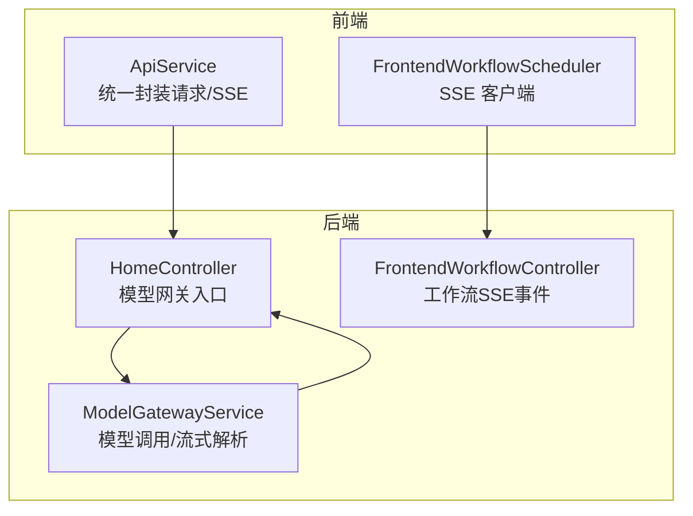
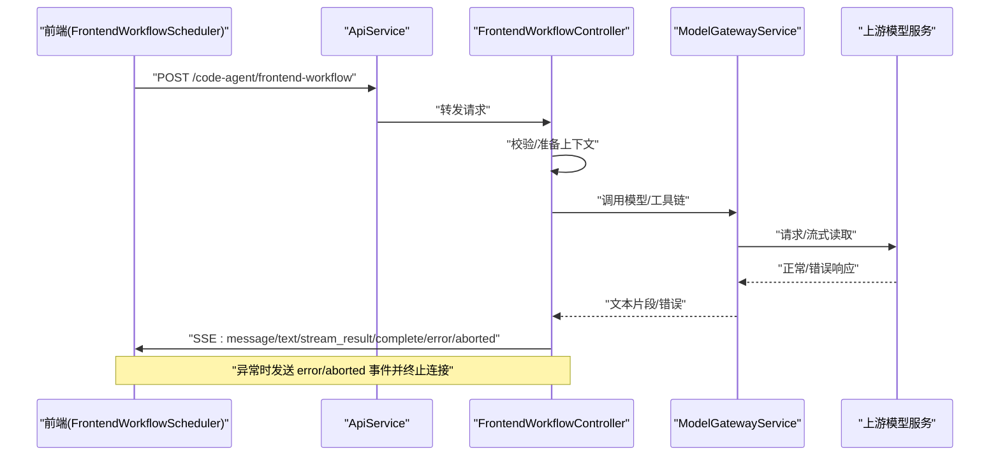
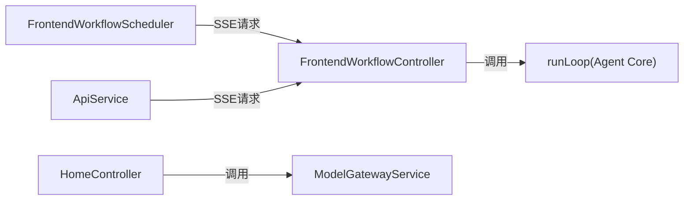

# 错误处理

<cite>
**本文引用的文件**
- [home.ts](file://code-agent-backend/src/controller/home.ts)
- [frontend-workflow.ts](file://code-agent-backend/src/controller/code-agent/frontend-workflow.ts)
- [apiService.ts](file://fta-layout-design/src/utils/apiService.ts)
- [FrontendWorkflowScheduler.ts](file://fta-layout-design/src/pages/EditorPage/services/FrontendWorkflowScheduler.ts)
- [model-gateway.ts](file://code-agent-backend/src/service/common/model-gateway.ts)
- [loop.ts](file://fta-agent-core/src/loop.ts)
- [error.ts](file://fta-agent-core/src/utils/error.ts)
- [api.md](file://fta-agent-core/mock-specs/api.md)
</cite>

## 目录
1. [简介](#简介)
2. [项目结构](#项目结构)
3. [核心组件](#核心组件)
4. [架构总览](#架构总览)
5. [详细组件分析](#详细组件分析)
6. [依赖关系分析](#依赖关系分析)
7. [性能考量](#性能考量)
8. [故障排查指南](#故障排查指南)
9. [结论](#结论)

## 简介
本文件系统性梳理本仓库中 LLM API 的错误处理机制，覆盖客户端错误（如缺少 system prompt、无效 JSON、缺失 apiKey）、服务端错误（如模型服务不可达、网络超时、认证失败）以及 SSE 流式响应的错误事件发送与终止流程。同时明确 HTTP 状态码使用规范与错误响应体结构，并给出前端错误处理最佳实践（错误分类、用户提示与日志上报）。

## 项目结构
围绕错误处理的关键模块分布如下：
- 后端控制器与服务
  - 模型网关控制器：负责校验请求、转发到上游模型服务并以 SSE 返回
  - 前端工作流控制器：负责前端工作流的 SSE 事件分发与错误事件发送
  - 模型网关服务：封装模型调用、流式解析与错误兜底
- 前端服务与调度器
  - ApiService：统一封装 fetch 请求、SSE 流式解析与错误分类
  - FrontendWorkflowScheduler：前端工作流的 SSE 客户端，负责事件解析与错误回调

图表来源
- [home.ts](file://code-agent-backend/src/controller/home.ts#L148-L195)
- [frontend-workflow.ts](file://code-agent-backend/src/controller/code-agent/frontend-workflow.ts#L192-L348)
- [apiService.ts](file://fta-layout-design/src/utils/apiService.ts#L152-L305)
- [FrontendWorkflowScheduler.ts](file://fta-layout-design/src/pages/EditorPage/services/FrontendWorkflowScheduler.ts#L130-L215)

章节来源
- [home.ts](file://code-agent-backend/src/controller/home.ts#L148-L195)
- [frontend-workflow.ts](file://code-agent-backend/src/controller/code-agent/frontend-workflow.ts#L192-L348)
- [apiService.ts](file://fta-layout-design/src/utils/apiService.ts#L152-L305)
- [FrontendWorkflowScheduler.ts](file://fta-layout-design/src/pages/EditorPage/services/FrontendWorkflowScheduler.ts#L130-L215)

## 核心组件
- HomeController（模型网关）
  - 校验请求体 JSON 与 OpenAI 风格 messages；提取并校验 apiKey/baseURL/model；转发到上游模型服务并以 SSE 输出；异常时通过 sendSSEError 发送错误事件并终止连接
- FrontendWorkflowController（前端工作流）
  - 在工作流执行过程中，按事件类型发送 message/text/stream_result/complete 等；异常时发送 error 或 aborted 事件并终止连接
- ModelGatewayService（模型网关服务）
  - 构造请求载荷、发起模型请求、解析响应文本、流式解析与错误兜底
- ApiService（前端）
  - 统一封装 fetch 请求、SSE 流式解析、错误分类（超时/网络/业务错误）并抛出自定义 ApiError
- FrontendWorkflowScheduler（前端）
  - 自定义 SSE 解析（event:/data:），将事件映射为前端回调；在 onError 回调中进行用户提示与日志上报

章节来源
- [home.ts](file://code-agent-backend/src/controller/home.ts#L38-L114)
- [frontend-workflow.ts](file://code-agent-backend/src/controller/code-agent/frontend-workflow.ts#L192-L348)
- [model-gateway.ts](file://code-agent-backend/src/service/common/model-gateway.ts#L192-L244)
- [apiService.ts](file://fta-layout-design/src/utils/apiService.ts#L251-L305)
- [FrontendWorkflowScheduler.ts](file://fta-layout-design/src/pages/EditorPage/services/FrontendWorkflowScheduler.ts#L130-L215)

## 架构总览
下面以序列图展示“前端发起工作流请求 -> 后端工作流控制器 -> 模型网关 -> 上游模型服务”的错误处理路径。

图表来源
- [frontend-workflow.ts](file://code-agent-backend/src/controller/code-agent/frontend-workflow.ts#L192-L348)
- [model-gateway.ts](file://code-agent-backend/src/service/common/model-gateway.ts#L301-L412)
- [apiService.ts](file://fta-layout-design/src/utils/apiService.ts#L338-L368)
- [FrontendWorkflowScheduler.ts](file://fta-layout-design/src/pages/EditorPage/services/FrontendWorkflowScheduler.ts#L130-L215)

## 详细组件分析

### 后端控制器：HomeController（模型网关）
- 请求体校验
  - JSON 解析失败时抛出错误
  - OpenAI 风格 messages 缺少 system 消息时抛出错误
  - 缺少 apiKey/baseURL 时抛出错误
- 转发与 SSE 输出
  - 正常时以 text/event-stream 写入上游流
  - 异常时通过 sendSSEError 发送 data: { error } 与 [DONE]，并结束连接
- 同步接口
  - model-gateway-sync 返回 success:false 与 error 字段，HTTP 状态由框架决定

章节来源
- [home.ts](file://code-agent-backend/src/controller/home.ts#L38-L114)
- [home.ts](file://code-agent-backend/src/controller/home.ts#L116-L131)
- [home.ts](file://code-agent-backend/src/controller/home.ts#L148-L195)
- [home.ts](file://code-agent-backend/src/controller/home.ts#L197-L242)

### 后端控制器：FrontendWorkflowController（前端工作流）
- 事件发送
  - message、text、stream_result、complete 等事件均通过 sendSSE 发送
  - 异常时发送 error 事件，包含 message/stack/sessionId/executionTime/timestamp
  - 用户主动中断时发送 aborted 事件
- 连接终止
  - 发送 error/aborted 后 res.end() 终止连接

章节来源
- [frontend-workflow.ts](file://code-agent-backend/src/controller/code-agent/frontend-workflow.ts#L192-L348)

### 模型网关服务：ModelGatewayService
- 请求构建与调用
  - 构造 OpenAI 风格 messages/prompt 等载荷
  - 发起 chat/completions 请求，支持同步与流式两种模式
- 文本提取
  - 支持多种常见响应格式（choices/message/content/text 等）
  - 流式解析时按 SSE data: 行切分并提取文本
- 错误兜底
  - 捕获异常并返回 success:false 的统一结构

章节来源
- [model-gateway.ts](file://code-agent-backend/src/service/common/model-gateway.ts#L142-L190)
- [model-gateway.ts](file://code-agent-backend/src/service/common/model-gateway.ts#L192-L244)
- [model-gateway.ts](file://code-agent-backend/src/service/common/model-gateway.ts#L261-L300)
- [model-gateway.ts](file://code-agent-backend/src/service/common/model-gateway.ts#L301-L412)

### 前端服务：ApiService（fetch 封装与 SSE）
- 统一请求
  - 构建 URL/Headers/Params/Data，支持 AbortController 超时
  - response.ok 检查失败时抛出 ApiError（包含 status）
  - 业务状态码兼容 code/success，不成功时抛出 ApiError
- 超时与未知错误
  - AbortError 映射为 408
  - 其他 Error 映射为 500
- SSE 流式解析
  - 标准 SSE data: 行解析
  - response.body 可用性检查
  - onError/onComplete 回调

章节来源
- [apiService.ts](file://fta-layout-design/src/utils/apiService.ts#L107-L150)
- [apiService.ts](file://fta-layout-design/src/utils/apiService.ts#L251-L305)

### 前端调度器：FrontendWorkflowScheduler（SSE 客户端）
- 自定义 SSE 解析
  - 解析 event:/data: 行，将事件映射为前端回调
- 错误处理
  - onError 回调中记录日志并上抛错误
  - 对 AbortError 做特殊处理（中断）
- 事件映射
  - error/aborted：调用 callbacks.onError
  - message：解析 assistant 文本并回调
  - complete：回调会话完成

章节来源
- [FrontendWorkflowScheduler.ts](file://fta-layout-design/src/pages/EditorPage/services/FrontendWorkflowScheduler.ts#L130-L215)
- [FrontendWorkflowScheduler.ts](file://fta-layout-design/src/pages/EditorPage/services/FrontendWorkflowScheduler.ts#L217-L299)

### Agent 核心循环：runLoop（流式错误与重试）
- 流式错误事件
  - 当收到 error 类型的 chunk 时，构造 Error 并设置 isRetryable=false
  - 从 chunk.error.value 中提取 statusCode
- 重试策略
  - 默认最多重试次数，指数退避等待，支持外部 AbortSignal
- 结果汇总
  - onStreamResult 回调中携带 statusCode/headers/body 与重试信息
  - 最终返回 error 类型（api_error）并附带 details

章节来源
- [loop.ts](file://fta-agent-core/src/loop.ts#L230-L360)
- [loop.ts](file://fta-agent-core/src/loop.ts#L283-L309)

### 错误工具：getErrorMessage
- 统一错误消息提取，避免无法序列化对象导致异常

章节来源
- [error.ts](file://fta-agent-core/src/utils/error.ts#L1-L10)

### API 设计规范（错误相关）
- 统一响应结构与拦截器约定（用于理解业务层错误处理）
- 该规范为概念性参考，实际错误处理以各模块实现为准

章节来源
- [api.md](file://fta-agent-core/mock-specs/api.md#L1-L66)

## 依赖关系分析
- 前端
  - FrontendWorkflowScheduler 依赖 ApiService 进行 SSE 请求与错误处理
  - FrontendWorkflowScheduler 自定义 SSE 解析，不依赖 ApiService 的流式解析
- 后端
  - HomeController 依赖 ModelGatewayService 进行模型调用
  - FrontendWorkflowController 依赖 Agent 核心循环 runLoop 与工具链
- Agent 核心
  - runLoop 通过 AI SDK 的 doStream 获取流式事件，遇到 error 类型时构造可重试/不可重试错误

图表来源
- [FrontendWorkflowScheduler.ts](file://fta-layout-design/src/pages/EditorPage/services/FrontendWorkflowScheduler.ts#L130-L215)
- [frontend-workflow.ts](file://code-agent-backend/src/controller/code-agent/frontend-workflow.ts#L192-L348)
- [home.ts](file://code-agent-backend/src/controller/home.ts#L148-L195)
- [model-gateway.ts](file://code-agent-backend/src/service/common/model-gateway.ts#L192-L244)
- [loop.ts](file://fta-agent-core/src/loop.ts#L230-L360)

## 性能考量
- 超时控制
  - 后端模型网关与前端 ApiService 均使用 AbortController 实现超时，避免长时间阻塞
- 流式解析
  - 前端自定义 SSE 解析减少中间层复杂度；后端 ModelGatewayService 对上游 SSE 进行逐事件提取
- 重试策略
  - runLoop 对可重试错误采用指数退避，降低瞬时错误对用户体验的影响

章节来源
- [home.ts](file://code-agent-backend/src/controller/home.ts#L148-L195)
- [apiService.ts](file://fta-layout-design/src/utils/apiService.ts#L198-L216)
- [model-gateway.ts](file://code-agent-backend/src/service/common/model-gateway.ts#L301-L412)
- [loop.ts](file://fta-agent-core/src/loop.ts#L24-L36)

## 故障排查指南

### 客户端错误（前端）
- 无效 JSON 载荷
  - 现象：后端 HomeController 抛出“无效 JSON”错误
  - 排查：确认请求体为合法 JSON；检查 Content-Type
- 缺少 system prompt
  - 现象：后端 HomeController 抛出“缺少 system 消息”错误
  - 排查：确保 messages 数组包含 role 为 system 的消息
- 缺失 apiKey/baseURL
  - 现象：后端 HomeController 抛出“缺少必需的模型配置参数”错误
  - 排查：确认请求参数或配置中提供 apiKey/baseURL
- SSE 连接失败
  - 现象：FrontendWorkflowScheduler 抛出“SSE 连接失败”并记录状态码
  - 排查：检查后端路由、CORS、Cookies、网络连通性

章节来源
- [home.ts](file://code-agent-backend/src/controller/home.ts#L38-L114)
- [FrontendWorkflowScheduler.ts](file://fta-layout-design/src/pages/EditorPage/services/FrontendWorkflowScheduler.ts#L153-L164)

### 服务端错误（后端）
- 模型服务不可达/超时
  - 现象：HomeController 在转发上游时捕获异常并通过 sendSSEError 发送错误事件
  - 排查：检查上游 baseURL、网络连通性、超时配置
- 认证失败
  - 现象：上游返回 401/403 等鉴权错误，后端根据异常抛出错误事件
  - 排查：核对 apiKey 是否正确、权限范围是否满足
- 网络超时
  - 现象：前端 ApiService 捕获 AbortError 并抛出 408
  - 排查：适当增大超时阈值或优化网络环境

章节来源
- [home.ts](file://code-agent-backend/src/controller/home.ts#L148-L195)
- [apiService.ts](file://fta-layout-design/src/utils/apiService.ts#L141-L149)

### SSE 流式错误处理
- sendSSEError（后端）
  - 设置状态码与 text/event-stream 头部，写入 data: { error }，再写入 data: [DONE] 并结束连接
- 前端自定义 SSE 解析
  - 解析 event:/data: 行，将 error/aborted 映射到 callbacks.onError
  - 对 AbortError 做特殊处理（中断）

章节来源
- [home.ts](file://code-agent-backend/src/controller/home.ts#L116-L131)
- [frontend-workflow.ts](file://code-agent-backend/src/controller/code-agent/frontend-workflow.ts#L314-L343)
- [FrontendWorkflowScheduler.ts](file://fta-layout-design/src/pages/EditorPage/services/FrontendWorkflowScheduler.ts#L181-L211)

### HTTP 状态码使用规范
- 400：请求参数错误（如无效 JSON、缺少必要字段）
- 401：未授权访问（认证失败）
- 403：权限不足
- 404：资源不存在
- 408：请求超时（前端 AbortError 映射）
- 500：服务器内部错误（未知错误、网络异常等）
- 502/503：上游网关/服务不可用（由上游返回）

章节来源
- [api.md](file://fta-agent-core/mock-specs/api.md#L67-L90)
- [apiService.ts](file://fta-layout-design/src/utils/apiService.ts#L141-L149)

### 错误响应体结构
- 后端 sendSSEError
  - data: { error }，随后 [DONE]，结束连接
- 前端 ApiService
  - 统一抛出 ApiError，包含 message/code/response
- Agent 核心 runLoop
  - onStreamResult 携带 statusCode/headers/body 与重试信息
  - 最终 error 结构包含 type/message/details

章节来源
- [home.ts](file://code-agent-backend/src/controller/home.ts#L116-L131)
- [apiService.ts](file://fta-layout-design/src/utils/apiService.ts#L107-L150)
- [loop.ts](file://fta-agent-core/src/loop.ts#L311-L359)

### 前端错误处理最佳实践
- 错误分类
  - 网络错误：超时/断网/跨域
  - 认证错误：401，引导重新登录
  - 权限错误：403，提示无权限
  - 参数错误：422，解析后端返回的字段级错误
  - 业务错误：4xx 业务错误码，显示友好提示
  - 未知错误：500，提示稍后再试
- 用户提示
  - 使用 Toast 或弹窗显示错误消息
  - 对字段级错误逐项提示
- 日志上报
  - 记录错误堆栈、请求 ID、时间戳、URL、状态码
  - 上报至监控平台以便追踪

章节来源
- [apiService.ts](file://fta-layout-design/src/utils/apiService.ts#L107-L150)
- [FrontendWorkflowScheduler.ts](file://fta-layout-design/src/pages/EditorPage/services/FrontendWorkflowScheduler.ts#L91-L125)

## 结论
本仓库在前后端分别实现了完善的错误处理机制：前端通过 ApiService 统一拦截与分类错误，后端通过 HomeController 与 FrontendWorkflowController 在关键节点发送 SSE 错误事件并终止连接。Agent 核心循环在流式阶段对错误进行细粒度处理与重试。建议在生产环境中：
- 明确 HTTP 状态码与错误体结构，保持前后端一致
- 前端对不同错误类型做差异化提示与引导
- 建立统一的日志与告警体系，提升问题定位效率
- 对上游模型服务的超时与重试策略进行容量评估与调优