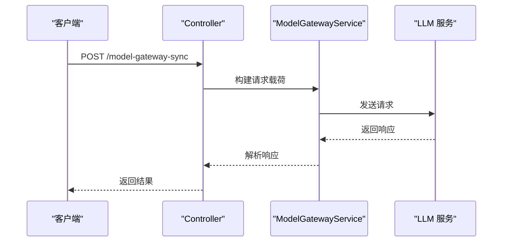
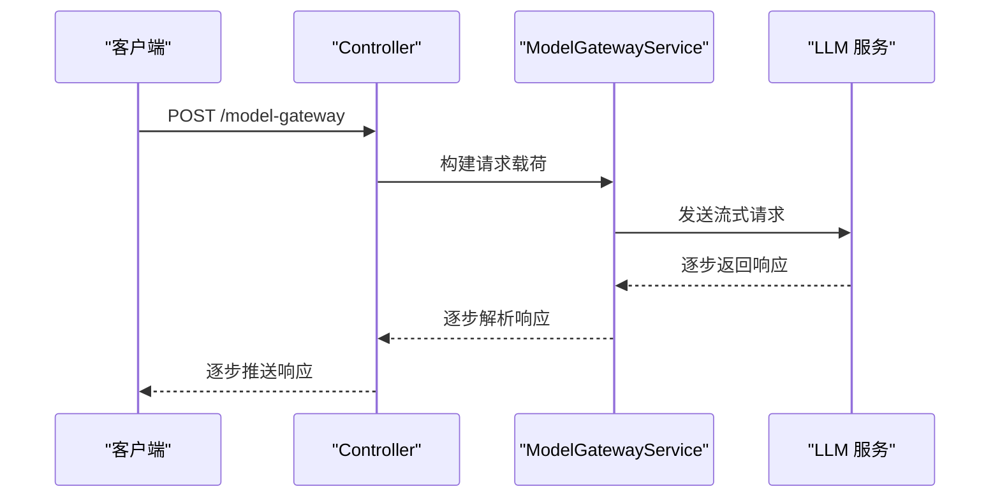

# LLM 服务集成

<cite>
**本文档引用文件**   
- [model-gateway.ts](file://code-agent-backend/src/service/common/model-gateway.ts)
- [home.ts](file://code-agent-backend/src/controller/home.ts)
- [config.default.ts](file://code-agent-backend/src/config/config.default.ts)
- [model-metrics.service.ts](file://code-agent-backend/src/service/common/model-metrics.service.ts)
- [frontend-workflow.ts](file://code-agent-backend/src/service/code-agent/frontend-workflow.ts)
- [frontend-workflow.controller.ts](file://code-agent-backend/src/controller/code-agent/frontend-workflow.ts)
</cite>

## 目录
1. [简介](#简介)
2. [架构概述](#架构概述)
3. [核心组件分析](#核心组件分析)
4. [接口实现机制](#接口实现机制)
5. [配置指南](#配置指南)
6. [健康检查与性能监控](#健康检查与性能监控)
7. [自定义适配器开发指南](#自定义适配器开发指南)
8. [常见错误与解决方案](#常见错误与解决方案)
9. [前端调用方式](#前端调用方式)
10. [总结](#总结)

## 简介
本文档详细介绍了 `model-gateway` 的架构与使用方式，旨在为开发者提供一个全面的 LLM 服务集成指南。`model-gateway` 是一个通用模型网关服务，它统一了对不同 AI 提供商（如 Anthropic、OpenAI）的调用逻辑，支持多种 API 格式和响应解析。通过 `ModelGatewayService`，开发者可以轻松地调用不同的 LLM 服务，而无需关心底层的具体实现细节。

**Section sources**
- [model-gateway.ts](file://code-agent-backend/src/service/common/model-gateway.ts)

## 架构概述
`model-gateway` 的架构设计旨在提供一个灵活且可扩展的解决方案，以支持多种 LLM 服务。其核心组件包括 `ModelGatewayService`、`ModelMetricsService` 和控制器层。`ModelGatewayService` 负责处理模型请求的构建、发送和响应解析，而 `ModelMetricsService` 则负责收集和缓存模型的性能指标。控制器层则暴露了两个主要接口：同步接口 `/model-gateway-sync` 和流式接口 `/model-gateway`，分别用于同步和流式调用 LLM 服务。

```mermaid
graph TD
A[客户端] --> B[/model-gateway]
A --> C[/model-gateway-sync]
B --> D[ModelGatewayService]
C --> D
D --> E[ModelMetricsService]
D --> F[LLM 服务]
E --> G[Redis]
```

**Diagram sources **
- [model-gateway.ts](file://code-agent-backend/src/service/common/model-gateway.ts)
- [home.ts](file://code-agent-backend/src/controller/home.ts)
- [model-metrics.service.ts](file://code-agent-backend/src/service/common/model-metrics.service.ts)

## 核心组件分析
### ModelGatewayService
`ModelGatewayService` 是 `model-gateway` 的核心服务，负责处理所有与 LLM 服务的交互。它提供了以下主要功能：

- **请求构建**：`buildRequestPayload` 方法根据传入的选项构建请求载荷，支持多种模型 API 格式，如 OpenAI 格式、通用格式和自定义格式。
- **响应解析**：`extractTextFromModelPayload` 方法从模型响应中提取文本内容，支持多种常见的 API 响应格式。
- **流式传输**：`streamModel` 方法支持流式调用模型，并通过回调函数将内容逐步输出。
- **健康检查**：`checkHealth` 方法用于检查模型服务是否可用。

**Section sources**
- [model-gateway.ts](file://code-agent-backend/src/service/common/model-gateway.ts)

### ModelMetricsService
`ModelMetricsService` 负责收集和缓存模型的性能指标，如请求成功率、响应时间、token 使用量等。这些指标通过 Prometheus 格式的 metrics 端点获取，并缓存在 Redis 中，以便快速访问。

**Section sources**
- [model-metrics.service.ts](file://code-agent-backend/src/service/common/model-metrics.service.ts)

## 接口实现机制
### 同步接口 `/model-gateway-sync`
同步接口 `/model-gateway-sync` 用于同步调用 LLM 服务。客户端发送一个 POST 请求，包含请求体中的模型配置和请求内容。服务端接收到请求后，构建请求载荷并发送到 LLM 服务，等待响应后返回结果。



**Diagram sources **
- [home.ts](file://code-agent-backend/src/controller/home.ts)
- [model-gateway.ts](file://code-agent-backend/src/service/common/model-gateway.ts)

### 流式接口 `/model-gateway`
流式接口 `/model-gateway` 用于流式调用 LLM 服务。客户端发送一个 POST 请求，服务端通过 Server-Sent Events (SSE) 将模型的响应逐步推送给客户端。这种方式适用于需要实时显示生成内容的场景。



**Diagram sources **
- [home.ts](file://code-agent-backend/src/controller/home.ts)
- [model-gateway.ts](file://code-agent-backend/src/service/common/model-gateway.ts)

## 配置指南
### 配置文件
`model-gateway` 的配置主要在 `config.default.ts` 文件中定义。以下是主要配置项：

- **baseURL**：LLM 服务的基地址。
- **apiKey**：LLM 服务的 API 密钥。
- **model**：默认使用的模型名称。
- **timeout**：请求超时时间。
- **temperature**：模型的温度参数，控制生成内容的随机性。

```typescript
config.modelGateway = {
  default: {
    baseURL: process.env.OPENAI_BASE_URL,
    apiKey: process.env.OPENAI_API_KEY,
    model: process.env.OPENAI_MODEL,
    timeout: process.env.MODEL_TIMEOUT ? Number(process.env.MODEL_TIMEOUT) : undefined,
    temperature: process.env.MODEL_TEMPERATURE ? Number(process.env.MODEL_TEMPERATURE) : undefined,
  },
};
```

**Section sources**
- [config.default.ts](file://code-agent-backend/src/config/config.default.ts)

### 环境变量
除了配置文件，还可以通过环境变量来配置 `model-gateway`。主要环境变量包括：

- `OPENAI_BASE_URL`：LLM 服务的基地址。
- `OPENAI_API_KEY`：LLM 服务的 API 密钥。
- `OPENAI_MODEL`：默认使用的模型名称。
- `MODEL_TIMEOUT`：请求超时时间。
- `MODEL_TEMPERATURE`：模型的温度参数。

## 健康检查与性能监控
### 健康检查
`ModelGatewayService` 提供了 `checkHealth` 方法，用于检查模型服务是否可用。该方法通过发送一个测试请求来验证服务的连通性。

```typescript
public async checkHealth(): Promise<boolean> {
  try {
    const result = await this.callModel({
      prompt: 'test',
      temperature: 0.1,
    });
    return result.success;
  } catch (error) {
    return false;
  }
}
```

**Section sources**
- [model-gateway.ts](file://code-agent-backend/src/service/common/model-gateway.ts)

### 性能监控
`ModelMetricsService` 负责收集和缓存模型的性能指标。这些指标通过 Prometheus 格式的 metrics 端点获取，并缓存在 Redis 中。主要指标包括：

- **请求成功率**：成功请求的比例。
- **响应时间**：请求的平均响应时间。
- **token 使用量**：请求和响应的 token 使用量。

```typescript
private async fetchAndParseMetrics(): Promise<ModelMetricsSnapshot | null> {
  const metricsUrl = this.buildMetricsUrl();
  if (!metricsUrl) {
    console.warn('[ModelMetricsService] metrics endpoint is not configured');
    return null;
  }

  try {
    const headers: Record<string, string> = {
      'Content-Type': 'application/json',
    };
    if (this.modelGatewayConfig?.apiKey) {
      headers.Authorization = `Bearer ${this.modelGatewayConfig.apiKey}`;
    }

    const response = await axios.get(metricsUrl, {
      headers,
      timeout: this.modelGatewayConfig?.timeout ?? 15000,
    });

    const payload =
      typeof response.data === 'string'
        ? response.data
        : Buffer.isBuffer(response.data)
        ? response.data.toString('utf-8')
        : JSON.stringify(response.data);
    return this.parsePrometheusPayload(payload);
  } catch (error) {
    const status = (error as any)?.response?.status;
    console.warn(
      `[ModelMetricsService] failed to pull metrics from ${metricsUrl}${status ? `, status=${status}` : ''}`,
      error
    );
    return null;
  }
}
```

**Section sources**
- [model-metrics.service.ts](file://code-agent-backend/src/service/common/model-metrics.service.ts)

## 自定义适配器开发指南
### 支持新的 LLM 协议格式
为了支持新的 LLM 协议格式，开发者可以扩展 `ModelGatewayService` 的 `buildRequestPayload` 和 `extractTextFromModelPayload` 方法。例如，如果需要支持一个新的 LLM 服务，可以添加新的请求格式和响应解析规则。

```typescript
private buildRequestPayload(options: ModelRequestOptions): Record<string, any> {
  const config = { ...this.modelConfig };
  const {
    prompt,
    model = config.model,
    temperature = config.temperature ?? 0.2,
    maxTokens = config.maxTokens,
    topP = config.topP,
    stream = false,
    customPayload = {},
  } = options;

  // 基础载荷
  const basePayload = {
    model,
    temperature,
    stream,
    ...(maxTokens && { max_tokens: maxTokens }),
    ...(topP && { top_p: topP }),
  };

  // 根据常见的API格式构建载荷
  const payloadVariants = [
    // OpenAI格式
    {
      ...basePayload,
      messages: [
        {
          role: 'user',
          content: prompt,
        },
      ],
    },
    // 通用格式 (直接传prompt)
    {
      ...basePayload,
      prompt,
      input: prompt,
    },
    // 自定义格式
    {
      ...basePayload,
      ...customPayload,
      ...(customPayload.prompt ? {} : { prompt }),
    },
    // 新的 LLM 服务格式
    {
      ...basePayload,
      newServicePrompt: prompt,
      newServiceModel: model,
    },
  ];

  return payloadVariants[0]; // 默认使用OpenAI格式，可根据配置调整
}
```

**Section sources**
- [model-gateway.ts](file://code-agent-backend/src/service/common/model-gateway.ts)

## 常见错误与解决方案
### 缺少 system prompt
如果请求体中缺少 system prompt，`model-gateway` 会抛出错误。解决方法是在请求体中添加 system prompt。

```typescript
private ensureOpenAIStyleMessages(payload: Record<string, any>): void {
  const messages = payload.messages;
  if (!Array.isArray(messages) || messages.length === 0) {
    throw new Error('Model gateway expects an OpenAI-style payload with a non-empty messages array');
  }

  const hasSystemMessage = messages.some((message) => message?.role === 'system');
  if (!hasSystemMessage) {
    throw new Error('Model gateway requires the system prompt to be included as a system role message');
  }
}
```

**Section sources**
- [home.ts](file://code-agent-backend/src/controller/home.ts)

### 配置参数缺失
如果 `baseURL` 或 `apiKey` 缺失，`model-gateway` 会抛出错误。解决方法是确保在配置文件或环境变量中正确设置这些参数。

```typescript
private extractAndValidateConfig(normalizedBody: Record<string, any>): {
  apiKey: string;
  baseURL: string;
  model?: string;
  restBody: Record<string, any>;
} {
  const { apiKey, baseURL, model, ...restBody } = normalizedBody;

  const finalApiKey = apiKey || this.modelGatewayConfig?.apiKey;
  const finalBaseURL = baseURL || this.modelGatewayConfig?.baseURL;
  const finalModel = model || this.modelGatewayConfig?.model;

  if (!finalApiKey || !finalBaseURL) {
    const missingParams: string[] = [];
    if (!finalApiKey) missingParams.push('apiKey');
    if (!finalBaseURL) missingParams.push('baseURL');
    throw new Error(`缺少必需的模型配置参数: ${missingParams.join(', ')}。请通过请求参数或配置文件提供。`);
  }

  return {
    apiKey: finalApiKey,
    baseURL: finalBaseURL,
    model: finalModel,
    restBody,
  };
}
```

**Section sources**
- [home.ts](file://code-agent-backend/src/controller/home.ts)

## 前端调用方式
### 同步调用
前端可以通过发送 POST 请求到 `/model-gateway-sync` 接口来同步调用 LLM 服务。请求体中包含模型配置和请求内容。

```typescript
async function callModelSync(prompt: string) {
  const response = await fetch('/model-gateway-sync', {
    method: 'POST',
    headers: {
      'Content-Type': 'application/json',
    },
    body: JSON.stringify({
      prompt,
      model: 'gpt-3.5-turbo',
    }),
  });

  const result = await response.json();
  if (result.success) {
    console.log(result.data);
  } else {
    console.error(result.error);
  }
}
```

### 流式调用
前端可以通过 `fetch-event-source` 库来流式调用 LLM 服务。`fetch-event-source` 库支持在 POST 请求中使用 SSE。

```typescript
import { fetchEventSource } from '@microsoft/fetch-event-source';

async function callModelStream(prompt: string) {
  await fetchEventSource('/model-gateway', {
    method: 'POST',
    headers: {
      'Content-Type': 'application/json',
    },
    body: JSON.stringify({
      prompt,
      model: 'gpt-3.5-turbo',
    }),
    onmessage(event) {
      const data = JSON.parse(event.data);
      console.log(event.event, data);
      
      if (event.event === 'complete') {
        // 任务完成
      }
    },
    onerror(err) {
      console.error('SSE error:', err);
    },
  });
}
```

**Section sources**
- [frontend-workflow.controller.ts](file://code-agent-backend/src/controller/code-agent/frontend-workflow.ts)
- [frontend-workflow-api.md](file://code-agent-backend/docs/frontend-workflow-api.md)

## 总结
`model-gateway` 提供了一个灵活且可扩展的解决方案，用于集成和调用不同的 LLM 服务。通过 `ModelGatewayService` 和 `ModelMetricsService`，开发者可以轻松地管理模型请求和性能监控。本文档详细介绍了 `model-gateway` 的架构、接口实现机制、配置指南、健康检查与性能监控、自定义适配器开发指南以及常见错误与解决方案。希望这些信息能帮助开发者更好地使用 `model-gateway`，实现高效的 LLM 服务集成。