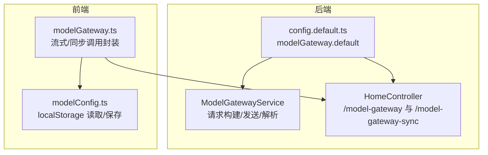
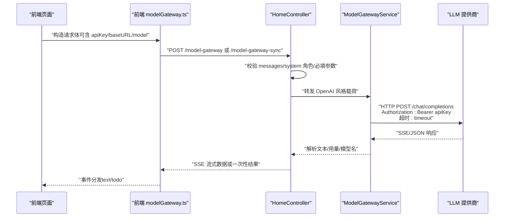
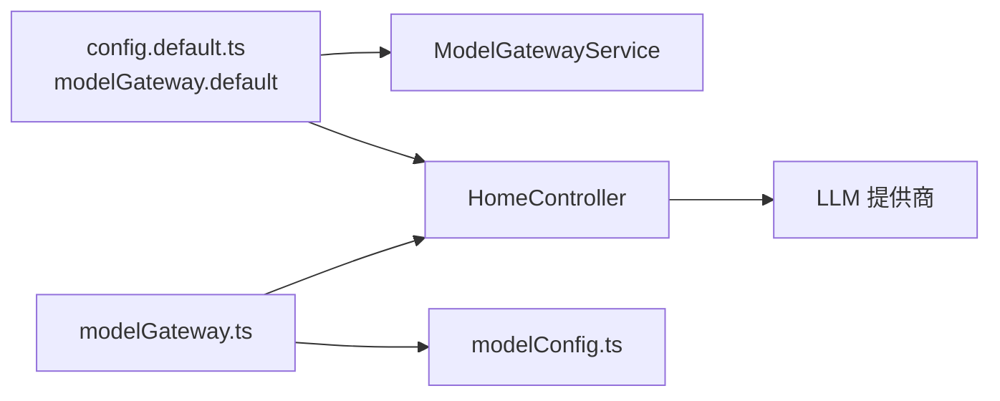
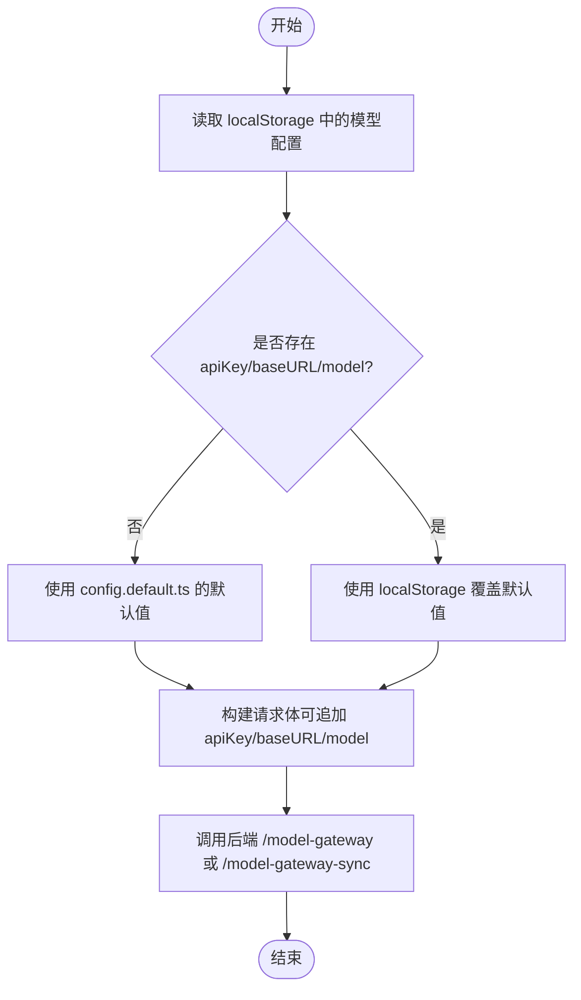

# LLM 参数详解

<cite>
**本文引用的文件**
- [config.default.ts](file://code-agent-backend/src/config/config.default.ts)
- [model-gateway.ts](file://code-agent-backend/src/service/common/model-gateway.ts)
- [home.ts](file://code-agent-backend/src/controller/home.ts)
- [modelGateway.ts](file://fta-layout-design/src/pages/EditorPage/utils/modelGateway.ts)
- [modelConfig.ts](file://fta-layout-design/src/utils/modelConfig.ts)
- [thinking-config.ts](file://fta-agent-core/src/thinking-config.ts)
- [model.ts](file://fta-agent-core/src/model.ts)
- [CLAUDE.md](file://CLAUDE.md)
</cite>

## 目录
1. [简介](#简介)
2. [项目结构](#项目结构)
3. [核心组件](#核心组件)
4. [架构总览](#架构总览)
5. [详细组件分析](#详细组件分析)
6. [依赖关系分析](#依赖关系分析)
7. [性能考量](#性能考量)
8. [故障排查指南](#故障排查指南)
9. [结论](#结论)
10. [附录](#附录)

## 简介
本文件围绕 model-gateway.default 配置对象中的核心参数进行系统性解读，涵盖 baseURL、apiKey、model、temperature、maxTokens、topP、timeout 等字段的含义、技术作用与业务影响。文档结合 ModelGatewayConfig 接口定义与多处实现，说明这些参数在不同 LLM 提供商（如 OpenAI 兼容与 Anthropic）下的配置差异与适配策略，并给出在 config.default.ts 中设置默认值的方法及对 AI 代码生成质量与性能的影响路径。

## 项目结构
本项目的 LLM 参数配置主要分布在后端配置文件与前后端网关实现中：
- 后端配置：通过 config.default.ts 的 modelGateway.default 读取环境变量，形成默认网关配置。
- 后端服务：ModelGatewayService 封装通用请求构建、发送与响应解析；HomeController 提供 /model-gateway 与 /model-gateway-sync 的代理与校验。
- 前端网关：fta-layout-design 提供前端侧的流式与同步调用封装，支持从本地存储读取默认配置。

图表来源
- [config.default.ts](file://code-agent-backend/src/config/config.default.ts#L214-L229)
- [model-gateway.ts](file://code-agent-backend/src/service/common/model-gateway.ts#L36-L41)
- [home.ts](file://code-agent-backend/src/controller/home.ts#L14-L23)
- [modelGateway.ts](file://fta-layout-design/src/pages/EditorPage/utils/modelGateway.ts#L1-L59)
- [modelConfig.ts](file://fta-layout-design/src/utils/modelConfig.ts#L1-L57)

章节来源
- [config.default.ts](file://code-agent-backend/src/config/config.default.ts#L214-L229)
- [model-gateway.ts](file://code-agent-backend/src/service/common/model-gateway.ts#L36-L41)
- [home.ts](file://code-agent-backend/src/controller/home.ts#L14-L23)
- [modelGateway.ts](file://fta-layout-design/src/pages/EditorPage/utils/modelGateway.ts#L1-L59)
- [modelConfig.ts](file://fta-layout-design/src/utils/modelConfig.ts#L1-L57)

## 核心组件
- ModelGatewayConfig 接口定义了网关的核心参数：
  - baseURL：模型服务的基础 URL（不带路径），用于拼接 /chat/completions。
  - apiKey：访问令牌，通过 Authorization: Bearer 注入。
  - model：默认模型名称，可被调用时覆盖。
  - temperature：采样温度，控制随机性与创造性。
  - maxTokens：最大生成长度。
  - topP：核采样概率质量阈值。
  - timeout：请求超时时间（毫秒）。
- ModelGatewayService：负责构建请求载荷、发送请求、解析响应与流式事件抽取。
- HomeController：提供 /model-gateway（SSE 流式）与 /model-gateway-sync（一次性）两个代理端点，严格校验 OpenAI 风格 messages 结构与 system 角色消息。
- 前端 modelGateway.ts：封装流式与同步调用，支持从 localStorage 读取默认配置。

章节来源
- [model-gateway.ts](file://code-agent-backend/src/service/common/model-gateway.ts#L4-L12)
- [model-gateway.ts](file://code-agent-backend/src/service/common/model-gateway.ts#L142-L190)
- [home.ts](file://code-agent-backend/src/controller/home.ts#L54-L82)
- [modelGateway.ts](file://fta-layout-design/src/pages/EditorPage/utils/modelGateway.ts#L1-L59)

## 架构总览
下图展示了从前端到后端再到 LLM 提供商的整体链路，以及关键参数在各层的作用点。

图表来源
- [home.ts](file://code-agent-backend/src/controller/home.ts#L148-L195)
- [model-gateway.ts](file://code-agent-backend/src/service/common/model-gateway.ts#L195-L215)
- [modelGateway.ts](file://fta-layout-design/src/pages/EditorPage/utils/modelGateway.ts#L226-L271)

## 详细组件分析

### 1) baseURL
- 技术作用
  - 作为模型服务的基础地址，最终拼接为 /chat/completions。
  - 后端控制器与服务均以该值进行请求拼接与校验。
- 业务影响
  - 不同提供商的 baseURL 差异较大，需按提供商正确配置。
  - 若末尾带斜杠会被规范化去除，避免重复斜杠。
- 配置方式
  - 默认从环境变量 OPENAI_BASE_URL 读取，可在 config.default.ts 中设置。
- 与提供商差异
  - OpenAI 兼容：通常形如 https://api.openai.com/v1
  - Anthropic：通常形如 https://api.anthropic.com/v1
  - 其他兼容服务：如某些路由或代理可能有不同路径前缀。

章节来源
- [home.ts](file://code-agent-backend/src/controller/home.ts#L17-L23)
- [model-gateway.ts](file://code-agent-backend/src/service/common/model-gateway.ts#L195-L215)
- [config.default.ts](file://code-agent-backend/src/config/config.default.ts#L218-L220)

### 2) apiKey
- 技术作用
  - 通过 Authorization: Bearer 注入到请求头。
  - 控制台与服务层均要求存在，缺失将抛出错误。
- 业务影响
  - 任何调用都必须提供有效密钥，否则直接失败。
  - 建议通过环境变量注入，避免硬编码。
- 配置方式
  - 默认从 OPENAI_API_KEY 读取；前端也可通过请求参数或 localStorage 覆盖。

章节来源
- [home.ts](file://code-agent-backend/src/controller/home.ts#L25-L36)
- [model-gateway.ts](file://code-agent-backend/src/service/common/model-gateway.ts#L202-L208)
- [config.default.ts](file://code-agent-backend/src/config/config.default.ts#L219-L221)
- [modelConfig.ts](file://fta-layout-design/src/utils/modelConfig.ts#L1-L57)

### 3) model
- 技术作用
  - 默认模型名，可被调用时显式覆盖。
  - 后端控制器与服务层均支持优先级：调用参数 > 请求体 payload.model > 配置 model。
- 业务影响
  - 不同提供商的模型命名不同，需与 baseURL 匹配。
  - 例如 OpenAI 兼容的 gpt-4、gpt-4o 等；Anthropic 的 claude-3、claude-3.5 等。
- 配置方式
  - 默认从 OPENAI_MODEL 读取；前端也可通过请求参数或 localStorage 覆盖。

章节来源
- [home.ts](file://code-agent-backend/src/controller/home.ts#L72-L78)
- [model-gateway.ts](file://code-agent-backend/src/service/common/model-gateway.ts#L235-L241)
- [config.default.ts](file://code-agent-backend/src/config/config.default.ts#L224-L224)

### 4) temperature
- 技术作用
  - 控制采样温度，越低越稳定，越高越随机。
  - 服务层默认值为 0.2；控制器默认值为 0.2（来自前端示例）。
- 业务影响
  - 代码生成场景建议较低温度以提升一致性与准确性。
  - 对创意类任务可适当提高以增强多样性。
- 配置方式
  - 可通过环境变量 MODEL_TEMPERATURE 设置默认值；也可在调用时覆盖。

章节来源
- [model-gateway.ts](file://code-agent-backend/src/service/common/model-gateway.ts#L147-L147)
- [modelGateway.ts](file://fta-layout-design/src/pages/EditorPage/utils/modelGateway.ts#L40-L76)
- [config.default.ts](file://code-agent-backend/src/config/config.default.ts#L226-L226)

### 5) maxTokens
- 技术作用
  - 控制最大生成长度，避免过长输出导致成本与延迟上升。
- 业务影响
  - 代码生成通常需要较长上下文与输出，需根据任务复杂度合理设置。
- 配置方式
  - 可在调用时指定；若未指定则不强制限制。

章节来源
- [model-gateway.ts](file://code-agent-backend/src/service/common/model-gateway.ts#L159-L160)

### 6) topP
- 技术作用
  - 核采样概率质量阈值，与 temperature 协同控制采样分布。
- 业务影响
  - 在追求稳定性的同时保持一定多样性时可配合使用。
- 配置方式
  - 可在调用时指定；若未指定则不启用。

章节来源
- [model-gateway.ts](file://code-agent-backend/src/service/common/model-gateway.ts#L160-L160)

### 7) timeout
- 技术作用
  - 控制请求超时时间（毫秒），防止长时间阻塞。
- 业务影响
  - 流式场景默认较长（600 秒），非流式场景默认较短（45 秒）。
  - 过短可能导致长输出被中断，过长可能占用资源。
- 配置方式
  - 可通过 MODEL_TIMEOUT 环境变量设置默认值；也可在调用时覆盖。

章节来源
- [model-gateway.ts](file://code-agent-backend/src/service/common/model-gateway.ts#L211-L211)
- [model-gateway.ts](file://code-agent-backend/src/service/common/model-gateway.ts#L317-L317)
- [config.default.ts](file://code-agent-backend/src/config/config.default.ts#L225-L225)

### 8) 模型命名规范与提供商差异
- OpenAI 兼容
  - baseURL：https://api.openai.com/v1
  - 模型命名：gpt-4、gpt-4o、o1-preview 等
  - 特性：支持 messages 数组与 system 角色消息
- Anthropic
  - baseURL：https://api.anthropic.com/v1
  - 模型命名：claude-3、claude-3.5 等
  - 特性：支持 providerOptions（如 anthropic.thinking），可通过 thinking-config.ts 进行推理预算配置
- 其他兼容服务
  - 可能使用不同的 baseURL 前缀或代理路径，需按提供商文档配置

章节来源
- [CLAUDE.md](file://CLAUDE.md#L50-L60)
- [thinking-config.ts](file://fta-agent-core/src/thinking-config.ts#L1-L25)
- [model.ts](file://fta-agent-core/src/model.ts#L47-L59)

### 9) 实际代码示例：在 config.default.ts 中设置默认值
- 设置步骤
  - 在 config.default.ts 的 modelGateway.default 中，分别设置 OPENAI_BASE_URL、OPENAI_API_KEY、OPENAI_MODEL、MODEL_TIMEOUT、MODEL_TEMPERATURE。
  - 以上键值将从环境变量读取，便于在不同环境（开发/生产）灵活切换。
- 影响范围
  - 后端服务与控制器均通过 @Config('modelGateway.default') 注入配置，无需修改代码即可生效。
  - 前端可通过 localStorage 保存 apiKey/baseURL/model，作为调用时的后备默认值。

章节来源
- [config.default.ts](file://code-agent-backend/src/config/config.default.ts#L214-L229)
- [modelConfig.ts](file://fta-layout-design/src/utils/modelConfig.ts#L1-L57)

### 10) 参数如何影响 AI 代码生成的质量与性能
- 质量
  - temperature 与 topP 控制输出多样性与稳定性，代码生成建议较低温度。
  - model 选择直接影响能力边界，需与 baseURL 匹配。
  - messages/system 角色消息是 OpenAI 风格的必要条件，确保系统提示被正确识别。
- 性能
  - timeout 决定等待上限，过短易中断，过长占用资源。
  - maxTokens 控制输出长度，影响往返时间与成本。
  - baseURL 与网络连通性决定首包延迟与稳定性。

章节来源
- [home.ts](file://code-agent-backend/src/controller/home.ts#L54-L82)
- [model-gateway.ts](file://code-agent-backend/src/service/common/model-gateway.ts#L142-L190)
- [model-gateway.ts](file://code-agent-backend/src/service/common/model-gateway.ts#L195-L215)

## 依赖关系分析
- 配置依赖
  - config.default.ts -> modelGateway.default -> ModelGatewayConfig
  - HomeController 与 ModelGatewayService 均依赖该配置
- 前端依赖
  - modelGateway.ts 依赖 modelConfig.ts 读取 localStorage
  - 前端调用 HomeController 的 /model-gateway 与 /model-gateway-sync
- 提供商差异
  - 不同 baseURL 与模型命名导致调用路径与参数语义差异

图表来源
- [config.default.ts](file://code-agent-backend/src/config/config.default.ts#L214-L229)
- [model-gateway.ts](file://code-agent-backend/src/service/common/model-gateway.ts#L36-L41)
- [home.ts](file://code-agent-backend/src/controller/home.ts#L14-L23)
- [modelGateway.ts](file://fta-layout-design/src/pages/EditorPage/utils/modelGateway.ts#L1-L59)
- [modelConfig.ts](file://fta-layout-design/src/utils/modelConfig.ts#L1-L57)

章节来源
- [config.default.ts](file://code-agent-backend/src/config/config.default.ts#L214-L229)
- [model-gateway.ts](file://code-agent-backend/src/service/common/model-gateway.ts#L36-L41)
- [home.ts](file://code-agent-backend/src/controller/home.ts#L14-L23)
- [modelGateway.ts](file://fta-layout-design/src/pages/EditorPage/utils/modelGateway.ts#L1-L59)
- [modelConfig.ts](file://fta-layout-design/src/utils/modelConfig.ts#L1-L57)

## 性能考量
- 超时策略
  - 流式调用默认 600 秒，适合长输出；非流式默认 45 秒，适合快速反馈。
  - 可通过 MODEL_TIMEOUT 调整全局默认值。
- 生成长度
  - 合理设置 maxTokens，避免过长输出导致成本与延迟上升。
- 网络与路径
  - baseURL 正确性直接影响首包延迟与成功率；避免多余斜杠与错误路径。
- 并发与重试
  - 建议在上层增加必要的重试与熔断策略（不在本仓库实现范围内）。

[本节为通用指导，不直接分析具体文件]

## 故障排查指南
- 缺少必要参数
  - apiKey 或 baseURL 未配置：控制器与服务层均会抛错，检查环境变量与 config.default.ts。
- OpenAI 风格校验失败
  - messages 必须为非空数组且包含 system 角色消息；否则抛错。
- 超时问题
  - 流式场景建议适当提高 timeout；非流式场景建议缩短以避免阻塞。
- 响应解析异常
  - 服务层尝试从多种字段抽取文本；若仍为空，返回错误信息，需检查提供商响应格式。

章节来源
- [home.ts](file://code-agent-backend/src/controller/home.ts#L54-L82)
- [home.ts](file://code-agent-backend/src/controller/home.ts#L95-L114)
- [model-gateway.ts](file://code-agent-backend/src/service/common/model-gateway.ts#L244-L258)
- [model-gateway.ts](file://code-agent-backend/src/service/common/model-gateway.ts#L264-L299)

## 结论
- model-gateway.default 是统一接入多提供商 LLM 的关键枢纽，其参数直接影响请求路径、鉴权、采样策略与超时行为。
- OpenAI 兼容与 Anthropic 在 baseURL 与模型命名上存在显著差异，需严格匹配。
- 通过环境变量与前端 localStorage 可灵活配置默认值，建议在不同环境分别设置，确保一致性与安全性。
- 在代码生成场景中，建议降低 temperature、合理设置 maxTokens 与 timeout，并确保 messages/system 角色消息符合 OpenAI 风格。

[本节为总结，不直接分析具体文件]

## 附录

### A. 参数对照表（技术与业务）
- baseURL：基础 URL，拼接 /chat/completions；不同提供商路径不同。
- apiKey：Bearer 认证；必须提供。
- model：默认模型名；可被调用时覆盖。
- temperature：采样温度；代码生成建议较低值。
- maxTokens：最大生成长度；平衡质量与成本。
- topP：核采样阈值；与 temperature 协同。
- timeout：请求超时；流式默认更长。

章节来源
- [model-gateway.ts](file://code-agent-backend/src/service/common/model-gateway.ts#L4-L12)
- [model-gateway.ts](file://code-agent-backend/src/service/common/model-gateway.ts#L142-L190)
- [home.ts](file://code-agent-backend/src/controller/home.ts#L54-L82)
- [config.default.ts](file://code-agent-backend/src/config/config.default.ts#L214-L229)

### B. 前端配置读取流程

图表来源
- [modelConfig.ts](file://fta-layout-design/src/utils/modelConfig.ts#L1-L57)
- [modelGateway.ts](file://fta-layout-design/src/pages/EditorPage/utils/modelGateway.ts#L261-L294)