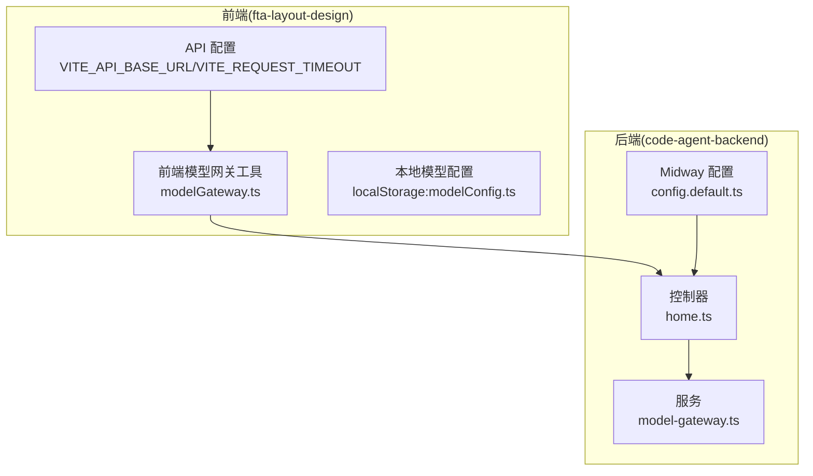
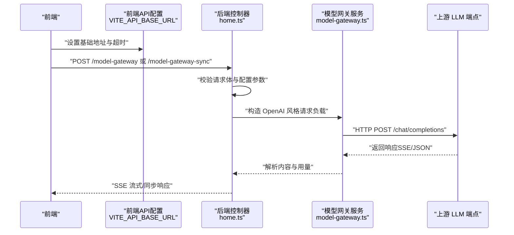
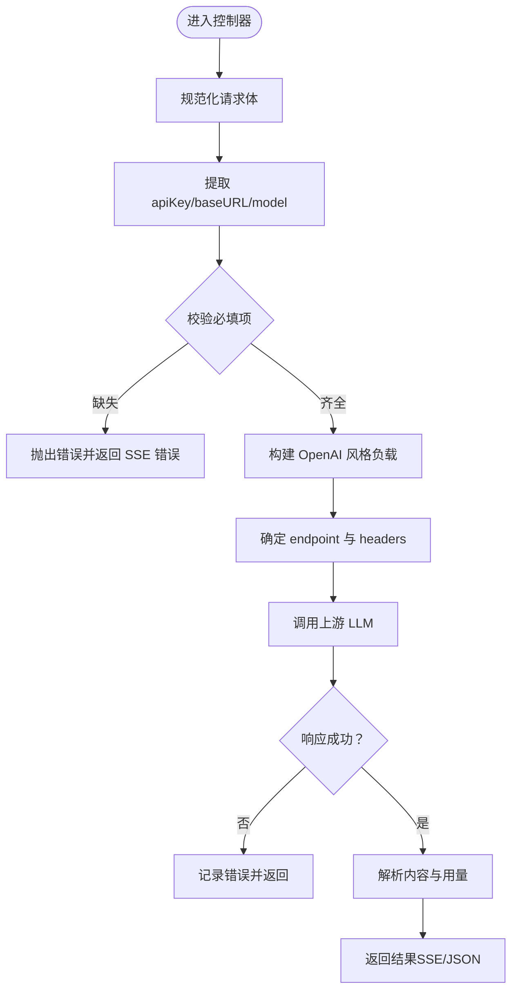
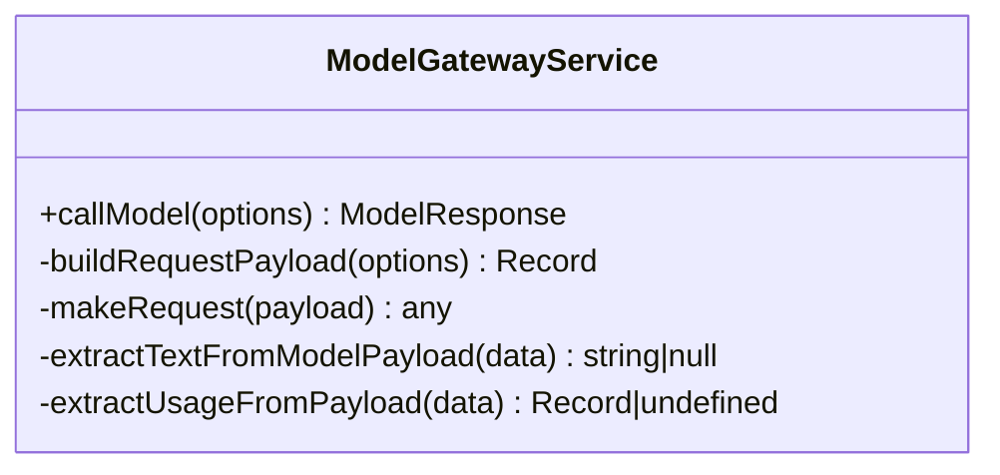
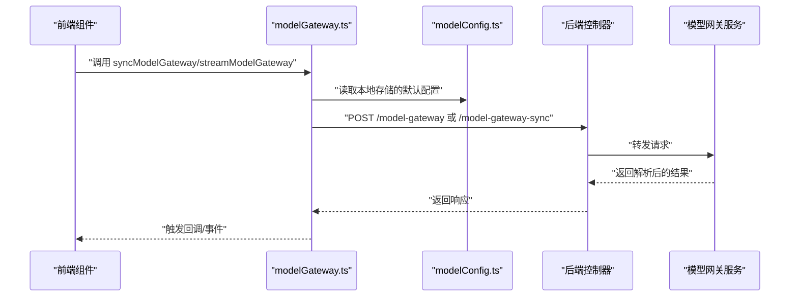
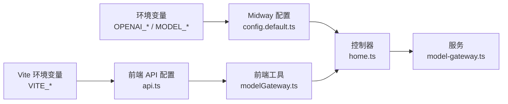
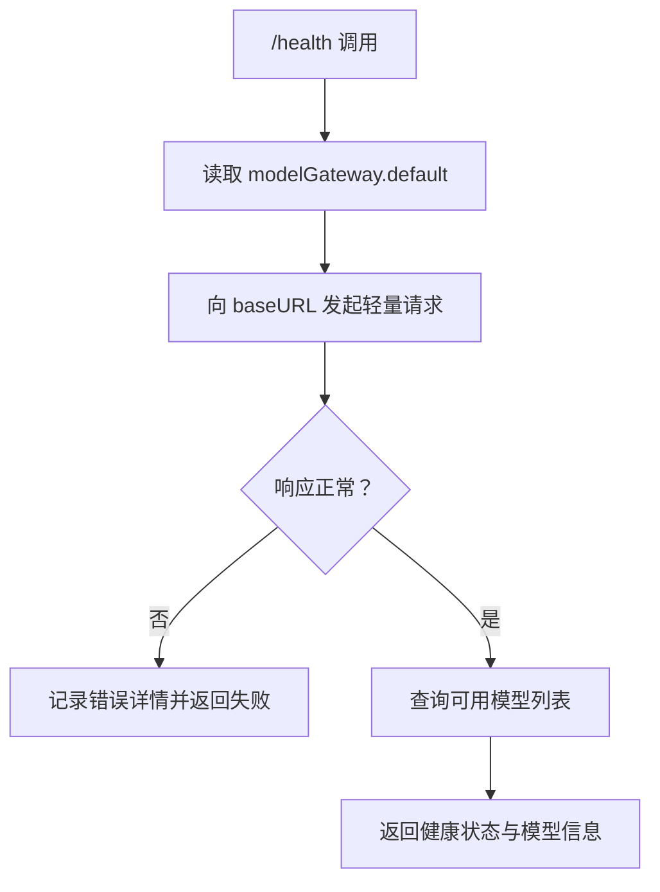

# LLM 配置指南

<cite>
**本文引用的文件列表**
- [config.default.ts](file://code-agent-backend/src/config/config.default.ts)
- [model-gateway.ts](file://code-agent-backend/src/service/common/model-gateway.ts)
- [home.ts](file://code-agent-backend/src/controller/home.ts)
- [modelGateway.ts](file://fta-layout-design/src/pages/EditorPage/utils/modelGateway.ts)
- [modelConfig.ts](file://fta-layout-design/src/utils/modelConfig.ts)
- [api.ts](file://fta-layout-design/src/config/api.ts)
- [.env.example](file://fta-layout-design/.env.example)
- [CLAUDE.md](file://CLAUDE.md)
- [README.md](file://README.md)
- [model.ts](file://fta-agent-core/src/model.ts)
</cite>

## 目录
1. [简介](#简介)
2. [项目结构与入口](#项目结构与入口)
3. [核心配置对象：model-gateway.default](#核心配置对象model-gatewaydefault)
4. [架构总览](#架构总览)
5. [详细组件分析](#详细组件分析)
6. [依赖关系分析](#依赖关系分析)
7. [性能与超时配置](#性能与超时配置)
8. [安全最佳实践](#安全最佳实践)
9. [配置验证与健康检查](#配置验证与健康检查)
10. [常见问题与排错](#常见问题与排错)
11. [结论](#结论)

## 简介
本指南聚焦于 LLM 服务的配置体系，系统性说明 model-gateway.default 配置对象中的关键字段（baseURL、apiKey、model、temperature、maxTokens、topP、timeout）的含义、默认值来源、使用场景与覆盖方式。同时阐述如何通过环境变量进行覆盖、不同 LLM 提供商（如 Anthropic、OpenAI）的 endpoint 差异、安全存储 apiKey 的最佳实践、配置验证机制（含 checkHealth 的思路）以及常见配置错误与解决方案。

## 项目结构与入口
- 后端配置入口：后端通过 Midway 配置系统加载默认配置，其中 model-gateway.default 从环境变量注入。
- 前端配置入口：前端通过 Vite 环境变量（如 VITE_API_BASE_URL、VITE_REQUEST_TIMEOUT）控制 API 基础地址与请求超时。
- 模型网关控制器：提供 /model-gateway（SSE）与 /model-gateway-sync（同步）两个入口，负责将请求转发至上游 LLM 端点。
- 模型网关服务：封装通用的请求构建、发送与响应解析逻辑，支持多种 LLM 响应格式。

图表来源
- [config.default.ts](file://code-agent-backend/src/config/config.default.ts#L214-L229)
- [home.ts](file://code-agent-backend/src/controller/home.ts#L148-L242)
- [model-gateway.ts](file://code-agent-backend/src/service/common/model-gateway.ts#L1-L244)
- [modelGateway.ts](file://fta-layout-design/src/pages/EditorPage/utils/modelGateway.ts#L1-L294)
- [modelConfig.ts](file://fta-layout-design/src/utils/modelConfig.ts#L1-L57)
- [api.ts](file://fta-layout-design/src/config/api.ts#L1-L30)

章节来源
- [config.default.ts](file://code-agent-backend/src/config/config.default.ts#L214-L229)
- [home.ts](file://code-agent-backend/src/controller/home.ts#L148-L242)
- [model-gateway.ts](file://code-agent-backend/src/service/common/model-gateway.ts#L1-L244)
- [modelGateway.ts](file://fta-layout-design/src/pages/EditorPage/utils/modelGateway.ts#L1-L294)
- [modelConfig.ts](file://fta-layout-design/src/utils/modelConfig.ts#L1-L57)
- [api.ts](file://fta-layout-design/src/config/api.ts#L1-L30)

## 核心配置对象：model-gateway.default
model-gateway.default 是后端的默认 LLM 网关配置对象，其字段与默认值来源如下：

- baseURL
  - 含义：上游 LLM 的基础端点（通常为 OpenAI 兼容的 chat/completions 地址）。
  - 默认值来源：process.env.OPENAI_BASE_URL。
  - 使用场景：当请求未显式传入 baseURL 时，控制器与服务会使用该默认值。
  - 注意：不同提供商的 endpoint 可能不同，详见“不同 LLM 提供商的 endpoint 差异”。

- apiKey
  - 含义：访问上游 LLM 的认证密钥。
  - 默认值来源：process.env.OPENAI_API_KEY。
  - 使用场景：控制器与服务会在请求头中添加 Authorization: Bearer ${apiKey}。
  - 安全建议：不要硬编码，通过环境变量注入。

- model
  - 含义：默认使用的模型名称（如 gpt-4、claude-3-5-sonnet 等）。
  - 默认值来源：process.env.OPENAI_MODEL。
  - 使用场景：若请求未指定 model，则使用此处默认值。

- temperature
  - 含义：采样温度，控制随机性与创造性。
  - 默认值来源：process.env.MODEL_TEMPERATURE（数值）。
  - 使用场景：用于微调输出稳定性与多样性。

- maxTokens
  - 含义：最大生成长度（tokens）。
  - 默认值来源：未在默认配置中直接设置，可在请求参数或服务内部按需传入。
  - 使用场景：限制输出长度，避免过长消耗。

- topP
  - 含义：核采样概率质量阈值，控制采样的多样性。
  - 默认值来源：未在默认配置中直接设置，可在请求参数或服务内部按需传入。
  - 使用场景：与 temperature 协同调节输出质量。

- timeout
  - 含义：请求超时时间（毫秒）。
  - 默认值来源：process.env.MODEL_TIMEOUT（数值）。
  - 使用场景：控制后端等待上游响应的时间上限。

章节来源
- [config.default.ts](file://code-agent-backend/src/config/config.default.ts#L214-L229)
- [home.ts](file://code-agent-backend/src/controller/home.ts#L148-L242)
- [model-gateway.ts](file://code-agent-backend/src/service/common/model-gateway.ts#L1-L244)

## 架构总览
下图展示了从前端到后端再到上游 LLM 的调用链路，以及配置如何在各层生效。

图表来源
- [home.ts](file://code-agent-backend/src/controller/home.ts#L148-L242)
- [model-gateway.ts](file://code-agent-backend/src/service/common/model-gateway.ts#L1-L244)
- [api.ts](file://fta-layout-design/src/config/api.ts#L1-L30)

## 详细组件分析

### 组件一：后端控制器（/model-gateway 与 /model-gateway-sync）
- 功能概述
  - /model-gateway：SSE 流式接口，将上游响应以流式方式返回给前端。
  - /model-gateway-sync：同步接口，一次性返回完整响应。
- 关键行为
  - 规范化请求体（支持字符串与对象）。
  - 从请求参数或配置中提取 apiKey、baseURL、model，并进行必要校验。
  - 构造 OpenAI 风格的消息负载（messages 数组必须存在且至少包含一条消息，且必须包含 system 角色消息）。
  - 选择合适的 endpoint（/chat/completions），并设置 Authorization 头。
  - 设置超时（控制器层与服务层均有超时控制）。

图表来源
- [home.ts](file://code-agent-backend/src/controller/home.ts#L148-L242)

章节来源
- [home.ts](file://code-agent-backend/src/controller/home.ts#L148-L242)

### 组件二：模型网关服务（通用请求封装）
- 功能概述
  - 封装通用的请求构建、发送与响应解析逻辑。
  - 支持从多种响应格式中提取文本内容与用量信息。
  - 在 makeRequest 中拼接 /chat/completions 并设置 Authorization 头与超时。
- 关键点
  - 若未配置 baseURL，将抛出错误。
  - 默认超时来自配置（若未设置则使用服务内部默认值）。

图表来源
- [model-gateway.ts](file://code-agent-backend/src/service/common/model-gateway.ts#L1-L244)

章节来源
- [model-gateway.ts](file://code-agent-backend/src/service/common/model-gateway.ts#L1-L244)

### 组件三：前端模型网关工具与本地配置
- 前端工具
  - modelGateway.ts：封装了流式与同步两种调用方式，支持从 localStorage 读取默认配置（apiKey、baseURL、model），并在请求时优先使用传入参数。
- 本地配置
  - modelConfig.ts：提供 getModelConfig/saveModelConfig/clearModelConfig/isModelConfigComplete 等工具，用于在浏览器侧持久化模型配置。
- API 配置
  - api.ts：根据 VITE_API_BASE_URL 与 VITE_REQUEST_TIMEOUT 构建前端 API 基础配置。

图表来源
- [modelGateway.ts](file://fta-layout-design/src/pages/EditorPage/utils/modelGateway.ts#L1-L294)
- [modelConfig.ts](file://fta-layout-design/src/utils/modelConfig.ts#L1-L57)
- [api.ts](file://fta-layout-design/src/config/api.ts#L1-L30)

章节来源
- [modelGateway.ts](file://fta-layout-design/src/pages/EditorPage/utils/modelGateway.ts#L1-L294)
- [modelConfig.ts](file://fta-layout-design/src/utils/modelConfig.ts#L1-L57)
- [api.ts](file://fta-layout-design/src/config/api.ts#L1-L30)

## 依赖关系分析
- 配置来源
  - 后端：config.default.ts 从环境变量注入 model-gateway.default。
  - 前端：Vite 环境变量注入 API 基础地址与超时。
- 控制器与服务
  - 控制器依赖配置对象与 axios 进行请求转发。
  - 服务依赖 axios 与配置对象进行统一的请求与响应处理。
- Agent Core（可选）
  - fta-agent-core/src/model.ts 展示了另一种通过 process.env.LLM_TIMEOUT 控制 LLM 超时的方式，适用于 Agent Core 的独立调用场景。

图表来源
- [config.default.ts](file://code-agent-backend/src/config/config.default.ts#L214-L229)
- [home.ts](file://code-agent-backend/src/controller/home.ts#L148-L242)
- [model-gateway.ts](file://code-agent-backend/src/service/common/model-gateway.ts#L1-L244)
- [api.ts](file://fta-layout-design/src/config/api.ts#L1-L30)

章节来源
- [config.default.ts](file://code-agent-backend/src/config/config.default.ts#L214-L229)
- [home.ts](file://code-agent-backend/src/controller/home.ts#L148-L242)
- [model-gateway.ts](file://code-agent-backend/src/service/common/model-gateway.ts#L1-L244)
- [api.ts](file://fta-layout-design/src/config/api.ts#L1-L30)
- [model.ts](file://fta-agent-core/src/model.ts#L47-L87)

## 性能与超时配置
- 后端超时
  - 控制器层：/model-gateway 默认超时为 600 秒，/model-gateway-sync 默认超时为 600 秒。
  - 服务层：默认超时为 45 秒，可通过配置覆盖。
  - 环境变量：MODEL_TIMEOUT（毫秒）可覆盖服务层默认超时。
- 前端超时
  - VITE_REQUEST_TIMEOUT（毫秒）控制前端 API 请求超时。
- Agent Core 超时
  - LLM 层超时：process.env.LLM_TIMEOUT（毫秒），默认 120 秒。

章节来源
- [home.ts](file://code-agent-backend/src/controller/home.ts#L148-L242)
- [model-gateway.ts](file://code-agent-backend/src/service/common/model-gateway.ts#L1-L244)
- [api.ts](file://fta-layout-design/src/config/api.ts#L1-L30)
- [model.ts](file://fta-agent-core/src/model.ts#L47-L87)

## 安全最佳实践
- 不要在代码中硬编码 apiKey
  - README 明确要求“敏感凭证务必通过环境变量注入”，并强调不要提交生成物与敏感信息。
- 使用环境变量而非明文存储
  - 后端：OPENAI_API_KEY、OPENAI_BASE_URL、OPENAI_MODEL、MODEL_TIMEOUT、MODEL_TEMPERATURE。
  - 前端：VITE_API_BASE_URL、VITE_REQUEST_TIMEOUT、VITE_ENABLE_MOCK（可选）。
- 前端本地配置仅用于开发调试
  - modelConfig.ts 仅在浏览器侧使用 localStorage 存储，不应用于生产环境。
- 传输安全
  - 使用 HTTPS；不在 URL 中传输敏感信息；确保 CORS 配置合理。
- 最小权限原则
  - 为不同环境与用途分配最小必要的 API Key 权限范围。

章节来源
- [README.md](file://README.md#L125-L138)
- [CLAUDE.md](file://CLAUDE.md#L25-L27)
- [modelConfig.ts](file://fta-layout-design/src/utils/modelConfig.ts#L1-L57)

## 配置验证与健康检查
- 配置验证机制
  - 控制器在接收请求时会：
    - 规范化请求体（字符串转 JSON）。
    - 从请求参数或配置中提取 apiKey、baseURL、model。
    - 校验 apiKey 与 baseURL 是否存在，缺失则抛错并返回 SSE 错误。
    - 校验 OpenAI 风格负载：messages 必须为非空数组，且必须包含 system 角色消息。
- 健康检查建议
  - 当前代码未提供专门的 /health 接口，但可参考以下思路扩展：
    - 新增 /health：读取 modelGateway.default 配置，尝试向 baseURL 发起一次轻量请求（如 /models 或 /chat/completions），并返回状态与可用模型列表。
    - 对比实际响应与期望格式，记录错误原因（URL 格式、鉴权失败、网络超时、权限不足等）。
    - 将健康检查纳入 CI/CD 与监控告警。

图表来源
- [home.ts](file://code-agent-backend/src/controller/home.ts#L148-L242)
- [config.default.ts](file://code-agent-backend/src/config/config.default.ts#L214-L229)

章节来源
- [home.ts](file://code-agent-backend/src/controller/home.ts#L148-L242)
- [config.default.ts](file://code-agent-backend/src/config/config.default.ts#L214-L229)

## 常见问题与排错
- URL 格式错误
  - 症状：请求 404/405 或无法连接。
  - 排查：确认 baseURL 是否正确（例如 OpenAI 兼容端点末尾不应带多余斜杠），并确保 endpoint 为 /chat/completions。
  - 参考：控制器会将 baseURL 规范化为去除末尾斜杠后再拼接 /chat/completions。
- 权限不足（401/403）
  - 症状：返回 401/403。
  - 排查：检查 apiKey 是否正确、是否具备相应权限；确认 Authorization 头已正确设置。
- 缺少必要参数
  - 症状：抛出“缺少必需的模型配置参数”错误。
  - 排查：确保请求体包含 apiKey/baseURL，或已在配置中设置；若使用前端工具，确认 localStorage 中已保存有效配置。
- OpenAI 风格负载不合法
  - 症状：抛出“缺少 system 角色消息”或“messages 为空”错误。
  - 排查：确保请求体包含 messages 数组且至少包含一条 system 角色消息。
- 超时问题
  - 症状：请求长时间无响应或中断。
  - 排查：调整 MODEL_TIMEOUT（后端）与 VITE_REQUEST_TIMEOUT（前端）；检查网络与上游 LLM 服务状态。
- 不同 LLM 提供商的 endpoint 差异
  - OpenAI：/chat/completions。
  - Anthropic：通常使用 /v1/messages（具体以提供商文档为准），需将 baseURL 指向对应端点。
  - 其他兼容提供商：可能需要调整 baseURL 与认证方式（如自定义头部），请参考对应提供商的官方文档。

章节来源
- [home.ts](file://code-agent-backend/src/controller/home.ts#L148-L242)
- [model-gateway.ts](file://code-agent-backend/src/service/common/model-gateway.ts#L1-L244)

## 结论
- model-gateway.default 的核心字段通过环境变量注入，支持灵活覆盖。
- 控制器与服务对配置进行了严格的校验与错误处理，确保调用链路稳定。
- 前端通过 Vite 环境变量与本地存储实现便捷的开发体验，但不应用于生产。
- 安全方面，务必通过环境变量管理 apiKey，避免硬编码与泄露。
- 建议在现有基础上增加 /health 接口，完善配置验证与健康监控。