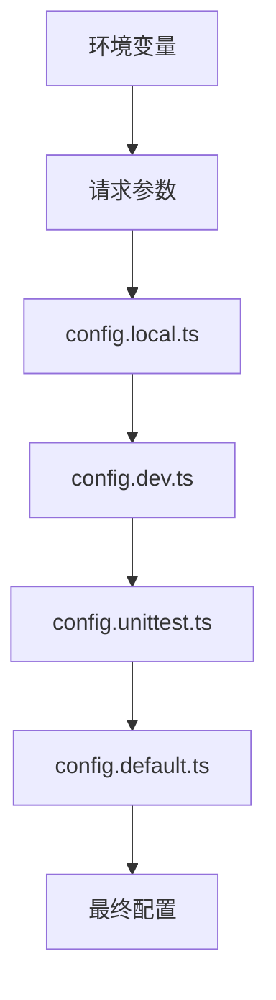
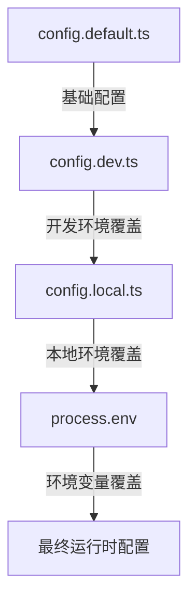
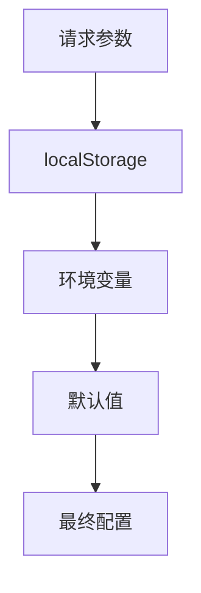

# 多环境配置管理

<cite>
**本文档引用文件**  
- [config.default.ts](file://code-agent-backend/src/config/config.default.ts)
- [config.dev.ts](file://code-agent-backend/src/config/config.dev.ts)
- [config.local.ts](file://code-agent-backend/src/config/config.local.ts)
- [config.unittest.ts](file://code-agent-backend/src/config/config.unittest.ts)
- [plugin.ts](file://code-agent-backend/src/config/plugin.ts)
- [model-gateway.ts](file://code-agent-backend/src/service/common/model-gateway.ts)
- [home.ts](file://code-agent-backend/src/controller/home.ts)
- [model-metrics.service.ts](file://code-agent-backend/src/service/common/model-metrics.service.ts)
- [configuration.ts](file://code-agent-backend/src/configuration.ts)
- [ModelConfigModal.tsx](file://fta-layout-design/src/components/ModelConfigModal.tsx)
- [modelGateway.ts](file://fta-layout-design/src/pages/EditorPage/utils/modelGateway.ts)
- [.env.example](file://fta-layout-design/.env.example)
- [README.md](file://README.md)
</cite>

## 目录
1. [多环境配置体系](#多环境配置体系)
2. [配置优先级与合并策略](#配置优先级与合并策略)
3. [LLM配置覆盖示例](#llm配置覆盖示例)
4. [配置验证机制](#配置验证机制)
5. [常见配置错误与解决方案](#常见配置错误与解决方案)
6. [前端配置管理](#前端配置管理)

## 多环境配置体系

本项目基于Midway.js框架实现多环境配置管理，通过环境特定的配置文件实现不同部署环境下的差异化配置。系统支持`default`、`dev`、`local`、`unittest`等多种环境配置，确保开发、测试和生产环境的隔离与适配。

核心配置文件位于`code-agent-backend/src/config/`目录下，包括：
- `config.default.ts`：默认配置，包含所有环境共享的基础设置
- `config.dev.ts`：开发环境专用配置
- `config.local.ts`：本地开发环境配置
- `config.unittest.ts`：单元测试环境配置

系统通过`configuration.ts`文件中的`importConfigs`配置项导入这些配置文件，并按照环境优先级进行合并。这种分层配置模式允许在不同环境中覆盖特定设置，同时保持大部分配置的一致性。



**配置来源优先级**（从高到低）：
1. HTTP请求参数中的配置
2. 环境变量（如`OPENAI_API_KEY`）
3. 特定环境配置文件（`config.local.ts`、`config.dev.ts`等）
4. 默认配置文件（`config.default.ts`）

**配置来源**
- [config.default.ts](file://code-agent-backend/src/config/config.default.ts#L1-L241)
- [configuration.ts](file://code-agent-backend/src/configuration.ts#L1-L55)

## 配置优先级与合并策略

Midway.js的配置系统采用"后覆盖前"的合并策略，即后加载的配置会覆盖先加载的同名配置项。配置加载顺序为：`default` → `dev` → `local` → `unittest`，这意味着更具体的环境配置会覆盖通用配置。

### 配置加载流程

1. **基础配置加载**：首先加载`config.default.ts`中的默认配置
2. **环境配置覆盖**：根据当前运行环境加载对应的环境配置文件
3. **环境变量注入**：从`process.env`中读取环境变量并覆盖配置
4. **运行时配置**：在请求处理过程中，允许通过请求参数动态覆盖配置

在`config.default.ts`中，LLM相关配置通过环境变量进行初始化：

```typescript
config.modelGateway = {
  default: {
    baseURL: process.env.OPENAI_BASE_URL,
    apiKey: process.env.OPENAI_API_KEY,
    model: process.env.OPENAI_MODEL,
    timeout: process.env.MODEL_TIMEOUT ? Number(process.env.MODEL_TIMEOUT) : undefined,
    temperature: process.env.MODEL_TEMPERATURE ? Number(process.env.MODEL_TEMPERATURE) : undefined,
  },
};
```

这种设计允许通过环境变量灵活调整模型配置，而无需修改代码。

### 配置合并示例

当系统运行在`local`环境时，配置合并过程如下：



**配置来源**
- [config.default.ts](file://code-agent-backend/src/config/config.default.ts#L217-L227)
- [config.dev.ts](file://code-agent-backend/src/config/config.dev.ts#L1-L14)
- [config.local.ts](file://code-agent-backend/src/config/config.local.ts#L1-L20)

## LLM配置覆盖示例

### 开发环境使用测试模型

在开发环境中，可以通过`config.dev.ts`文件配置测试用的LLM模型，确保开发过程中的安全性和成本控制：

```typescript
// code-agent-backend/src/config/config.dev.ts
export const mongoose = {
  client: {
    uri: 'mongodb://10.13.67.90:27017/fta',
    options: {
      user: 'ftauser',
      pass: '123456',
    },
  },
};
```

同时，在开发环境中可以使用较弱的测试模型，如：

```typescript
// config.dev.ts 中的模型配置（示例）
config.modelGateway = {
  default: {
    baseURL: 'https://api.test-llm.com/v1',
    apiKey: 'test-api-key-dev',
    model: 'gpt-3.5-turbo-test',
    timeout: 30000,
  },
};
```

### 生产环境切换到高性能模型

在生产环境中，系统会自动使用`config.default.ts`中配置的高性能模型：

```typescript
// code-agent-backend/src/config/config.default.ts
config.modelGateway = {
  default: {
    baseURL: process.env.OPENAI_BASE_URL,
    apiKey: process.env.OPENAI_API_KEY,
    model: process.env.OPENAI_MODEL, // 通常为 gpt-4 或更高性能模型
    timeout: process.env.MODEL_TIMEOUT ? Number(process.env.MODEL_TIMEOUT) : undefined,
  },
};
```

通过环境变量设置生产环境的高性能模型：

```bash
# 生产环境变量设置
export OPENAI_BASE_URL="https://api.openai.com/v1"
export OPENAI_API_KEY="sk-prod-xxxxxxxxxxxxxxxxxxxxxxxxxxxxxxxx"
export OPENAI_MODEL="gpt-4-turbo"
export MODEL_TIMEOUT="60000"
```

### 动态配置覆盖

系统还支持在运行时通过HTTP请求参数动态覆盖LLM配置，为特定请求使用不同的模型：

```typescript
// home.ts 中的配置提取逻辑
private extractAndValidateConfig(normalizedBody: Record<string, any>): {
  apiKey: string;
  baseURL: string;
  model?: string;
  restBody: Record<string, any>;
} {
  const { apiKey, baseURL, model, ...restBody } = normalizedBody;
  
  // 优先使用请求参数，其次使用配置文件中的配置
  const finalApiKey = apiKey || this.modelGatewayConfig?.apiKey;
  const finalBaseURL = baseURL || this.modelGatewayConfig?.baseURL;
  const finalModel = model || this.modelGatewayConfig?.model;
  
  return {
    apiKey: finalApiKey,
    baseURL: finalBaseURL,
    model: finalModel,
    restBody,
  };
}
```

这种设计允许前端在特定场景下（如需要更高精度的分析）临时切换到更强大的模型。

**配置来源**
- [config.default.ts](file://code-agent-backend/src/config/config.default.ts#L217-L227)
- [config.dev.ts](file://code-agent-backend/src/config/config.dev.ts#L1-L14)
- [home.ts](file://code-agent-backend/src/controller/home.ts#L89-L113)

## 配置验证机制

系统实现了多层次的配置验证机制，确保LLM配置的有效性和可用性。

### 启动时配置校验

在应用启动时，通过`configuration.ts`中的生命周期钩子预热关键服务，确保配置在启动阶段就被验证：

```typescript
// code-agent-backend/src/configuration.ts
async onReady(container: IMidwayContainer) {
  this.app.useMiddleware(AuthMiddleware);
  // 预热模型指标服务，确保单例在启动阶段即开始轮询
  await container.getAsync(ModelMetricsService);
}
```

### 运行时配置验证

系统在处理每个请求时都会对LLM配置进行验证，确保必需参数的存在：

```typescript
// home.ts 中的配置验证逻辑
private extractAndValidateConfig(normalizedBody: Record<string, any>): {
  apiKey: string;
  baseURL: string;
  model?: string;
  restBody: Record<string, any>;
} {
  // ... 配置提取逻辑
  
  if (!finalApiKey || !finalBaseURL) {
    const missingParams: string[] = [];
    if (!finalApiKey) missingParams.push('apiKey');
    if (!finalBaseURL) missingParams.push('baseURL');
    throw new Error(`缺少必需的模型配置参数: ${missingParams.join(', ')}。请通过请求参数或配置文件提供。`);
  }
  
  return {
    apiKey: finalApiKey,
    baseURL: finalBaseURL,
    model: finalModel,
    restBody,
  };
}
```

### 健康检查接口

系统提供了`checkHealth`接口用于验证模型服务的可用性，通过实际调用模型API来检测配置有效性：

```typescript
// model-gateway.ts 中的健康检查实现
public async checkHealth(): Promise<boolean> {
  try {
    const result = await this.callModel({
      prompt: 'test',
      temperature: 0.1,
    });
    return result.success;
  } catch (error) {
    return false;
  }
}
```

该健康检查通过发送一个简单的测试请求到LLM服务，根据响应结果判断服务是否可用。如果配置正确且服务正常，返回`true`；否则返回`false`。

### 模型指标服务验证

`ModelMetricsService`通过定期拉取模型指标来验证配置的有效性：

```typescript
// model-metrics.service.ts 中的指标拉取逻辑
private async fetchAndParseMetrics(): Promise<ModelMetricsSnapshot | null> {
  const metricsUrl = this.buildMetricsUrl();
  if (!metricsUrl) {
    console.warn('[ModelMetricsService] metrics endpoint is not configured');
    return null;
  }
  
  try {
    const headers: Record<string, string> = {
      'Content-Type': 'application/json',
    };
    if (this.modelGatewayConfig?.apiKey) {
      headers.Authorization = `Bearer ${this.modelGatewayConfig.apiKey}`;
    }
    
    const response = await axios.get(metricsUrl, {
      headers,
      timeout: this.modelGatewayConfig?.timeout ?? 15000,
    });
    
    // 成功获取指标，说明配置有效
    return this.parsePrometheusPayload(payload);
  } catch (error) {
    // 获取指标失败，记录警告
    console.warn(`[ModelMetricsService] failed to pull metrics from ${metricsUrl}`, error);
    return null;
  }
}
```

**配置来源**
- [model-gateway.ts](file://code-agent-backend/src/service/common/model-gateway.ts#L416-L427)
- [model-metrics.service.ts](file://code-agent-backend/src/service/common/model-metrics.service.ts#L101-L136)
- [home.ts](file://code-agent-backend/src/controller/home.ts#L95-L106)

## 常见配置错误与解决方案

### URL格式错误

**问题描述**：`baseURL`配置缺少协议头或格式不正确。

**错误示例**：
```typescript
// 错误的配置
baseURL: 'api.openai.com/v1' // 缺少 https://

// 或
baseURL: 'https://api.openai.com/v1/' // 末尾多余的斜杠
```

**解决方案**：
1. 确保`baseURL`包含完整的协议头
2. 避免末尾多余的斜杠
3. 使用前端UI进行格式验证

```typescript
// 正确的配置
baseURL: 'https://api.openai.com/v1'
```

前端在`ModelConfigModal.tsx`中实现了URL格式验证：

```typescript
<Form.Item
  label='Base URL'
  name='baseURL'
  rules={[
    { required: false, message: '请输入 Base URL' },
    { type: 'url', message: '请输入有效的 URL' },
  ]}>
  <Input placeholder='例如: https://api.openai.com/v1' />
</Form.Item>
```

### 权限不足

**问题描述**：API Key权限不足或已过期，导致无法访问LLM服务。

**错误表现**：
- API返回401或403状态码
- 错误信息包含"invalid api key"或"unauthorized"

**解决方案**：
1. 检查API Key是否正确
2. 确认API Key具有足够的权限
3. 检查API Key是否已过期
4. 在前端提供清晰的错误提示

```typescript
// model-gateway.ts 中的错误处理
private async makeRequest(payload: Record<string, any>): Promise<any> {
  const config = this.modelConfig;
  
  if (!config.baseURL) {
    throw new Error('Model gateway endpoint is not configured');
  }
  
  const headers: Record<string, string> = {
    'Content-Type': 'application/json',
  };
  
  // 添加认证头
  headers.Authorization = `Bearer ${config.apiKey}`;
  
  const response = await axios.post(config.baseURL + '/chat/completions', payload, {
    headers,
    timeout: config.timeout ?? 45_000,
  });
  
  return response.data;
}
```

### 超时配置不当

**问题描述**：`timeout`配置过短，导致大模型响应被中断。

**解决方案**：
1. 根据模型类型设置合理的超时时间
2. 生产环境建议设置较长的超时时间
3. 提供默认超时值作为后备

```typescript
// config.default.ts 中的超时配置
timeout: process.env.MODEL_TIMEOUT ? Number(process.env.MODEL_TIMEOUT) : undefined,
```

推荐的超时设置：
- GPT-3.5系列：30-60秒
- GPT-4系列：60-120秒
- 复杂任务：120秒以上

### 模型名称错误

**问题描述**：`model`配置的模型名称不存在或拼写错误。

**解决方案**：
1. 确认模型名称的正确拼写
2. 检查模型是否在当前区域可用
3. 使用模型列表API验证模型可用性

```typescript
// home.ts 中的模型配置逻辑
if (model) {
  requestPayload.model = model;
} else if (!requestPayload.model && this.modelGatewayConfig?.model) {
  requestPayload.model = this.modelGatewayConfig.model;
}
```

**配置来源**
- [ModelConfigModal.tsx](file://fta-layout-design/src/components/ModelConfigModal.tsx#L57-L67)
- [model-gateway.ts](file://code-agent-backend/src/service/common/model-gateway.ts#L198-L212)
- [home.ts](file://code-agent-backend/src/controller/home.ts#L72-L77)

## 前端配置管理

前端应用通过多种机制管理LLM配置，提供用户友好的配置界面和本地存储功能。

### 环境变量配置

前端通过`.env`文件和环境变量进行配置管理：

```bash
# fta-layout-design/.env.example
VITE_API_BASE_URL=http://127.0.0.1:7001
VITE_REQUEST_TIMEOUT=30000
VITE_ENABLE_MOCK=false
```

这些环境变量在构建时被注入到应用中，确保不同环境使用正确的后端API地址。

### 本地配置存储

前端提供`ModelConfigModal`组件，允许用户在浏览器本地存储中保存LLM配置：

```typescript
// ModelConfigModal.tsx 中的配置保存逻辑
const handleSave = () => {
  const values = form.getFieldsValue();
  saveModelConfig(values);
  message.success('配置保存成功');
  onClose();
};

const handleClear = () => {
  form.resetFields();
  clearModelConfig();
  message.success('配置已清空');
};
```

配置保存在`localStorage`中，优先级低于请求参数，但高于环境变量配置。

### 运行时配置优先级

前端在运行时遵循以下配置优先级：



在`modelGateway.ts`中实现了这一优先级逻辑：

```typescript
// fta-layout-design/src/pages/EditorPage/utils/modelGateway.ts
export const syncModelGateway = async ({
  body,
  apiKey,
  baseURL,
  model,
}: SyncModelGatewayOptions): Promise<StreamModelGatewayEvent[]> => {
  // 优先使用请求参数，如果没有则从 localStorage 读取
  const storedConfig = getModelConfig();
  const finalApiKey = apiKey || storedConfig.apiKey;
  const finalBaseURL = baseURL || storedConfig.baseURL;
  const finalModel = model || storedConfig.model;
  
  const requestPayload = {
    ...body,
    ...(finalApiKey && { apiKey: finalApiKey }),
    ...(finalBaseURL && { baseURL: finalBaseURL }),
    ...(finalModel && { model: finalModel }),
  };
  
  // 发送请求...
};
```

这种设计允许用户在特定请求中临时覆盖配置，同时保留常用的默认配置。

**配置来源**
- [.env.example](file://fta-layout-design/.env.example)
- [ModelConfigModal.tsx](file://fta-layout-design/src/components/ModelConfigModal.tsx)
- [modelGateway.ts](file://fta-layout-design/src/pages/EditorPage/utils/modelGateway.ts#L268-L278)