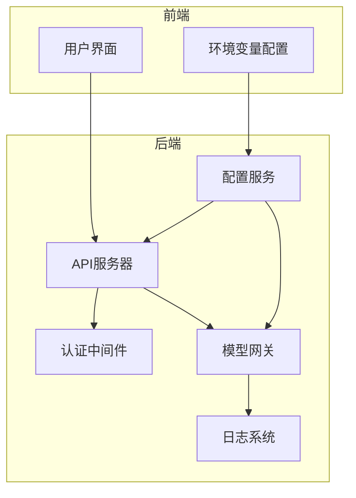
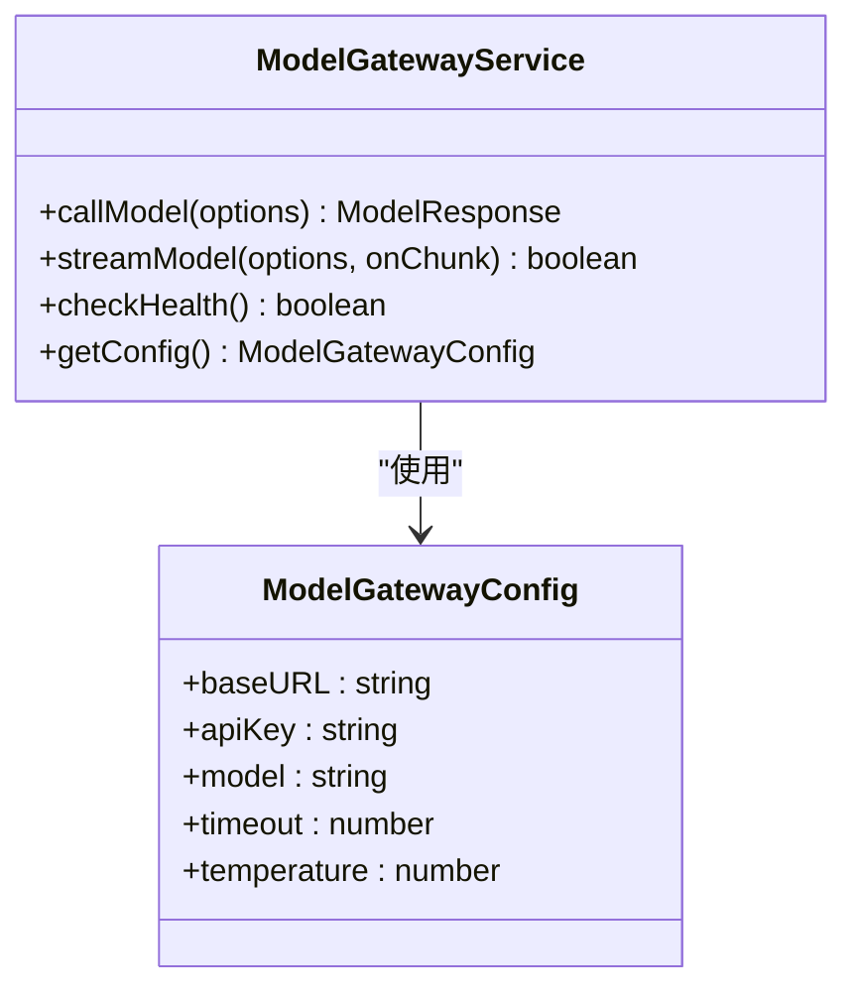
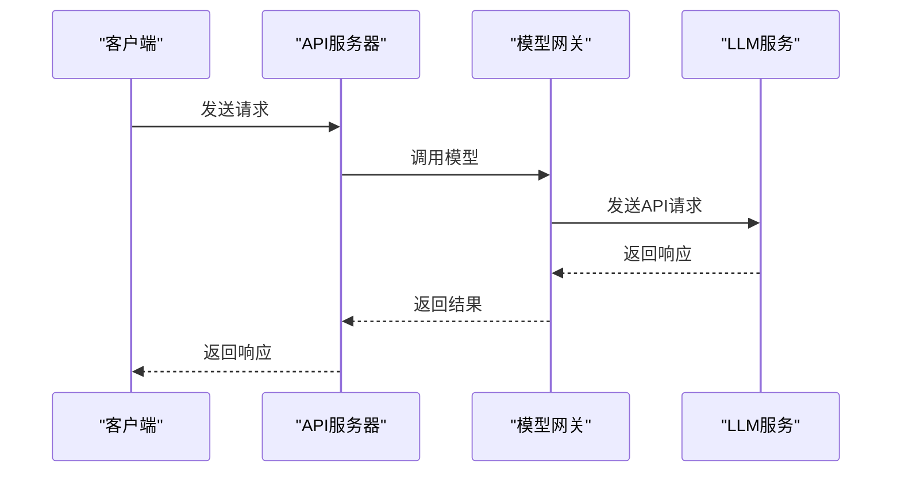
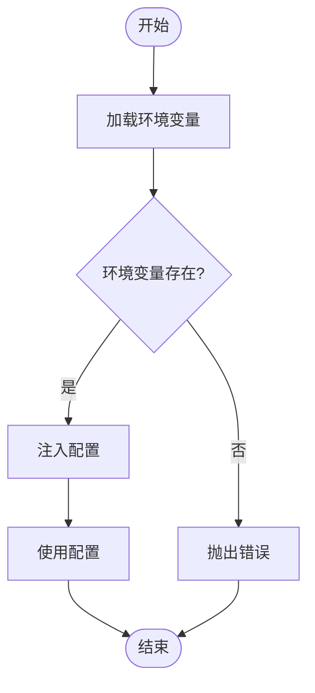
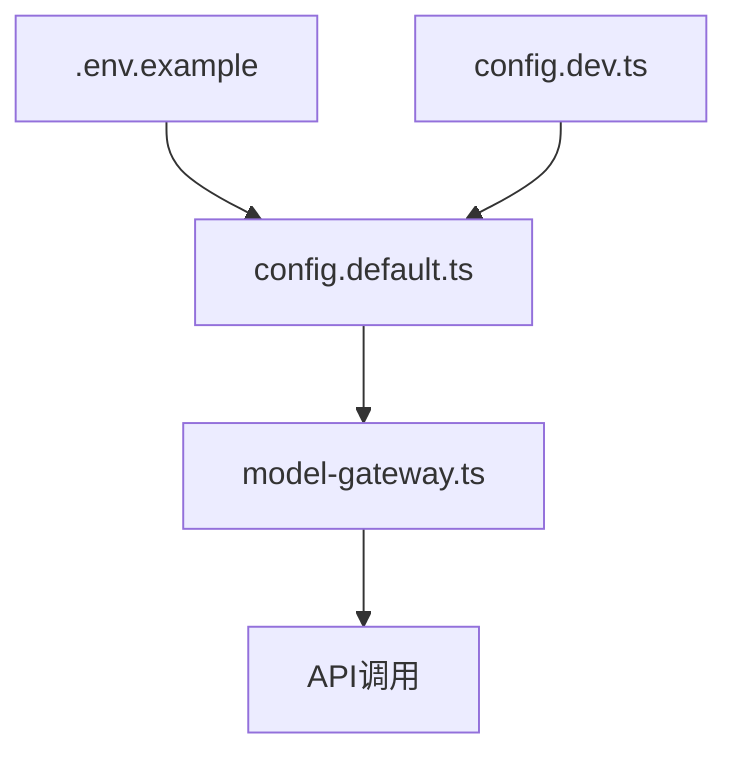

# 安全实践指南

<cite>
**本文档引用的文件**  
- [config.default.ts](file://code-agent-backend/src/config/config.default.ts)
- [model-gateway.ts](file://code-agent-backend/src/service/common/model-gateway.ts)
- [.env.example](file://fta-layout-design/.env.example)
</cite>

## 目录
1. [简介](#简介)
2. [项目结构](#项目结构)
3. [核心组件](#核心组件)
4. [架构概述](#架构概述)
5. [详细组件分析](#详细组件分析)
6. [依赖分析](#依赖分析)
7. [性能考虑](#性能考虑)
8. [故障排除指南](#故障排除指南)
9. [结论](#结论)
10. [附录](#附录)（如有必要）

## 简介
本文档旨在阐述LLM配置安全实践，重点说明如何通过环境变量安全地管理API密钥等敏感信息。文档基于代码库中的配置文件和实现机制，详细描述了配置注入、安全存储和最佳实践策略，以防止敏感信息泄露。

## 项目结构
项目采用模块化结构，主要分为后端服务、前端布局设计和共享类型定义。后端服务使用Midway框架，配置文件位于`code-agent-backend/src/config/`目录下，包括默认配置、开发环境配置和单元测试配置。前端布局设计位于`fta-layout-design/`目录，包含React组件和配置文件。`.env.example`文件提供了环境变量的示例，指导开发者如何安全地配置应用。

**Section sources**
- [config.default.ts](file://code-agent-backend/src/config/config.default.ts#L1-L241)
- [.env.example](file://fta-layout-design/.env.example#L1-L12)

## 核心组件
核心组件包括配置管理、模型网关服务和认证中间件。配置管理通过环境变量注入敏感信息，避免硬编码。模型网关服务封装了与LLM的交互逻辑，支持多种API格式和响应解析。认证中间件实现了多层鉴权机制，确保只有授权用户才能访问系统。

**Section sources**
- [config.default.ts](file://code-agent-backend/src/config/config.default.ts#L217-L228)
- [model-gateway.ts](file://code-agent-backend/src/service/common/model-gateway.ts#L1-L436)

## 架构概述
系统架构采用分层设计，前端通过API与后端通信，后端服务通过模型网关调用LLM。配置信息通过环境变量注入，确保敏感信息不被硬编码在代码中。日志系统统一格式化输出，便于审计和监控。

**Diagram sources**
- [config.default.ts](file://code-agent-backend/src/config/config.default.ts#L217-L228)
- [model-gateway.ts](file://code-agent-backend/src/service/common/model-gateway.ts#L1-L436)

## 详细组件分析

### 模型网关服务分析
模型网关服务是系统与LLM交互的核心组件，负责封装API调用、处理响应和提取文本内容。它通过配置注入机制获取API密钥和基础URL，确保敏感信息不被硬编码。

#### 对象导向组件

**Diagram sources**
- [model-gateway.ts](file://code-agent-backend/src/service/common/model-gateway.ts#L38-L436)

#### API/服务组件

**Diagram sources**
- [model-gateway.ts](file://code-agent-backend/src/service/common/model-gateway.ts#L195-L215)

### 配置管理分析
配置管理通过环境变量注入敏感信息，如API密钥和基础URL。`.env.example`文件提供了环境变量的示例，开发者需复制并重命名为`.env`文件，填入实际值。

#### 复杂逻辑组件

**Diagram sources**
- [config.default.ts](file://code-agent-backend/src/config/config.default.ts#L217-L228)
- [.env.example](file://fta-layout-design/.env.example#L1-L12)

**Section sources**
- [config.default.ts](file://code-agent-backend/src/config/config.default.ts#L217-L228)
- [model-gateway.ts](file://code-agent-backend/src/service/common/model-gateway.ts#L1-L436)
- [.env.example](file://fta-layout-design/.env.example#L1-L12)

## 依赖分析
系统依赖于Midway框架、Axios库和环境变量管理。配置文件之间存在依赖关系，`config.default.ts`定义了默认配置，其他环境配置文件（如`config.dev.ts`）覆盖默认值。模型网关服务依赖于配置服务获取API密钥和基础URL。

**Diagram sources**
- [config.default.ts](file://code-agent-backend/src/config/config.default.ts#L217-L228)
- [model-gateway.ts](file://code-agent-backend/src/service/common/model-gateway.ts#L1-L436)

**Section sources**
- [config.default.ts](file://code-agent-backend/src/config/config.default.ts#L1-L241)
- [config.dev.ts](file://code-agent-backend/src/config/config.dev.ts#L1-L14)
- [model-gateway.ts](file://code-agent-backend/src/service/common/model-gateway.ts#L1-L436)

## 性能考虑
模型网关服务通过流式响应支持实时输出，减少等待时间。配置注入机制在应用启动时完成，避免运行时开销。日志系统统一格式化输出，便于分析和监控。

## 故障排除指南
常见问题包括API密钥无效、网络连接失败和配置错误。建议检查环境变量是否正确设置，确认网络连接正常，并查看日志文件获取详细错误信息。

**Section sources**
- [model-gateway.ts](file://code-agent-backend/src/service/common/model-gateway.ts#L244-L258)
- [auth.ts](file://code-agent-backend/src/middleware/auth.ts#L171-L174)

## 结论
通过环境变量管理敏感信息、使用配置注入机制和实施多层鉴权，系统实现了较高的安全性。遵循本文档的最佳实践，可以有效防止API密钥泄露和其他安全风险。

## 附录
### 安全最佳实践清单
- **最小权限原则**：仅授予必要的权限。
- **定期轮换密钥**：定期更新API密钥。
- **网络访问控制**：限制对敏感服务的访问。
- **审计日志记录**：记录所有关键操作，便于审计。

### 配置不当导致的安全风险
- **密钥泄露**：硬编码密钥可能导致泄露。
- **未授权访问**：缺乏鉴权机制可能导致未授权访问。
- **日志泄露**：日志中记录敏感信息可能导致泄露。

**Section sources**
- [config.default.ts](file://code-agent-backend/src/config/config.default.ts#L217-L228)
- [model-gateway.ts](file://code-agent-backend/src/service/common/model-gateway.ts#L1-L436)
- [.env.example](file://fta-layout-design/.env.example#L1-L12)