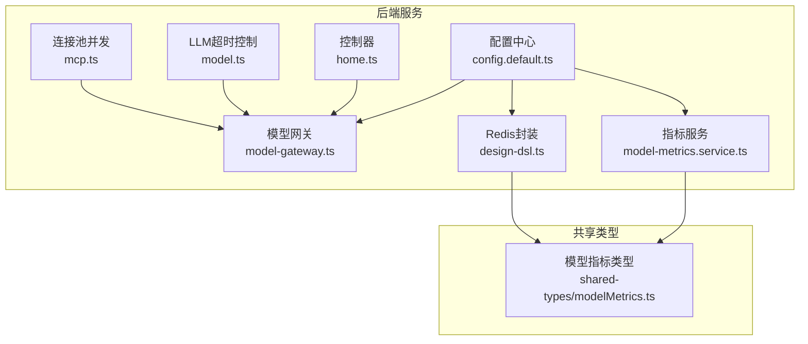
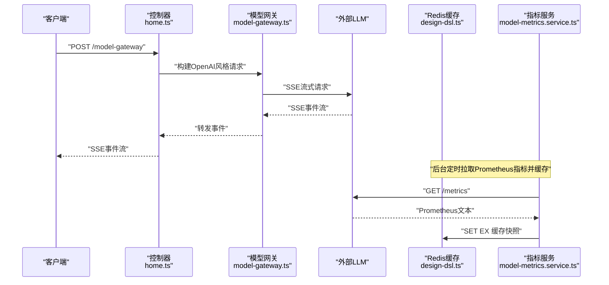
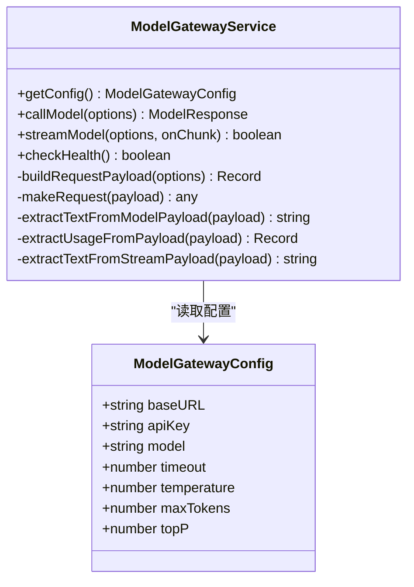
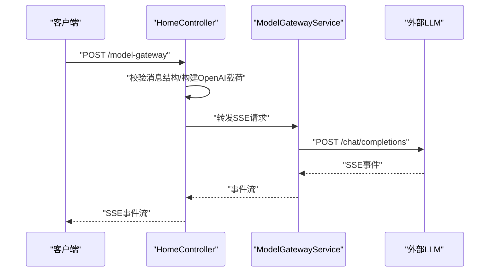
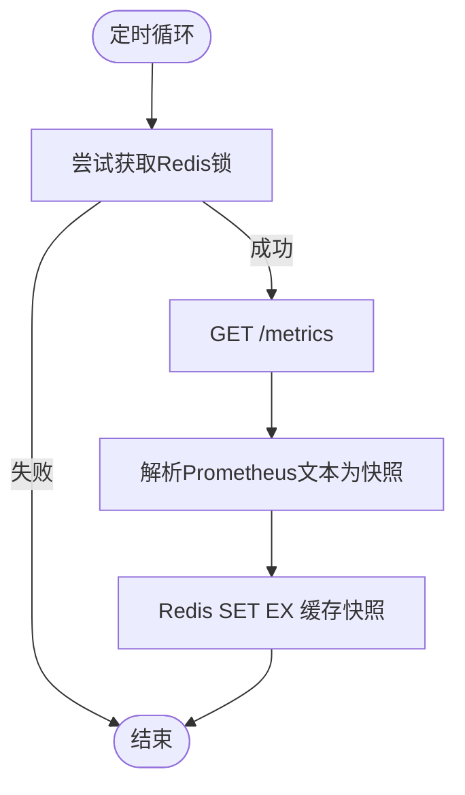
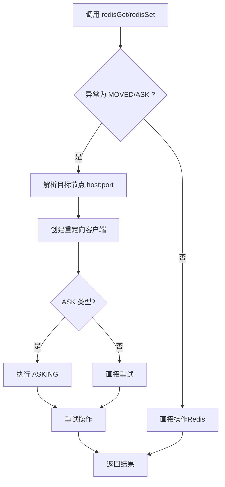
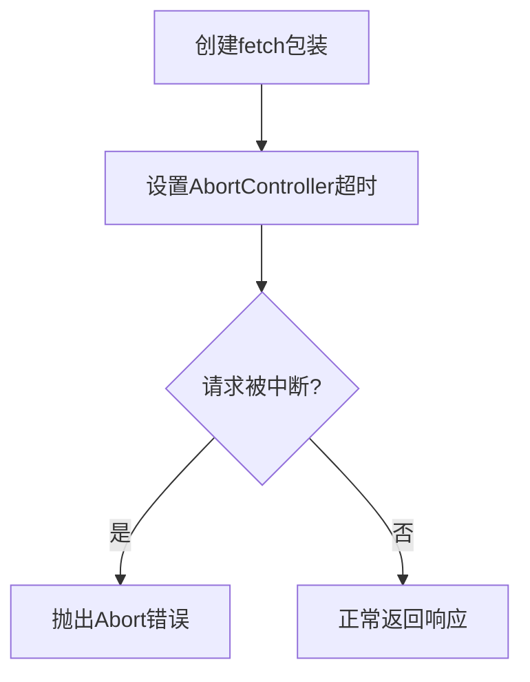
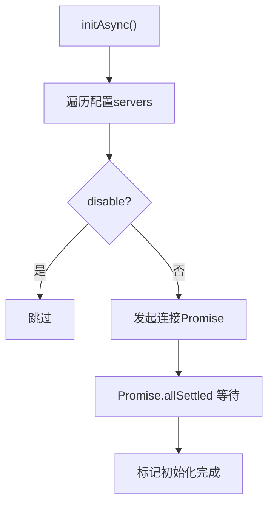
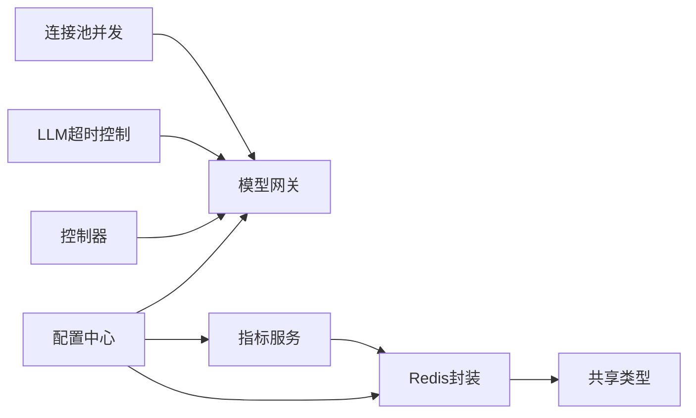

# 性能优化

<cite>
**本文引用的文件**
- [config.default.ts](file://code-agent-backend/src/config/config.default.ts)
- [model-gateway.ts](file://code-agent-backend/src/service/common/model-gateway.ts)
- [home.ts](file://code-agent-backend/src/controller/home.ts)
- [model-metrics.service.ts](file://code-agent-backend/src/service/common/model-metrics.service.ts)
- [model-metrics.ts（DTO）](file://code-agent-backend/src/dto/model-metrics.ts)
- [model-metrics.ts（类型）](file://code-agent-backend/src/types/model-metrics.ts)
- [shared-types/modelMetrics.ts](file://shared-types/src/modelMetrics.ts)
- [design-dsl.ts（Redis重定向与TTL）](file://code-agent-backend/src/service/code-agent/design-dsl.ts)
- [model.ts（LLM超时控制）](file://fta-agent-core/src/model.ts)
- [mcp.ts（连接池与并发）](file://fta-agent-core/src/mcp.ts)
</cite>

## 目录
1. [简介](#简介)
2. [项目结构](#项目结构)
3. [核心组件](#核心组件)
4. [架构总览](#架构总览)
5. [详细组件分析](#详细组件分析)
6. [依赖关系分析](#依赖关系分析)
7. [性能考量](#性能考量)
8. [故障排查指南](#故障排查指南)
9. [结论](#结论)

## 简介
本指南聚焦于LLM服务集成的性能优化，围绕以下主题展开：
- 连接池管理与HTTP客户端复用
- 响应缓存策略（Redis缓存模型指标与路径缓存）
- 负载均衡机制（基于使用情况的多提供商分配）
- 性能监控指标（请求延迟、成功率、令牌用量）

文档将结合仓库现有实现，给出可落地的最佳实践与改进建议，并提供可视化图示帮助理解。

## 项目结构
本项目由后端服务、共享类型与前端布局设计三部分组成。与LLM性能优化直接相关的后端模块包括：
- 配置中心：集中管理Redis、模型网关、Bull队列等
- 模型网关：统一封装模型调用、SSE流式传输与错误处理
- 指标服务：拉取并缓存模型侧Prometheus指标，供前端展示
- 设计DSL服务：封装Redis操作，含MOVED/ASK重定向与TTL控制
- LLM核心：超时控制与模型解析
- MCP：连接池初始化与并发控制

图表来源
- [config.default.ts](file://code-agent-backend/src/config/config.default.ts#L150-L240)
- [model-gateway.ts](file://code-agent-backend/src/service/common/model-gateway.ts#L1-L120)
- [home.ts](file://code-agent-backend/src/controller/home.ts#L148-L244)
- [model-metrics.service.ts](file://code-agent-backend/src/service/common/model-metrics.service.ts#L1-L120)
- [design-dsl.ts](file://code-agent-backend/src/service/code-agent/design-dsl.ts#L78-L202)
- [model.ts](file://fta-agent-core/src/model.ts#L40-L87)
- [mcp.ts](file://fta-agent-core/src/mcp.ts#L49-L112)
- [shared-types/modelMetrics.ts](file://shared-types/src/modelMetrics.ts#L1-L64)

章节来源
- [config.default.ts](file://code-agent-backend/src/config/config.default.ts#L150-L240)
- [model-gateway.ts](file://code-agent-backend/src/service/common/model-gateway.ts#L1-L120)
- [home.ts](file://code-agent-backend/src/controller/home.ts#L148-L244)
- [model-metrics.service.ts](file://code-agent-backend/src/service/common/model-metrics.service.ts#L1-L120)
- [design-dsl.ts](file://code-agent-backend/src/service/code-agent/design-dsl.ts#L78-L202)
- [model.ts](file://fta-agent-core/src/model.ts#L40-L87)
- [mcp.ts](file://fta-agent-core/src/mcp.ts#L49-L112)
- [shared-types/modelMetrics.ts](file://shared-types/src/modelMetrics.ts#L1-L64)

## 核心组件
- 配置中心：集中管理Redis、模型网关、Bull队列等，便于统一优化参数
- 模型网关：封装OpenAI风格请求、SSE流式传输、错误处理与超时控制
- 指标服务：定时拉取Prometheus指标，Redis缓存快照，供前端评估模型状态
- 设计DSL服务：封装Redis读写，处理MOVED/ASK重定向与TTL
- LLM超时控制：为外部LLM调用注入超时保护
- MCP连接池：异步初始化多个连接，支持并发与重试

章节来源
- [config.default.ts](file://code-agent-backend/src/config/config.default.ts#L150-L240)
- [model-gateway.ts](file://code-agent-backend/src/service/common/model-gateway.ts#L1-L120)
- [model-metrics.service.ts](file://code-agent-backend/src/service/common/model-metrics.service.ts#L1-L120)
- [design-dsl.ts](file://code-agent-backend/src/service/code-agent/design-dsl.ts#L78-L202)
- [model.ts](file://fta-agent-core/src/model.ts#L40-L87)
- [mcp.ts](file://fta-agent-core/src/mcp.ts#L49-L112)

## 架构总览
下图展示了LLM请求在系统内的流转与关键性能点：

图表来源
- [home.ts](file://code-agent-backend/src/controller/home.ts#L148-L244)
- [model-gateway.ts](file://code-agent-backend/src/service/common/model-gateway.ts#L190-L320)
- [model-metrics.service.ts](file://code-agent-backend/src/service/common/model-metrics.service.ts#L101-L144)
- [design-dsl.ts](file://code-agent-backend/src/service/code-agent/design-dsl.ts#L171-L201)

## 详细组件分析

### 组件A：模型网关（ModelGatewayService）
职责与特性：
- 统一构建OpenAI风格请求载荷
- 支持SSE流式传输，按事件分片输出
- 内置超时控制与错误处理
- 可扩展为多提供商路由（当前实现仅固定baseURL）

图表来源
- [model-gateway.ts](file://code-agent-backend/src/service/common/model-gateway.ts#L1-L120)
- [model-gateway.ts](file://code-agent-backend/src/service/common/model-gateway.ts#L190-L320)

章节来源
- [model-gateway.ts](file://code-agent-backend/src/service/common/model-gateway.ts#L1-L120)
- [model-gateway.ts](file://code-agent-backend/src/service/common/model-gateway.ts#L190-L320)

### 组件B：控制器（HomeController）
职责与特性：
- 将外部请求代理到模型网关，保持SSE流式传输
- 校验OpenAI风格消息结构
- 输出请求耗时日志（同步模式）

图表来源
- [home.ts](file://code-agent-backend/src/controller/home.ts#L148-L244)
- [model-gateway.ts](file://code-agent-backend/src/service/common/model-gateway.ts#L190-L320)

章节来源
- [home.ts](file://code-agent-backend/src/controller/home.ts#L148-L244)

### 组件C：指标服务（ModelMetricsService）
职责与特性：
- 定时拉取Prometheus指标，解析为统一快照
- Redis缓存最近一次快照，带TTL与分布式锁
- 提供HTTP接口返回快照、轮询间隔与缓存TTL

图表来源
- [model-metrics.service.ts](file://code-agent-backend/src/service/common/model-metrics.service.ts#L83-L144)
- [model-metrics.service.ts](file://code-agent-backend/src/service/common/model-metrics.service.ts#L146-L192)
- [model-metrics.service.ts](file://code-agent-backend/src/service/common/model-metrics.service.ts#L192-L295)

章节来源
- [model-metrics.service.ts](file://code-agent-backend/src/service/common/model-metrics.service.ts#L83-L144)
- [model-metrics.service.ts](file://code-agent-backend/src/service/common/model-metrics.service.ts#L146-L192)
- [model-metrics.service.ts](file://code-agent-backend/src/service/common/model-metrics.service.ts#L192-L295)
- [model-metrics.ts（DTO）](file://code-agent-backend/src/dto/model-metrics.ts#L1-L20)
- [model-metrics.ts（类型）](file://code-agent-backend/src/types/model-metrics.ts#L1-L1)
- [shared-types/modelMetrics.ts](file://shared-types/src/modelMetrics.ts#L1-L64)

### 组件D：Redis缓存与TTL（design-dsl.ts）
职责与特性：
- 封装Redis GET/SET，支持TTL
- 处理MOVED/ASK重定向，自动切换客户端并重试
- 作为路径缓存与指标缓存的基础能力

图表来源
- [design-dsl.ts](file://code-agent-backend/src/service/code-agent/design-dsl.ts#L78-L202)

章节来源
- [design-dsl.ts](file://code-agent-backend/src/service/code-agent/design-dsl.ts#L78-L202)

### 组件E：LLM超时控制（model.ts）
职责与特性：
- 为外部LLM调用注入超时保护，避免长时间阻塞
- 支持合并Abort信号，保证可中断性

图表来源
- [model.ts](file://fta-agent-core/src/model.ts#L40-L87)

章节来源
- [model.ts](file://fta-agent-core/src/model.ts#L40-L87)

### 组件F：连接池与并发（mcp.ts）
职责与特性：
- 异步初始化多个连接，使用Promise.allSettled并行等待
- 支持重试与状态管理，提升整体可用性

图表来源
- [mcp.ts](file://fta-agent-core/src/mcp.ts#L49-L112)

章节来源
- [mcp.ts](file://fta-agent-core/src/mcp.ts#L49-L112)

## 依赖关系分析
- 配置中心为模型网关、指标服务与Redis提供统一参数来源
- 控制器依赖模型网关进行请求转发
- 指标服务依赖Redis进行快照缓存
- 设计DSL服务为路径缓存提供Redis能力
- LLM超时控制为外部调用提供稳定性保障
- MCP连接池为多服务连接提供并发基础

图表来源
- [config.default.ts](file://code-agent-backend/src/config/config.default.ts#L150-L240)
- [model-gateway.ts](file://code-agent-backend/src/service/common/model-gateway.ts#L1-L120)
- [model-metrics.service.ts](file://code-agent-backend/src/service/common/model-metrics.service.ts#L1-L120)
- [design-dsl.ts](file://code-agent-backend/src/service/code-agent/design-dsl.ts#L78-L202)
- [shared-types/modelMetrics.ts](file://shared-types/src/modelMetrics.ts#L1-L64)
- [model.ts](file://fta-agent-core/src/model.ts#L40-L87)
- [mcp.ts](file://fta-agent-core/src/mcp.ts#L49-L112)

章节来源
- [config.default.ts](file://code-agent-backend/src/config/config.default.ts#L150-L240)
- [model-gateway.ts](file://code-agent-backend/src/service/common/model-gateway.ts#L1-L120)
- [model-metrics.service.ts](file://code-agent-backend/src/service/common/model-metrics.service.ts#L1-L120)
- [design-dsl.ts](file://code-agent-backend/src/service/code-agent/design-dsl.ts#L78-L202)
- [shared-types/modelMetrics.ts](file://shared-types/src/modelMetrics.ts#L1-L64)
- [model.ts](file://fta-agent-core/src/model.ts#L40-L87)
- [mcp.ts](file://fta-agent-core/src/mcp.ts#L49-L112)

## 性能考量

### 连接池管理与HTTP客户端复用
- 现状
  - 模型网关使用Axios发起请求，未显式配置连接池参数
  - 控制器对SSE流式传输采用单次请求转发
  - MCP模块具备连接池初始化能力，但未在模型网关中启用
- 建议
  - 在Axios实例上启用HTTP/HTTPS长连接与keep-alive，减少TCP握手开销
  - 配置合理的超时阈值（连接超时、读取超时），避免线程阻塞
  - 在高并发场景引入连接池（如Axios自定义Agent或第三方库），限制最大并发连接数
  - 对SSE流式传输增加背压控制，避免内存暴涨
  - 参考MCP的并发初始化思路，将外部LLM连接纳入池化管理

章节来源
- [model-gateway.ts](file://code-agent-backend/src/service/common/model-gateway.ts#L190-L320)
- [home.ts](file://code-agent-backend/src/controller/home.ts#L148-L244)
- [mcp.ts](file://fta-agent-core/src/mcp.ts#L49-L112)

### 响应缓存策略（Redis）
- 指标缓存
  - 指标服务已实现Redis缓存与分布式锁，TTL为固定秒级
  - 建议：根据Prometheus采集频率与前端轮询周期，动态调整TTL与轮询间隔
- 路径缓存
  - 设计DSL服务封装了Redis GET/SET与TTL，支持MOVED/ASK重定向
  - 建议：为热点路径设置合理TTL；对写操作失败的重定向进行幂等处理
- 模型响应缓存
  - 当前未见模型响应级别的Redis缓存实现
  - 建议：对相同输入的模型请求结果进行哈希键缓存，结合TTL与前缀缓存命中率指标进行淘汰策略

章节来源
- [model-metrics.service.ts](file://code-agent-backend/src/service/common/model-metrics.service.ts#L138-L144)
- [design-dsl.ts](file://code-agent-backend/src/service/code-agent/design-dsl.ts#L171-L201)
- [shared-types/modelMetrics.ts](file://shared-types/src/modelMetrics.ts#L1-L64)

### 负载均衡机制（基于使用情况）
- 现状
  - 模型网关当前仅使用配置中的单一baseURL
  - 指标服务解析KV缓存使用率、排队数等，可用于判断负载
- 建议
  - 多提供商配置：在配置中心维护多个提供商列表，包含baseURL、apiKey、权重
  - 负载策略：
    - 基于排队数与KV缓存使用率选择空闲度更高的提供商
    - 基于前缀缓存命中率与首token耗时（ttft）动态分流
    - 固定权重与随机策略作为降级方案
  - 失败重试：对超时与熔断错误进行指数退避重试
  - 限流与熔断：对单提供商设置并发上限与错误阈值，避免雪崩

章节来源
- [config.default.ts](file://code-agent-backend/src/config/config.default.ts#L214-L228)
- [model-metrics.service.ts](file://code-agent-backend/src/service/common/model-metrics.service.ts#L192-L295)
- [shared-types/modelMetrics.ts](file://shared-types/src/modelMetrics.ts#L1-L64)

### 性能监控指标
- 指标来源：Prometheus文本解析为统一快照
- 关键指标（来自快照字段）
  - 吞吐（throughput）：解码阶段整体吞吐（tokens/s）
  - 每输出token耗时（tpot）：seconds/token
  - 首token耗时（ttft）：seconds
  - 运行中/等待中的请求数（numRequestsRunning/numRequestsWaiting）
  - KV缓存使用率（kvCacheUsagePerc）
  - 前缀缓存命中率（prefixCacheHitRate）
  - 总生成tokens（generationTokensTotal）
- 建议
  - 前端根据快照状态（忙碌/空闲）动态调整请求策略
  - 后端将这些指标暴露为HTTP接口，便于仪表盘聚合
  - 结合业务场景，补充令牌用量统计与成本估算

章节来源
- [model-metrics.service.ts](file://code-agent-backend/src/service/common/model-metrics.service.ts#L192-L295)
- [shared-types/modelMetrics.ts](file://shared-types/src/modelMetrics.ts#L1-L64)

## 故障排查指南
- SSE流中断
  - 检查控制器与模型网关的SSE转发链路，确认headers与超时设置
  - 关注流式事件分片与“[DONE]”标识
- Redis缓存异常
  - 指标缓存：检查Redis锁获取与释放流程，确认TTL与轮询间隔
  - 路径缓存：关注MOVED/ASK重定向处理与重试逻辑
- 超时与熔断
  - LLM超时控制：确认超时阈值与Abort信号合并
  - 外部LLM：结合ttft与tpot定位慢请求
- 多提供商切换
  - 校验配置中心的提供商列表与权重
  - 通过指标快照判断分流效果，必要时降级至备用提供商

章节来源
- [home.ts](file://code-agent-backend/src/controller/home.ts#L148-L244)
- [model-gateway.ts](file://code-agent-backend/src/service/common/model-gateway.ts#L190-L320)
- [model-metrics.service.ts](file://code-agent-backend/src/service/common/model-metrics.service.ts#L138-L192)
- [design-dsl.ts](file://code-agent-backend/src/service/code-agent/design-dsl.ts#L78-L202)
- [model.ts](file://fta-agent-core/src/model.ts#L40-L87)

## 结论
本指南基于现有代码实现了对LLM服务集成的性能优化路径梳理。建议优先落地以下改进：
- 引入连接池与HTTP客户端复用，优化SSE流式传输
- 增设模型响应缓存与路径缓存，结合TTL与重定向处理
- 基于指标快照实现多提供商的智能分流与熔断
- 完善性能监控指标的采集与展示，形成闭环优化