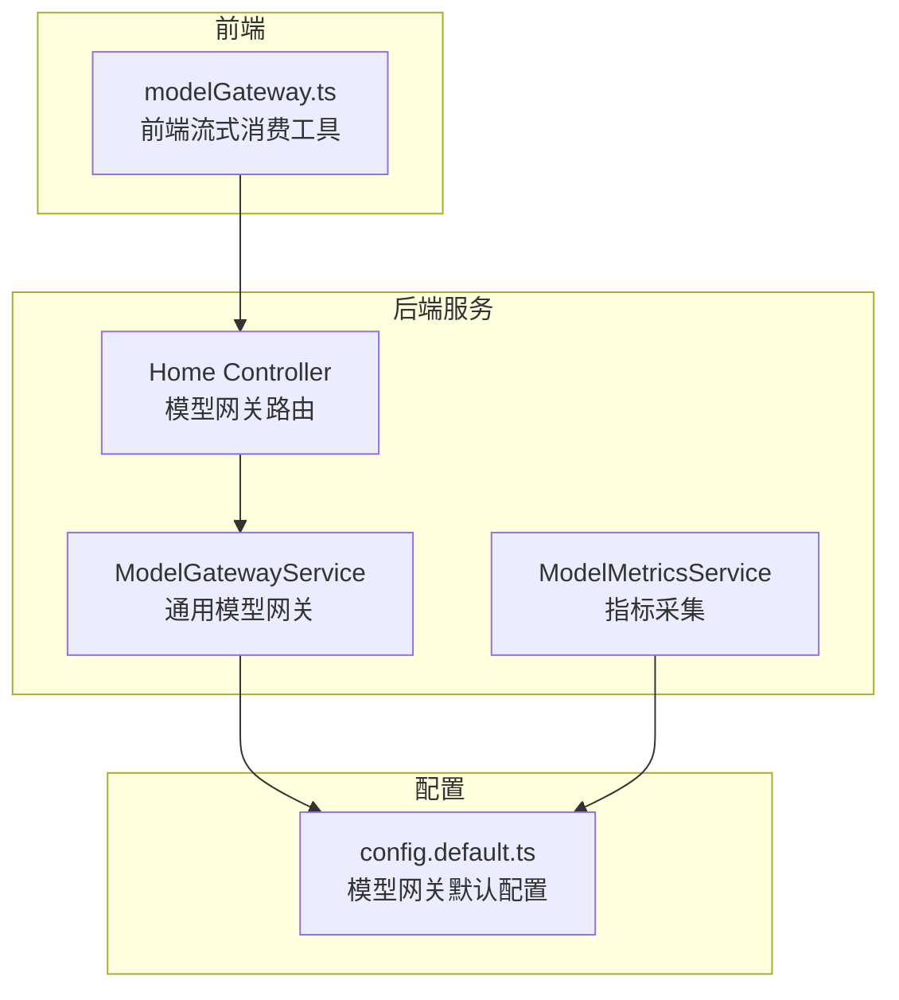
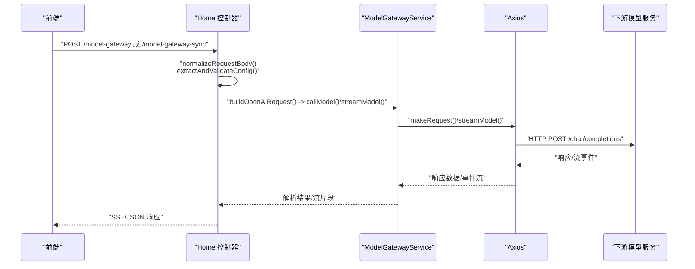
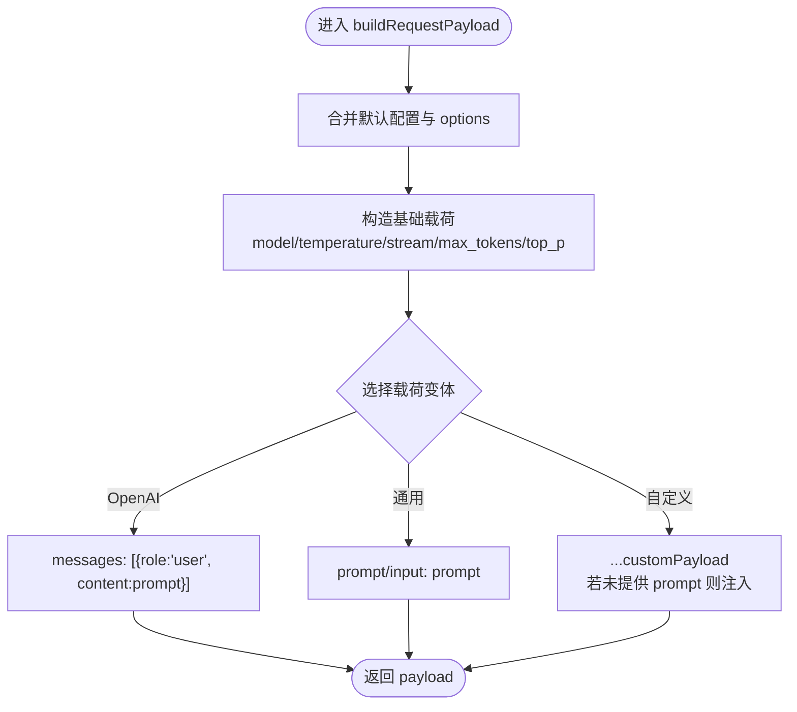
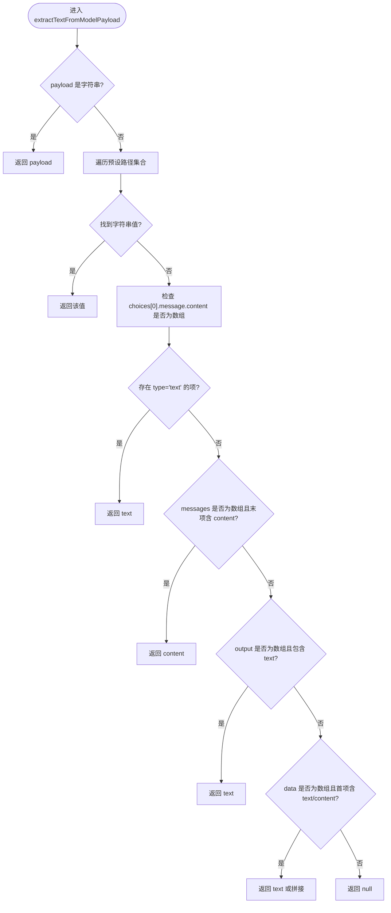
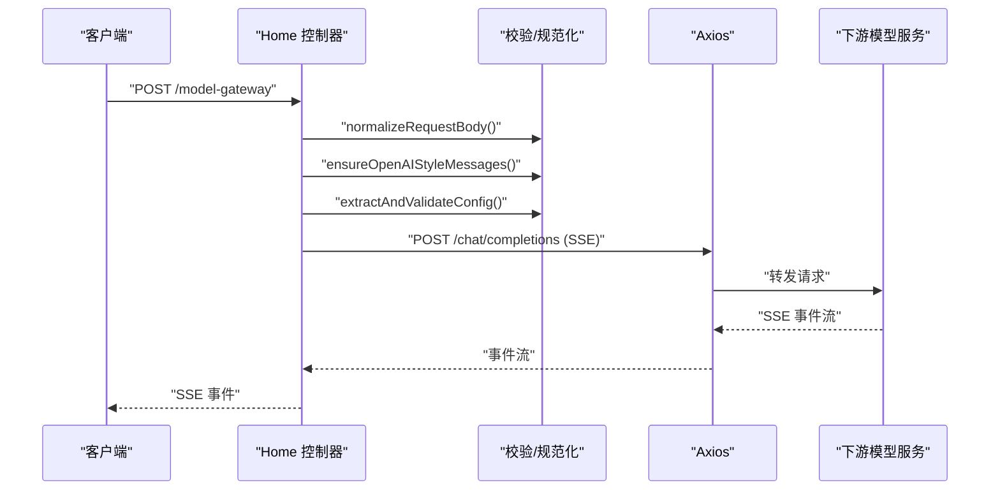
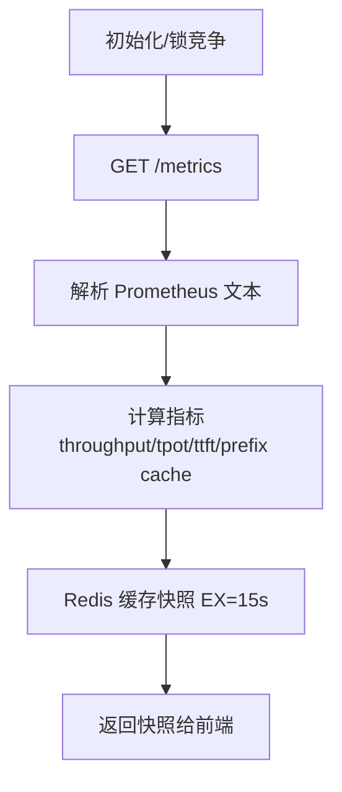
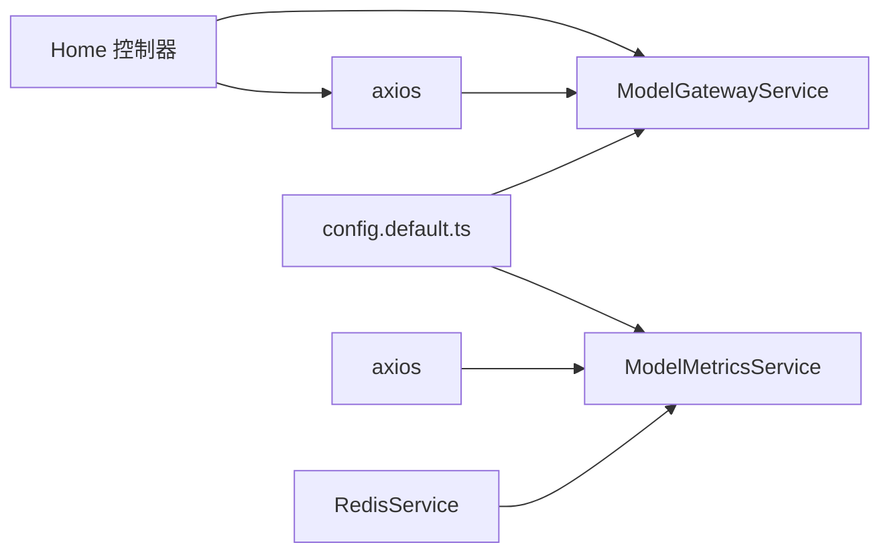

# 扩展开发指南

<cite>
**本文引用的文件列表**
- [model-gateway.ts](file://code-agent-backend/src/service/common/model-gateway.ts)
- [home.ts](file://code-agent-backend/src/controller/home.ts)
- [config.default.ts](file://code-agent-backend/src/config/config.default.ts)
- [model-metrics.service.ts](file://code-agent-backend/src/service/common/model-metrics.service.ts)
- [model-metrics.ts](file://code-agent-backend/src/types/model-metrics.ts)
- [modelMetrics.ts](file://shared-types/src/modelMetrics.ts)
- [modelMetricsController.ts](file://code-agent-backend/src/controller/code-agent/model-metrics.ts)
- [modelMetricsService.ts](file://fta-layout-design/src/services/modelMetricsService.ts)
- [modelGateway.ts](file://fta-layout-design/src/pages/EditorPage/utils/modelGateway.ts)
- [api.test.ts](file://code-agent-backend/test/controller/api.test.ts)
</cite>

## 目录
1. [简介](#简介)
2. [项目结构](#项目结构)
3. [核心组件](#核心组件)
4. [架构总览](#架构总览)
5. [详细组件分析](#详细组件分析)
6. [依赖关系分析](#依赖关系分析)
7. [性能优化建议](#性能优化建议)
8. [故障排查指南](#故障排查指南)
9. [结论](#结论)
10. [附录](#附录)

## 简介
本指南面向希望为 model-gateway 添加新 LLM 提供商支持的开发者，重点围绕以下目标展开：
- 如何通过 customPayload 参数适配非标准 API 格式
- 如何扩展 extractTextFromModelPayload 和 buildRequestPayload 方法以支持新的响应/请求结构
- 如何实现自定义的模型适配器类并注入到依赖容器
- 性能优化：连接池管理、响应缓存策略与负载均衡机制
- 测试验证步骤，确保新集成的 LLM 服务符合预期行为

## 项目结构
model-gateway 的核心能力集中在通用网关服务与控制器层，同时配套指标采集与前端流式消费工具。下图展示关键文件之间的关系与职责划分。

图表来源
- [model-gateway.ts](file://code-agent-backend/src/service/common/model-gateway.ts#L1-L436)
- [home.ts](file://code-agent-backend/src/controller/home.ts#L148-L243)
- [config.default.ts](file://code-agent-backend/src/config/config.default.ts#L214-L229)
- [model-metrics.service.ts](file://code-agent-backend/src/service/common/model-metrics.service.ts#L1-L310)
- [modelGateway.ts](file://fta-layout-design/src/pages/EditorPage/utils/modelGateway.ts#L182-L224)

章节来源
- [model-gateway.ts](file://code-agent-backend/src/service/common/model-gateway.ts#L1-L436)
- [home.ts](file://code-agent-backend/src/controller/home.ts#L148-L243)
- [config.default.ts](file://code-agent-backend/src/config/config.default.ts#L214-L229)
- [model-metrics.service.ts](file://code-agent-backend/src/service/common/model-metrics.service.ts#L1-L310)
- [modelGateway.ts](file://fta-layout-design/src/pages/EditorPage/utils/modelGateway.ts#L182-L224)

## 核心组件
- 通用模型网关 ModelGatewayService
  - 负责构建请求载荷、发起请求、解析响应、提取文本与用量信息，并支持同步与流式两种调用方式
  - 关键方法：buildRequestPayload、extractTextFromModelPayload、extractUsageFromPayload、callModel、streamModel
- Home 控制器
  - 提供 /model-gateway 与 /model-gateway-sync 两条路由，负责参数校验、消息格式转换与流式转发
- 模型指标服务 ModelMetricsService
  - 从 /metrics 拉取 Prometheus 文本格式指标，解析并缓存到 Redis，提供轮询与 TTL 策略
- 前端流式消费工具
  - 将后端 SSE 流转换为前端可消费的事件片段，支持回退解析

章节来源
- [model-gateway.ts](file://code-agent-backend/src/service/common/model-gateway.ts#L1-L436)
- [home.ts](file://code-agent-backend/src/controller/home.ts#L148-L243)
- [model-metrics.service.ts](file://code-agent-backend/src/service/common/model-metrics.service.ts#L1-L310)
- [modelGateway.ts](file://fta-layout-design/src/pages/EditorPage/utils/modelGateway.ts#L182-L224)

## 架构总览
下面的序列图展示了从控制器到通用网关再到下游模型服务的调用链路，以及流式场景下的事件分发。

图表来源
- [home.ts](file://code-agent-backend/src/controller/home.ts#L148-L243)
- [model-gateway.ts](file://code-agent-backend/src/service/common/model-gateway.ts#L195-L412)

章节来源
- [home.ts](file://code-agent-backend/src/controller/home.ts#L148-L243)
- [model-gateway.ts](file://code-agent-backend/src/service/common/model-gateway.ts#L195-L412)

## 详细组件分析

### 通用模型网关 ModelGatewayService
- 职责
  - 统一构建请求载荷，支持 OpenAI 风格 messages、通用 prompt/input 以及自定义 customPayload
  - 从多种常见响应结构中提取文本内容与用量信息
  - 支持同步与流式两种调用路径，流式解析 SSE 事件并回调
- 关键点
  - buildRequestPayload：根据 options 与默认配置生成 payload；支持 customPayload 合并
  - extractTextFromModelPayload：按路径优先级提取文本，覆盖 choices、messages、data、output 等常见结构
  - extractUsageFromPayload：按路径提取 usage 信息
  - streamModel：解析 SSE 事件，支持多格式 delta/message/text

图表来源
- [model-gateway.ts](file://code-agent-backend/src/service/common/model-gateway.ts#L142-L190)

章节来源
- [model-gateway.ts](file://code-agent-backend/src/service/common/model-gateway.ts#L142-L190)

### 响应解析与流式处理
- extractTextFromModelPayload：优先尝试字符串直返，再按路径数组查找 output/result/text/response/data.0.text/content/choices.0.message.content/choices.0.text 等
- extractUsageFromPayload：按 usage/tokenUsage/meta.usage/data.0.usage 等路径提取
- extractTextFromStreamPayload：针对 choices.delta/message/text 等结构提取增量文本，支持多模态 content 数组

图表来源
- [model-gateway.ts](file://code-agent-backend/src/service/common/model-gateway.ts#L46-L111)

章节来源
- [model-gateway.ts](file://code-agent-backend/src/service/common/model-gateway.ts#L46-L111)
- [model-gateway.ts](file://code-agent-backend/src/service/common/model-gateway.ts#L261-L299)

### 控制器层与参数校验
- normalizeRequestBody：支持字符串与对象输入，统一为对象
- ensureOpenAIStyleMessages：要求 messages 存在且至少包含一条 system 消息
- extractAndValidateConfig：从请求体提取 apiKey/baseURL/model，缺失时报错
- model-gateway 路由：构建 OpenAI 风格请求，转发为 SSE 流
- model-gateway-sync 路由：同步请求并返回 JSON

图表来源
- [home.ts](file://code-agent-backend/src/controller/home.ts#L38-L243)

章节来源
- [home.ts](file://code-agent-backend/src/controller/home.ts#L38-L243)

### 指标采集与缓存
- ModelMetricsService：定时拉取 /metrics，解析 Prometheus 文本，计算吞吐、TTFT、命中率等指标，缓存至 Redis
- 前端消费：通过 API 读取最新快照，支持降级与错误透传

图表来源
- [model-metrics.service.ts](file://code-agent-backend/src/service/common/model-metrics.service.ts#L1-L310)
- [modelMetrics.ts](file://shared-types/src/modelMetrics.ts#L1-L65)
- [modelMetricsController.ts](file://code-agent-backend/src/controller/code-agent/model-metrics.ts#L1-L31)
- [modelMetricsService.ts](file://fta-layout-design/src/services/modelMetricsService.ts#L1-L33)

章节来源
- [model-metrics.service.ts](file://code-agent-backend/src/service/common/model-metrics.service.ts#L1-L310)
- [modelMetrics.ts](file://shared-types/src/modelMetrics.ts#L1-L65)
- [modelMetricsController.ts](file://code-agent-backend/src/controller/code-agent/model-metrics.ts#L1-L31)
- [modelMetricsService.ts](file://fta-layout-design/src/services/modelMetricsService.ts#L1-L33)

## 依赖关系分析
- ModelGatewayService 依赖
  - 配置：config.default.ts 中的 modelGateway.default
  - HTTP：axios
- Home 控制器依赖
  - ModelGatewayService（通过依赖注入）
  - axios（直接使用）
- ModelMetricsService 依赖
  - RedisService（@midwayjs/redis）
  - axios
  - 配置：modelGateway.default

图表来源
- [config.default.ts](file://code-agent-backend/src/config/config.default.ts#L214-L229)
- [model-gateway.ts](file://code-agent-backend/src/service/common/model-gateway.ts#L195-L215)
- [home.ts](file://code-agent-backend/src/controller/home.ts#L148-L243)
- [model-metrics.service.ts](file://code-agent-backend/src/service/common/model-metrics.service.ts#L1-L310)

章节来源
- [config.default.ts](file://code-agent-backend/src/config/config.default.ts#L214-L229)
- [model-gateway.ts](file://code-agent-backend/src/service/common/model-gateway.ts#L195-L215)
- [home.ts](file://code-agent-backend/src/controller/home.ts#L148-L243)
- [model-metrics.service.ts](file://code-agent-backend/src/service/common/model-metrics.service.ts#L1-L310)

## 性能优化建议
- 连接池与超时
  - 在 axios 层面设置合理的超时与重试策略，避免阻塞请求线程
  - 若接入多个上游，建议使用连接池或代理层进行复用与限流
- 响应缓存策略
  - 对于稳定不变的提示词或系统提示，可在应用层做轻量缓存（基于 prompt+model+参数哈希），减少重复请求
  - 指标缓存已采用 Redis EX 策略，建议结合业务场景评估 TTL 与刷新频率
- 负载均衡机制
  - 在网关层对多个上游提供者进行健康检查与权重分配
  - 对于流式场景，注意保持同一会话的连接稳定性
- 流式传输优化
  - SSE 分片解析需保证边界完整性，避免半包丢失
  - 前端消费侧建议采用背压与缓冲策略，避免 UI 卡顿

[本节为通用性能建议，不直接分析具体文件]

## 故障排查指南
- 常见错误定位
  - 请求参数缺失：检查 apiKey/baseURL/model 是否在请求体或配置中提供
  - OpenAI 风格校验失败：messages 是否为空或缺少 system 消息
  - 响应解析失败：确认下游返回结构是否在 extractTextFromModelPayload 的路径集合内
- 日志与可观测性
  - 控制器与网关均输出错误日志，便于快速定位
  - 指标服务定期拉取 /metrics，可用于判断上游健康度与性能瓶颈
- 前端流式消费
  - 若前端未收到事件，检查 SSE 头部与事件格式，必要时回退到 fallback 解析

章节来源
- [home.ts](file://code-agent-backend/src/controller/home.ts#L38-L243)
- [model-gateway.ts](file://code-agent-backend/src/service/common/model-gateway.ts#L220-L259)
- [model-metrics.service.ts](file://code-agent-backend/src/service/common/model-metrics.service.ts#L101-L136)

## 结论
通过通用网关与控制器的解耦设计，model-gateway 已具备良好的扩展性。新增 LLM 提供商的核心在于：
- 使用 customPayload 适配非标准请求结构
- 在 extractTextFromModelPayload 中补充对应响应路径
- 在 buildRequestPayload 中增加新的载荷变体或合并策略
- 将适配器注入依赖容器，配合配置中心与控制器路由完成集成
- 结合指标采集与缓存策略，持续优化性能与稳定性

[本节为总结性内容，不直接分析具体文件]

## 附录

### 新增 LLM 提供商扩展步骤
- 步骤一：准备配置
  - 在配置文件中添加或更新 modelGateway.default，确保 baseURL、apiKey、model、timeout 等字段齐全
  - 参考：[config.default.ts](file://code-agent-backend/src/config/config.default.ts#L214-L229)
- 步骤二：适配请求载荷
  - 在 buildRequestPayload 中增加新的载荷变体，或在 customPayload 合并逻辑中处理特殊字段
  - 参考：[model-gateway.ts](file://code-agent-backend/src/service/common/model-gateway.ts#L142-L190)
- 步骤三：适配响应解析
  - 在 extractTextFromModelPayload 中追加对应路径，确保能从新提供者的响应中提取文本
  - 参考：[model-gateway.ts](file://code-agent-backend/src/service/common/model-gateway.ts#L46-L111)
- 步骤四：注入与路由
  - 将自定义适配器类通过 @Provide/@Scope 注册为服务，注入到控制器中
  - 参考：[home.ts](file://code-agent-backend/src/controller/home.ts#L148-L243)
- 步骤五：性能与监控
  - 配置指标采集与缓存策略，观察吞吐、TTFT、命中率等指标
  - 参考：[model-metrics.service.ts](file://code-agent-backend/src/service/common/model-metrics.service.ts#L1-L310)
- 步骤六：前端消费
  - 使用前端工具解析 SSE 事件，必要时回退到 fallback 解析
  - 参考：[modelGateway.ts](file://fta-layout-design/src/pages/EditorPage/utils/modelGateway.ts#L182-L224)

### 测试验证清单
- 单元测试
  - 使用现有测试框架创建针对新适配器的用例，覆盖请求构建、响应解析、错误处理
  - 参考：[api.test.ts](file://code-agent-backend/test/controller/api.test.ts#L1-L28)
- 集成测试
  - 通过控制器路由 /model-gateway 与 /model-gateway-sync 验证端到端流程
  - 参考：[home.ts](file://code-agent-backend/src/controller/home.ts#L148-L243)
- 回归测试
  - 确保原有 OpenAI 风格与通用风格仍正常工作
  - 参考：[model-gateway.ts](file://code-agent-backend/src/service/common/model-gateway.ts#L142-L190)