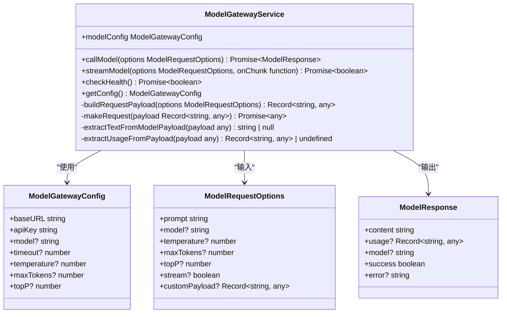
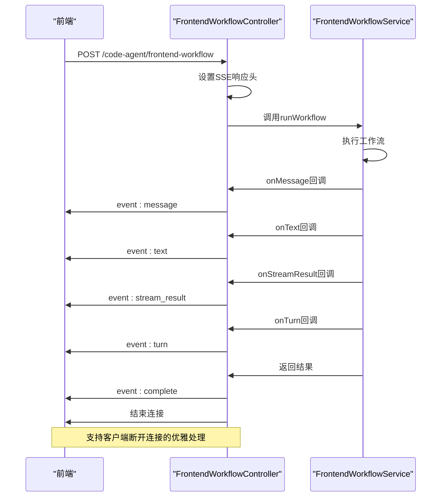
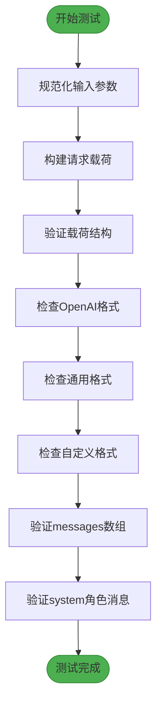
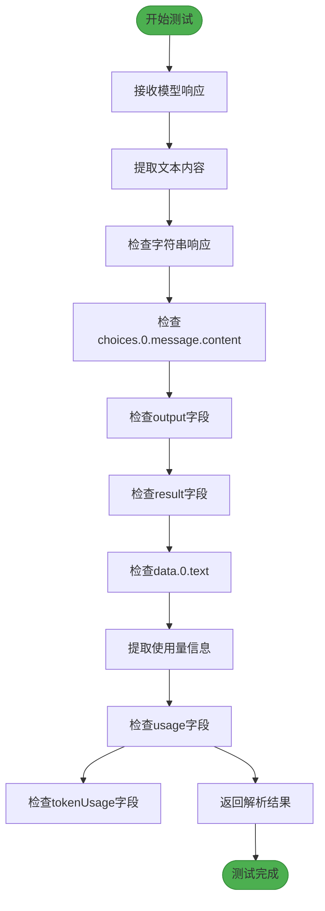
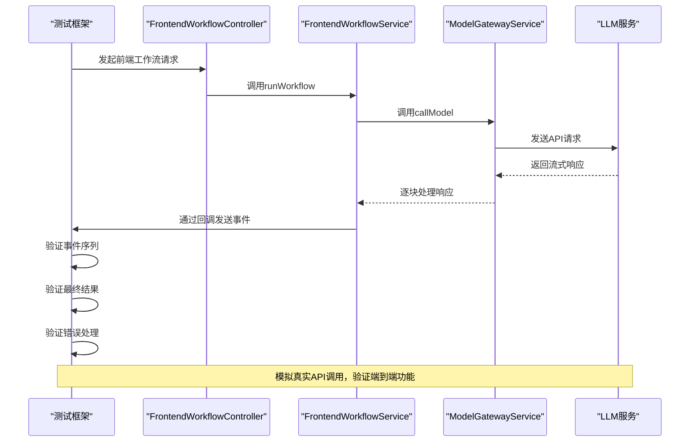
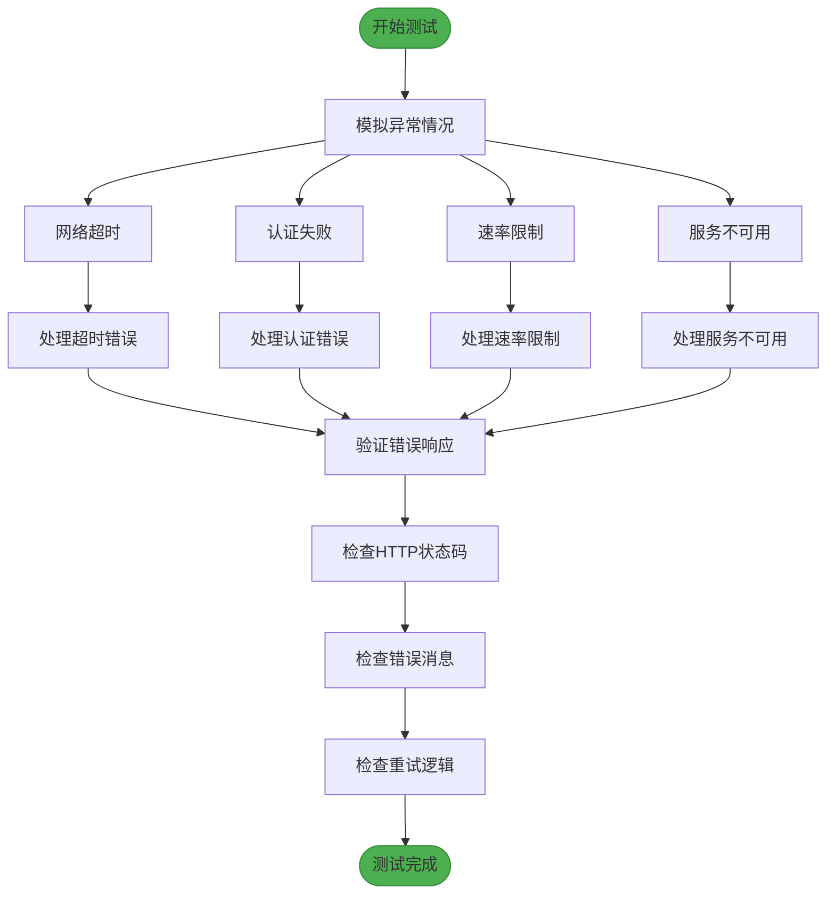
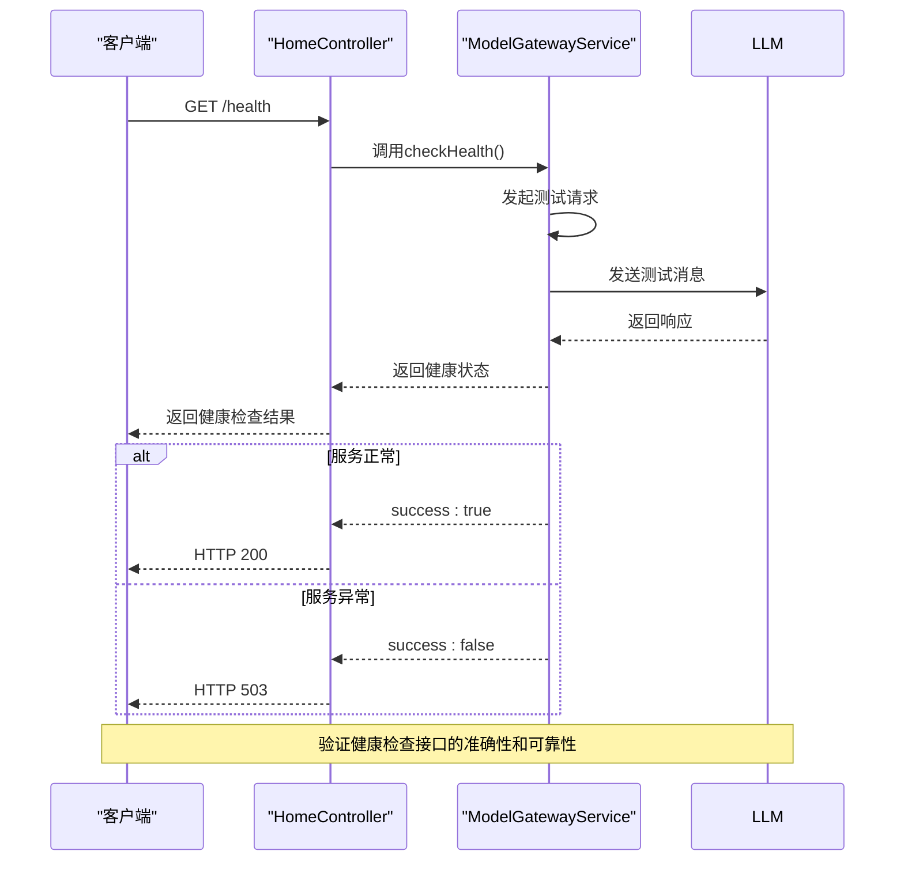
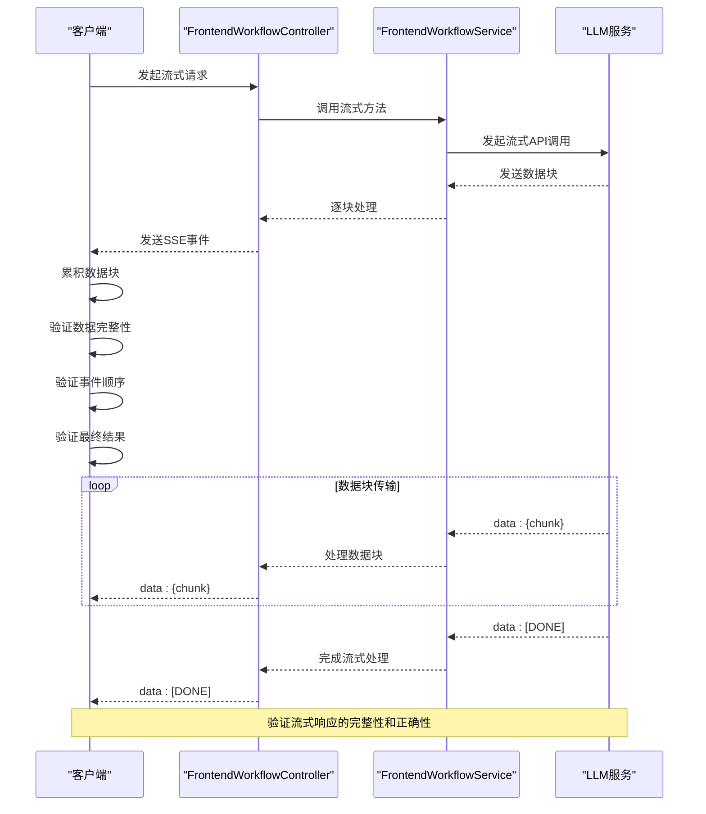

# 测试验证

<cite>
**本文档引用的文件**
- [model-gateway.ts](file://code-agent-backend/src/service/common/model-gateway.ts)
- [home.ts](file://code-agent-backend/src/controller/home.ts)
- [config.default.ts](file://code-agent-backend/src/config/config.default.ts)
- [api.test.ts](file://code-agent-backend/test/controller/api.test.ts)
- [requirement-builder.test.ts](file://code-agent-backend/test/utils/requirement-builder.test.ts)
- [frontendProjectService.test.ts](file://fta-agent-core/src/frontendProjectService.test.ts)
- [model-gateway.test.ts](file://fta-agent-core/src/agentService.test.ts)
- [workstationConnector.ts](file://fta-layout-design/src/utils/workstationConnector.ts)
- [baseService.ts](file://fta-layout-design/src/services/baseService.ts)
- [FrontendWorkflowScheduler.ts](file://fta-layout-design/src/pages/EditorPage/services/FrontendWorkflowScheduler.ts)
</cite>

## 目录
1. [引言](#引言)
2. [核心组件分析](#核心组件分析)
3. [单元测试用例](#单元测试用例)
4. [集成测试流程](#集成测试流程)
5. [异常情况测试](#异常情况测试)
6. [健康检查验证](#健康检查验证)
7. [流式响应测试](#流式响应测试)
8. [结论](#结论)

## 引言
本文档旨在为LLM服务集成提供全面的测试验证方案，确保新集成的LLM服务符合预期行为。通过分析代码库中的测试结构和实现，我们将制定一套完整的测试策略，涵盖单元测试、集成测试、异常处理测试、健康检查和流式响应验证等关键方面。

**Section sources**
- [model-gateway.ts](file://code-agent-backend/src/service/common/model-gateway.ts#L1-L436)
- [home.ts](file://code-agent-backend/src/controller/home.ts#L1-L202)

## 核心组件分析

### 模型网关服务
模型网关服务是LLM集成的核心组件，负责封装各种模型的调用逻辑，支持多种API格式和响应解析。该服务提供了统一的接口来调用不同的LLM服务，同时处理请求载荷构建和响应解析。



**Diagram sources**
- [model-gateway.ts](file://code-agent-backend/src/service/common/model-gateway.ts#L1-L436)

### 前端工作流控制器
前端工作流控制器负责处理前端发起的LLM请求，支持流式响应（SSE）和工具调用。该控制器通过SSE协议与前端通信，实时发送消息、文本片段、流式结果和对话轮次等事件。



**Diagram sources**
- [frontend-workflow.ts](file://code-agent-backend/src/controller/code-agent/frontend-workflow.ts#L1-L368)

## 单元测试用例

### 请求载荷构建测试
验证模型网关服务正确构建请求载荷，支持多种模型API格式。



**Diagram sources**
- [model-gateway.ts](file://code-agent-backend/src/service/common/model-gateway.ts#L142-L189)

### 响应解析测试
验证模型网关服务能够正确解析不同格式的模型响应，提取文本内容和使用量信息。



**Diagram sources**
- [model-gateway.ts](file://code-agent-backend/src/service/common/model-gateway.ts#L46-L111)

## 集成测试流程

### 端到端工作流测试
创建集成测试流程，模拟真实API调用并验证端到端的功能。



**Diagram sources**
- [frontendProjectService.test.ts](file://fta-agent-core/src/frontendProjectService.test.ts#L82-L123)
- [frontend-workflow.ts](file://code-agent-backend/src/controller/code-agent/frontend-workflow.ts#L139-L288)

## 异常情况测试

### Mock服务测试
使用mock服务测试网络超时、认证失败和速率限制等异常情况。

```mermaid
classDiagram
class MockService {
+callService(service string, method string, params any) Promise~any~
+getMockFileContent(filePath string) string
+getMockDirectoryList(dirPath string) any[]
}
class BaseService {
+makeRequest~T~(mockData function, apiCall function) Promise~T~
+wrapAPIRequest~T~(apiCall function) Promise~T~
}
class FrontendWorkflowScheduler {
+executeWithCustomSSEHandling(requestBody any, callbacks FrontendWorkflowCallbacks, config StreamingRequestConfig) Promise~void~
+handleSSEEvent(eventType string, data any, callbacks FrontendWorkflowCallbacks) void
}
MockService --> BaseService : "实现"
FrontendWorkflowScheduler --> MockService : "使用"
FrontendWorkflowScheduler --> BaseService : "继承"
note right of MockService : 提供mock服务实现，用于测试异常情况
note right of BaseService : 基础API服务类，支持mock和真实API切换
note right of FrontendWorkflowScheduler : 处理SSE连接，支持自定义事件解析
```

**Diagram sources**
- [workstationConnector.ts](file://fta-layout-design/src/utils/workstationConnector.ts#L1-L133)
- [baseService.ts](file://fta-layout-design/src/services/baseService.ts#L1-L42)

### 异常处理流程
验证系统在各种异常情况下的行为，包括网络超时、认证失败和速率限制。



**Section sources**
- [model-gateway.ts](file://code-agent-backend/src/service/common/model-gateway.ts#L244-L258)
- [home.ts](file://code-agent-backend/src/controller/home.ts#L119-L131)

## 健康检查验证

### 健康检查接口
验证健康检查接口的正确性，确保能够准确反映LLM服务的状态。



**Section sources**
- [model-gateway.ts](file://code-agent-backend/src/service/common/model-gateway.ts#L417-L427)
- [home.ts](file://code-agent-backend/src/controller/home.ts#L148-L195)

## 流式响应测试

### 流式响应完整性
测试流式响应（SSE）的完整性和正确性，确保数据块正确传输和解析。



**Diagram sources**
- [FrontendWorkflowScheduler.ts](file://fta-layout-design/src/pages/EditorPage/services/FrontendWorkflowScheduler.ts#L91-L238)
- [apiService.ts](file://fta-layout-design/src/utils/apiService.ts#L251-L305)

## 结论
本文档提供了完整的LLM服务集成测试验证方案，涵盖了单元测试、集成测试、异常处理、健康检查和流式响应等关键方面。通过实施这些测试策略，可以确保新集成的LLM服务符合预期行为，提高系统的可靠性和稳定性。

**Section sources**
- [model-gateway.ts](file://code-agent-backend/src/service/common/model-gateway.ts#L1-L436)
- [home.ts](file://code-agent-backend/src/controller/home.ts#L1-L202)
- [frontendProjectService.test.ts](file://fta-agent-core/src/frontendProjectService.test.ts#L82-L123)