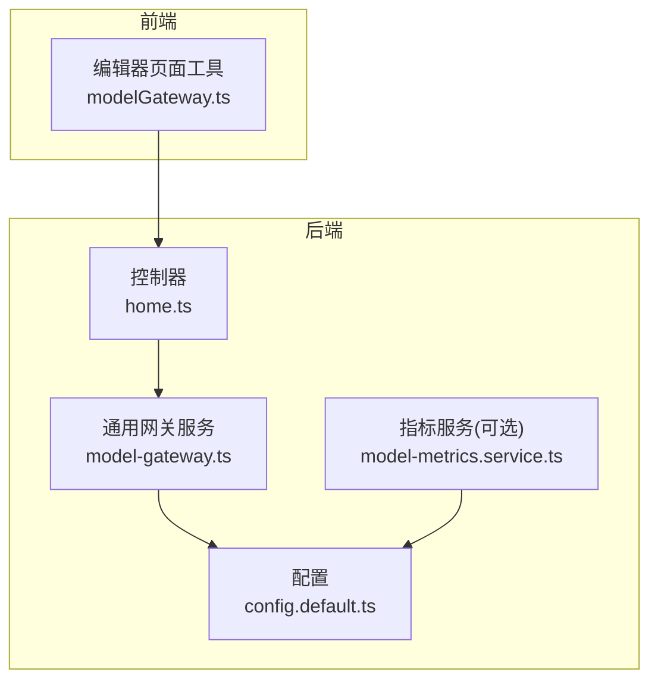
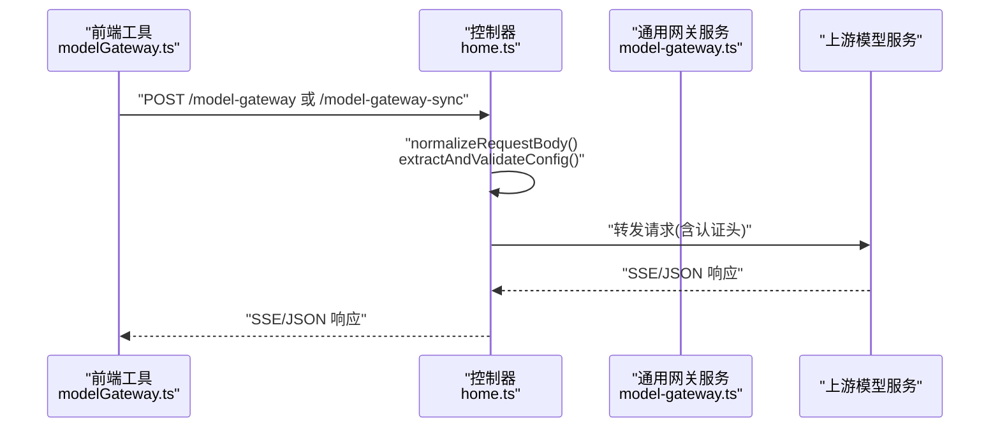
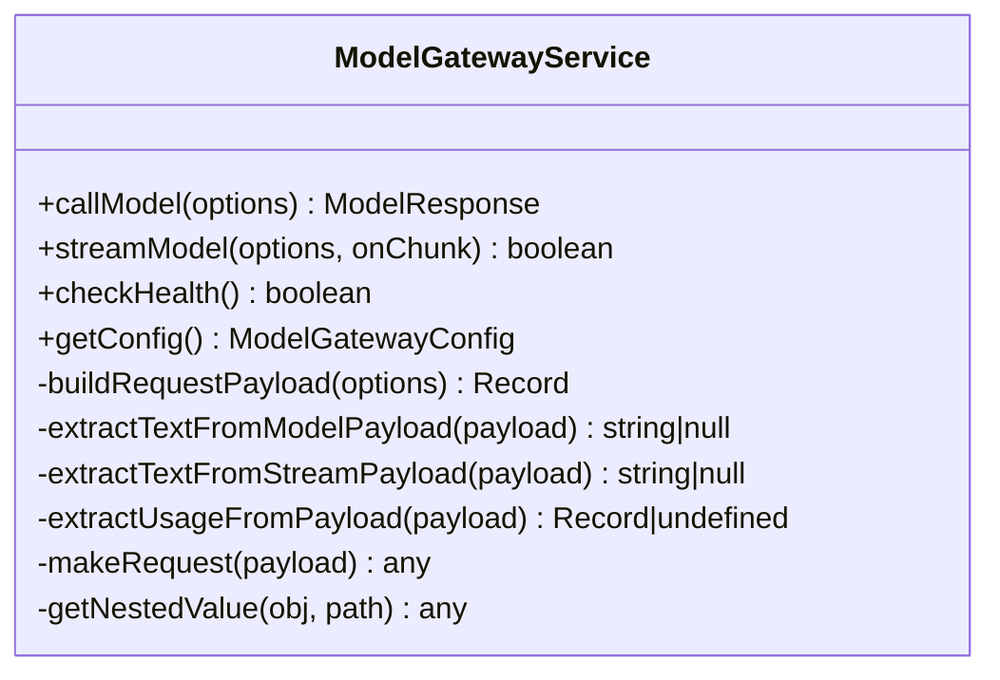
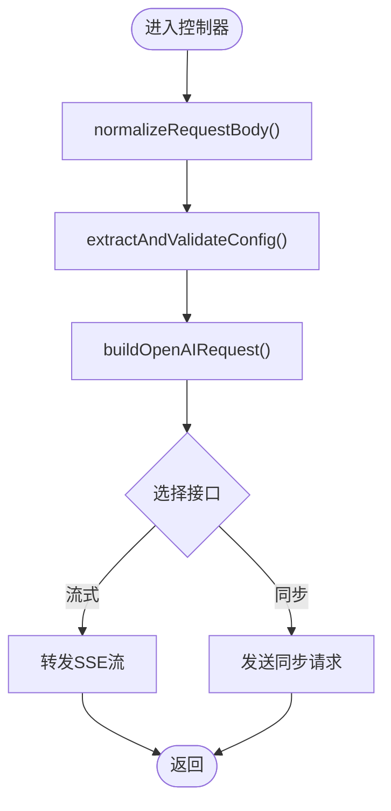
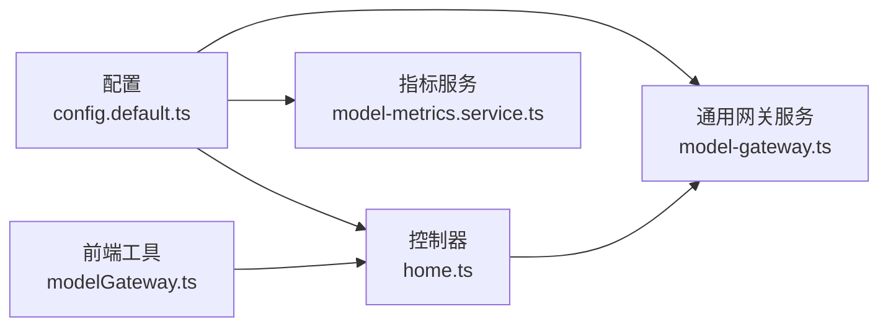

# 适配器开发

<cite>
**本文引用的文件列表**
- [model-gateway.ts](file://code-agent-backend/src/service/common/model-gateway.ts)
- [home.ts](file://code-agent-backend/src/controller/home.ts)
- [config.default.ts](file://code-agent-backend/src/config/config.default.ts)
- [configuration.ts](file://code-agent-backend/src/configuration.ts)
- [modelGateway.ts](file://fta-layout-design/src/pages/EditorPage/utils/modelGateway.ts)
- [model-metrics.service.ts](file://code-agent-backend/src/service/common/model-metrics.service.ts)
</cite>

## 目录
1. [简介](#简介)
2. [项目结构与角色定位](#项目结构与角色定位)
3. [核心组件](#核心组件)
4. [架构总览](#架构总览)
5. [详细组件分析](#详细组件分析)
6. [依赖关系分析](#依赖关系分析)
7. [性能与可靠性考量](#性能与可靠性考量)
8. [故障排查指南](#故障排查指南)
9. [结论](#结论)
10. [附录：适配器开发步骤与最佳实践](#附录适配器开发步骤与最佳实践)

## 简介
本指南面向希望为系统新增“LLM服务适配器”的开发者，目标是帮助你在不破坏现有架构的前提下，快速实现对新模型提供商的接入。你将学会：
- 如何继承并扩展通用网关服务类，覆盖关键的请求载荷构建与响应文本抽取逻辑；
- 如何利用自定义载荷参数定制请求格式，以适配非标准API；
- 如何处理不同LLM提供商的特殊认证机制与响应结构；
- 如何将适配器注入到Midway.js依赖容器，并通过配置文件激活新适配器。

## 项目结构与角色定位
- 通用网关服务位于后端服务层，负责统一封装模型调用、请求载荷构建、响应解析与流式输出等通用能力。
- 控制器层提供HTTP接口，将外部请求转发至通用网关服务，或直接代理到上游模型服务。
- 配置层集中管理模型网关的基础配置（如baseURL、apiKey、超时等），并支持按环境加载。
- 前端侧工具封装了对后端网关接口的调用，便于在编辑器页面中发起流式/同步请求。

图表来源
- [model-gateway.ts](file://code-agent-backend/src/service/common/model-gateway.ts#L1-L435)
- [home.ts](file://code-agent-backend/src/controller/home.ts#L1-L243)
- [config.default.ts](file://code-agent-backend/src/config/config.default.ts#L214-L228)
- [model-metrics.service.ts](file://code-agent-backend/src/service/common/model-metrics.service.ts#L1-L192)

章节来源
- [model-gateway.ts](file://code-agent-backend/src/service/common/model-gateway.ts#L1-L435)
- [home.ts](file://code-agent-backend/src/controller/home.ts#L1-L243)
- [config.default.ts](file://code-agent-backend/src/config/config.default.ts#L214-L228)
- [model-metrics.service.ts](file://code-agent-backend/src/service/common/model-metrics.service.ts#L1-L192)

## 核心组件
- 通用网关服务：封装请求构建、认证头添加、请求发送、响应解析与流式处理。
- 控制器：提供HTTP接口，负责参数校验、请求体规范化、上游服务代理。
- 配置：集中管理模型网关基础配置，支持从环境变量注入。
- 前端工具：封装流式与同步调用，便于在编辑器页面中集成。

章节来源
- [model-gateway.ts](file://code-agent-backend/src/service/common/model-gateway.ts#L1-L435)
- [home.ts](file://code-agent-backend/src/controller/home.ts#L1-L243)
- [config.default.ts](file://code-agent-backend/src/config/config.default.ts#L214-L228)
- [modelGateway.ts](file://fta-layout-design/src/pages/EditorPage/utils/modelGateway.ts#L182-L294)

## 架构总览
通用网关服务对外暴露统一的调用入口，内部根据配置与请求选项生成请求载荷，并通过HTTP客户端向模型服务发起请求；同时支持流式SSE输出与同步响应解析。

图表来源
- [home.ts](file://code-agent-backend/src/controller/home.ts#L38-L114)
- [modelGateway.ts](file://fta-layout-design/src/pages/EditorPage/utils/modelGateway.ts#L182-L294)

章节来源
- [home.ts](file://code-agent-backend/src/controller/home.ts#L148-L242)
- [modelGateway.ts](file://fta-layout-design/src/pages/EditorPage/utils/modelGateway.ts#L182-L294)

## 详细组件分析

### 通用网关服务（ModelGatewayService）分析
- 职责边界
  - 统一构建请求载荷（支持OpenAI风格、通用风格与自定义载荷）。
  - 统一处理响应文本抽取与用量统计。
  - 统一发起HTTP请求与SSE流式处理。
  - 提供健康检查与配置查询能力。
- 关键方法与扩展点
  - 构建请求载荷：buildRequestPayload
  - 抽取响应文本：extractTextFromModelPayload / extractTextFromStreamPayload
  - 发起请求：makeRequest
  - 流式处理：streamModel
  - 健康检查：checkHealth
  - 配置查询：getConfig

图表来源
- [model-gateway.ts](file://code-agent-backend/src/service/common/model-gateway.ts#L1-L435)

章节来源
- [model-gateway.ts](file://code-agent-backend/src/service/common/model-gateway.ts#L142-L215)
- [model-gateway.ts](file://code-agent-backend/src/service/common/model-gateway.ts#L220-L259)
- [model-gateway.ts](file://code-agent-backend/src/service/common/model-gateway.ts#L264-L412)

### 控制器（HomeController）分析
- 职责边界
  - 对外提供HTTP接口，负责参数校验、请求体规范化、上游服务代理与SSE响应。
- 关键流程
  - normalizeRequestBody：将字符串或对象规范化为请求体。
  - extractAndValidateConfig：从请求体或配置中提取并校验apiKey/baseURL/model。
  - buildOpenAIRequest：确保消息数组与system消息存在。
  - model-gateway：流式代理，转发SSE。
  - model-gateway-sync：同步代理，返回完整响应。

图表来源
- [home.ts](file://code-agent-backend/src/controller/home.ts#L38-L114)
- [home.ts](file://code-agent-backend/src/controller/home.ts#L148-L242)

章节来源
- [home.ts](file://code-agent-backend/src/controller/home.ts#L1-L243)

### 配置（config.default.ts）分析
- 职责边界
  - 集中管理模型网关配置，支持从环境变量注入baseURL、apiKey、model、timeout、temperature等。
- 关键点
  - modelGateway.default：默认网关配置。
  - 支持通过process.env.xxx动态注入。

章节来源
- [config.default.ts](file://code-agent-backend/src/config/config.default.ts#L214-L228)

### 前端工具（modelGateway.ts）分析
- 职责边界
  - 封装编辑器页面对模型网关的调用，支持流式与同步两种模式。
- 关键点
  - 流式：解析SSE数据块，提取事件。
  - 同步：直接获取完整响应并解析事件。

章节来源
- [modelGateway.ts](file://fta-layout-design/src/pages/EditorPage/utils/modelGateway.ts#L182-L294)

## 依赖关系分析
- 通用网关服务依赖Midway装饰器与配置注入，使用axios发起HTTP请求。
- 控制器依赖通用网关服务与axios，负责参数校验与上游代理。
- 配置通过@Config装饰器注入到服务与控制器。
- 指标服务同样依赖通用网关配置，用于拉取Prometheus指标。

图表来源
- [model-gateway.ts](file://code-agent-backend/src/service/common/model-gateway.ts#L1-L435)
- [home.ts](file://code-agent-backend/src/controller/home.ts#L1-L243)
- [config.default.ts](file://code-agent-backend/src/config/config.default.ts#L214-L228)
- [model-metrics.service.ts](file://code-agent-backend/src/service/common/model-metrics.service.ts#L1-L192)

章节来源
- [model-gateway.ts](file://code-agent-backend/src/service/common/model-gateway.ts#L1-L435)
- [home.ts](file://code-agent-backend/src/controller/home.ts#L1-L243)
- [config.default.ts](file://code-agent-backend/src/config/config.default.ts#L214-L228)
- [model-metrics.service.ts](file://code-agent-backend/src/service/common/model-metrics.service.ts#L1-L192)

## 性能与可靠性考量
- 超时控制
  - 通用网关服务与控制器均设置了合理的超时时间，避免长时间阻塞。
- 流式处理
  - 通用网关服务支持SSE流式输出，前端工具解析SSE数据块，提升交互体验。
- 健康检查
  - 提供checkHealth接口，便于快速判断模型服务可用性。
- 指标采集
  - 指标服务基于通用网关配置，尝试拉取Prometheus指标，便于监控。

章节来源
- [model-gateway.ts](file://code-agent-backend/src/service/common/model-gateway.ts#L195-L215)
- [model-gateway.ts](file://code-agent-backend/src/service/common/model-gateway.ts#L304-L412)
- [home.ts](file://code-agent-backend/src/controller/home.ts#L148-L242)
- [model-metrics.service.ts](file://code-agent-backend/src/service/common/model-metrics.service.ts#L101-L156)

## 故障排查指南
- 常见问题
  - 未配置baseURL或apiKey：通用网关服务与控制器均会抛出明确错误提示。
  - 请求体格式不正确：控制器会对字符串请求体进行JSON解析，失败时抛错。
  - 响应无法解析：通用网关服务内置多路径抽取策略，若仍失败，返回错误信息。
- 排查建议
  - 检查环境变量OPENAI_BASE_URL、OPENAI_API_KEY、OPENAI_MODEL等是否正确注入。
  - 使用同步接口先验证响应结构，再切换到流式接口。
  - 查看控制器与通用网关服务的日志输出，定位具体环节。

章节来源
- [model-gateway.ts](file://code-agent-backend/src/service/common/model-gateway.ts#L195-L215)
- [home.ts](file://code-agent-backend/src/controller/home.ts#L38-L114)
- [home.ts](file://code-agent-backend/src/controller/home.ts#L148-L242)

## 结论
通过通用网关服务与控制器的协作，系统实现了对多种模型提供商的统一接入。对于新增适配器，只需关注请求载荷构建与响应文本抽取两个关键点，并结合配置与依赖注入机制即可快速完成集成。

## 附录：适配器开发步骤与最佳实践

### 一、继承与扩展ModelGatewayService
- 目标
  - 新增一个适配器类，继承通用网关服务，覆盖以下方法：
    - buildRequestPayload：根据新提供商的API要求，构造请求载荷。
    - extractTextFromModelPayload：从新提供商的响应中抽取文本内容。
    - 可选：重写makeRequest或streamModel，以适配特殊的认证头或SSE格式。
- 注意事项
  - 保持与通用网关服务一致的输入输出契约（ModelRequestOptions、ModelResponse）。
  - 在extractTextFromModelPayload中，优先支持新提供商的典型字段路径，必要时提供回退策略。
  - 若新提供商的SSE格式与通用实现不一致，可在streamModel中重写解析逻辑。

章节来源
- [model-gateway.ts](file://code-agent-backend/src/service/common/model-gateway.ts#L142-L215)
- [model-gateway.ts](file://code-agent-backend/src/service/common/model-gateway.ts#L220-L259)
- [model-gateway.ts](file://code-agent-backend/src/service/common/model-gateway.ts#L264-L412)

### 二、使用customPayload定制请求载荷
- 场景
  - 当新提供商的API不支持标准字段名或消息结构时，可通过customPayload传入自定义字段。
- 实现要点
  - 在buildRequestPayload中，将customPayload合并到最终载荷，并确保必要字段（如prompt）的存在。
  - 若customPayload中已包含prompt，可避免重复注入。
- 示例参考
  - 通用网关服务已内置三种载荷变体：OpenAI风格、通用风格、自定义风格。你可以在此基础上扩展更多变体。

章节来源
- [model-gateway.ts](file://code-agent-backend/src/service/common/model-gateway.ts#L142-L189)

### 三、处理不同LLM提供商的特殊认证机制
- 常见认证方式
  - Bearer Token：通用网关服务默认在Authorization头中添加Bearer token。
  - 其他头部：如X-API-Key、X-Auth-Token等，可在重写的makeRequest中添加。
  - 查询参数：若提供商要求通过查询参数传递密钥，可在重写的makeRequest中拼接到URL。
- 实施建议
  - 在适配器中重写makeRequest，按提供商要求设置认证头或查询参数。
  - 若提供商需要额外签名或加密，可在适配器中引入相应的签名逻辑。

章节来源
- [model-gateway.ts](file://code-agent-backend/src/service/common/model-gateway.ts#L195-L215)

### 四、适配器注入到Midway.js依赖容器
- 步骤
  - 在适配器类上使用@Provide()与@Scope(...)装饰器，确保生命周期与作用域符合预期。
  - 在配置文件中为适配器提供独立的配置项（如modelGateway.myProvider），以便在运行时切换。
  - 在需要使用适配器的地方，通过依赖注入获取实例（如在控制器或业务服务中）。
- 参考
  - 通用网关服务通过@Provide()与@Config('modelGateway.default')注入配置。
  - 项目配置文件导入路径在configuration.ts中声明。

章节来源
- [model-gateway.ts](file://code-agent-backend/src/service/common/model-gateway.ts#L36-L41)
- [configuration.ts](file://code-agent-backend/src/configuration.ts#L39-L42)
- [config.default.ts](file://code-agent-backend/src/config/config.default.ts#L214-L228)

### 五、通过配置文件激活新适配器
- 方法
  - 在配置文件中新增一个provider配置段（如modelGateway.myProvider），填入baseURL、apiKey、model、timeout等。
  - 在适配器类中使用@Config('modelGateway.myProvider')读取该配置。
  - 在控制器或业务代码中，按需切换使用通用网关服务或新适配器实例。
- 注意
  - 确保环境变量与配置文件中的键名一致，避免遗漏。
  - 若新提供商需要特殊认证头，可在适配器中重写makeRequest以满足需求。

章节来源
- [config.default.ts](file://code-agent-backend/src/config/config.default.ts#L214-L228)
- [model-gateway.ts](file://code-agent-backend/src/service/common/model-gateway.ts#L36-L41)

### 六、响应结构与文本抽取的最佳实践
- 建议
  - 在extractTextFromModelPayload中，按“最可能→次可能→回退”的顺序遍历字段路径，提高兼容性。
  - 对于数组类型的choices/message/content，优先选取第一条有效内容。
  - 对于多模态响应，优先抽取text类型的内容片段。
- 参考
  - 通用网关服务已内置多条路径抽取策略，可作为扩展的参考模板。

章节来源
- [model-gateway.ts](file://code-agent-backend/src/service/common/model-gateway.ts#L46-L111)