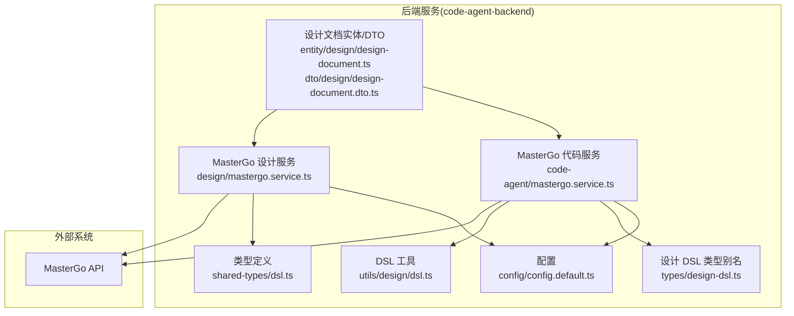
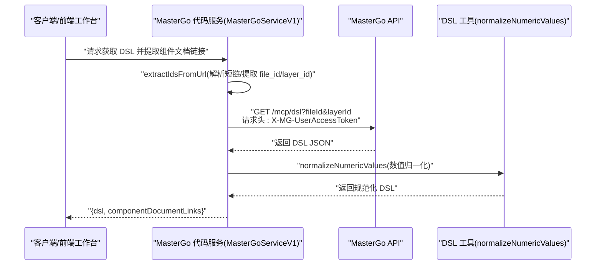
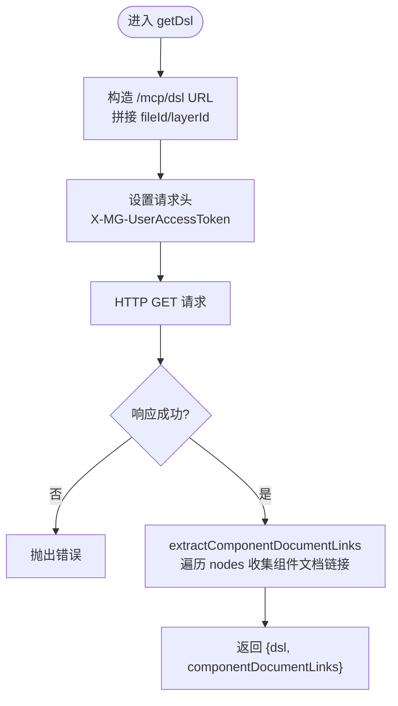
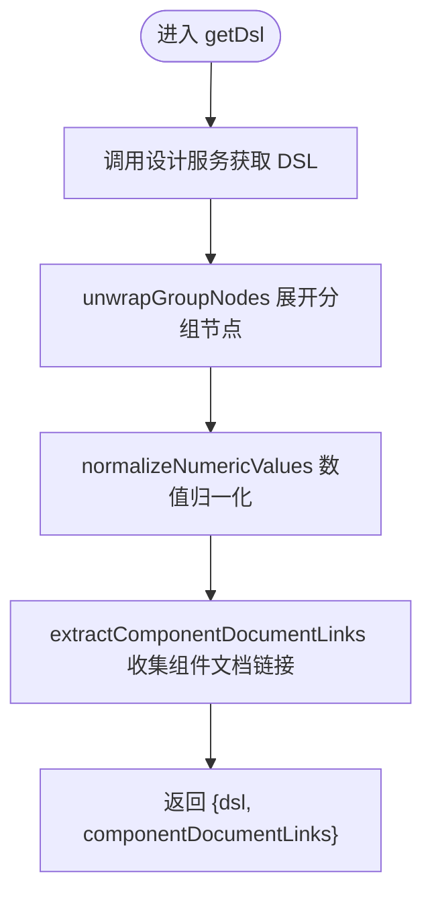
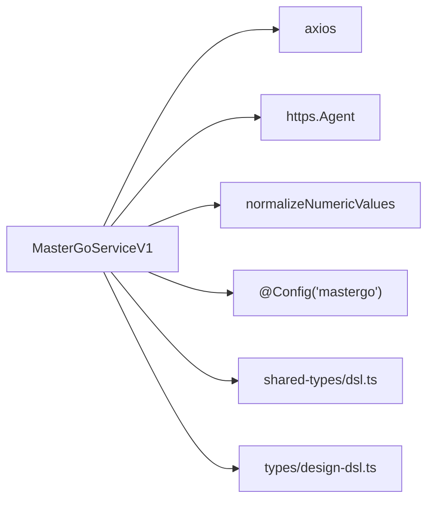

# MasterGo 集成

<cite>
**本文引用的文件**
- [code-agent-backend/src/service/design/mastergo.service.ts](file://code-agent-backend/src/service/design/mastergo.service.ts)
- [code-agent-backend/src/service/code-agent/mastergo.service.ts](file://code-agent-backend/src/service/code-agent/mastergo.service.ts)
- [code-agent-backend/src/utils/design/dsl.ts](file://code-agent-backend/src/utils/design/dsl.ts)
- [shared-types/src/dsl.ts](file://shared-types/src/dsl.ts)
- [code-agent-backend/src/types/design-dsl.ts](file://code-agent-backend/src/types/design-dsl.ts)
- [code-agent-backend/src/config/config.default.ts](file://code-agent-backend/src/config/config.default.ts)
- [code-agent-backend/src/entity/design/design-document.ts](file://code-agent-backend/src/entity/design/design-document.ts)
- [code-agent-backend/src/dto/design/design-document.dto.ts](file://code-agent-backend/src/dto/design/design-document.dto.ts)
- [MasterGoDSL.md](file://MasterGoDSL.md)
- [README.md](file://README.md)
</cite>

## 目录
1. [简介](#简介)
2. [项目结构](#项目结构)
3. [核心组件](#核心组件)
4. [架构总览](#架构总览)
5. [详细组件分析](#详细组件分析)
6. [依赖分析](#依赖分析)
7. [性能考量](#性能考量)
8. [故障排查指南](#故障排查指南)
9. [结论](#结论)
10. [附录](#附录)

## 简介
本文件面向需要在后端系统中集成 MasterGo 设计稿接入能力的开发者，系统性说明如何通过 MasterGo API 获取设计 DSL，并围绕 DSL 结构解析、组件文档链接提取、服务初始化与调用、错误处理与安全注意事项、扩展指南与调试技巧等方面提供完整说明。文档同时给出 MasterGoServiceV1 的初始化与调用示例，覆盖无效 URL 格式等常见错误场景，并提供扩展新 DSL 处理规则与支持其他设计工具的实践建议。

## 项目结构
与 MasterGo 集成相关的关键文件分布如下：
- 设计侧 MasterGo 服务：负责从 MasterGo 拉取 DSL 并提取组件文档链接
- 代码侧 MasterGo 服务：在设计 DSL 基础上进行分组展开、数值归一化等处理
- DSL 类型定义：共享的 DSL 数据模型，确保前后端一致
- 配置：包含 MasterGo 的 Base URL 与令牌配置
- 实体与 DTO：设计文档实体与创建 DTO，承载 MasterGo URL 字段
- 文档与 README：提供了整体架构与设计稿到代码流程说明

图表来源
- [code-agent-backend/src/service/design/mastergo.service.ts](file://code-agent-backend/src/service/design/mastergo.service.ts#L1-L137)
- [code-agent-backend/src/service/code-agent/mastergo.service.ts](file://code-agent-backend/src/service/code-agent/mastergo.service.ts#L1-L187)
- [code-agent-backend/src/utils/design/dsl.ts](file://code-agent-backend/src/utils/design/dsl.ts#L1-L45)
- [shared-types/src/dsl.ts](file://shared-types/src/dsl.ts#L1-L163)
- [code-agent-backend/src/types/design-dsl.ts](file://code-agent-backend/src/types/design-dsl.ts#L1-L21)
- [code-agent-backend/src/config/config.default.ts](file://code-agent-backend/src/config/config.default.ts#L206-L213)
- [code-agent-backend/src/entity/design/design-document.ts](file://code-agent-backend/src/entity/design/design-document.ts#L1-L47)
- [code-agent-backend/src/dto/design/design-document.dto.ts](file://code-agent-backend/src/dto/design/design-document.dto.ts#L1-L54)

章节来源
- [README.md](file://README.md#L1-L66)

## 核心组件
- MasterGo 设计服务（MasterGoService）
  - 功能：从 MasterGo 拉取 DSL，解析短链，提取组件文档链接
  - 关键方法：extractIdsFromUrl、getDsl、getDslFromUrl
  - 错误处理：URL 格式校验、短链跳转处理
- MasterGo 代码服务（MasterGoServiceV1）
  - 功能：在设计服务基础上，对 DSL 进行分组展开与数值归一化，并提取组件文档链接
  - 关键方法：unwrapGroupNodes、normalizeNumericValues、getDsl、getDslFromUrl
- DSL 工具（normalizeNumericValues）
  - 功能：递归处理 DSL 数值字段，保留两位小数
- 类型定义
  - shared-types/dsl.ts：DSL 节点、样式、布局等核心类型
  - types/design-dsl.ts：DSL 类型别名，便于跨模块使用
- 配置
  - config.default.ts：包含 mastergo.baseUrl 与 mastergo.token
- 设计文档实体/DTO
  - design-document.ts：包含 mastergoUrl 字段
  - design-document.dto.ts：创建设计文档时携带 mastergoUrl

章节来源
- [code-agent-backend/src/service/design/mastergo.service.ts](file://code-agent-backend/src/service/design/mastergo.service.ts#L1-L137)
- [code-agent-backend/src/service/code-agent/mastergo.service.ts](file://code-agent-backend/src/service/code-agent/mastergo.service.ts#L1-L187)
- [code-agent-backend/src/utils/design/dsl.ts](file://code-agent-backend/src/utils/design/dsl.ts#L1-L45)
- [shared-types/src/dsl.ts](file://shared-types/src/dsl.ts#L1-L163)
- [code-agent-backend/src/types/design-dsl.ts](file://code-agent-backend/src/types/design-dsl.ts#L1-L21)
- [code-agent-backend/src/config/config.default.ts](file://code-agent-backend/src/config/config.default.ts#L206-L213)
- [code-agent-backend/src/entity/design/design-document.ts](file://code-agent-backend/src/entity/design/design-document.ts#L1-L47)
- [code-agent-backend/src/dto/design/design-document.dto.ts](file://code-agent-backend/src/dto/design/design-document.dto.ts#L1-L54)

## 架构总览
下图展示了从 MasterGo 拉取 DSL 到后端服务处理与后续流程的关系。

图表来源
- [code-agent-backend/src/service/code-agent/mastergo.service.ts](file://code-agent-backend/src/service/code-agent/mastergo.service.ts#L112-L186)
- [code-agent-backend/src/utils/design/dsl.ts](file://code-agent-backend/src/utils/design/dsl.ts#L1-L45)

章节来源
- [README.md](file://README.md#L32-L66)

## 详细组件分析

### MasterGo 设计服务（MasterGoService）
- 身份验证与请求头
  - 使用配置项 mastergo.token 注入请求头 X-MG-UserAccessToken
  - 统一 Content-Type 与 Accept
- Base URL 配置与校验
  - 从 mastergo.baseUrl 读取基础地址
  - 使用 URL 构造器进行格式校验，非法格式抛出错误
- DSL 获取与组件文档链接提取
  - getDsl：拼接 /mcp/dsl，带 fileId、layerId 参数，设置请求头与超时
  - extractComponentDocumentLinks：遍历 dsl.nodes，收集 componentInfo.componentSetDocumentLink[0]，去重后返回
- URL 解析与短链处理
  - extractIdsFromUrl：若 URL 包含 /goto/，先发起一次短链跳转请求，获取真实目标 URL，再从中解析 file_id 与 layer_id

图表来源
- [code-agent-backend/src/service/design/mastergo.service.ts](file://code-agent-backend/src/service/design/mastergo.service.ts#L106-L136)

章节来源
- [code-agent-backend/src/service/design/mastergo.service.ts](file://code-agent-backend/src/service/design/mastergo.service.ts#L1-L137)
- [code-agent-backend/src/config/config.default.ts](file://code-agent-backend/src/config/config.default.ts#L206-L213)

### MasterGo 代码服务（MasterGoServiceV1）
- 初始化与配置
  - 读取 mastergo.baseUrl 与 mastergo.token
  - 统一请求头与 Base URL 校验逻辑同设计服务
- DSL 处理流程
  - getDsl：先按设计服务拉取 DSL
  - unwrapGroupNodes：递归展开 GROUP 节点，合并相对布局偏移
  - normalizeNumericValues：对 DSL 中数值字段进行数值精度处理（保留两位小数）
  - extractComponentDocumentLinks：同样提取组件文档链接
- URL 解析与短链处理
  - 与设计服务一致，支持短链跳转解析

图表来源
- [code-agent-backend/src/service/code-agent/mastergo.service.ts](file://code-agent-backend/src/service/code-agent/mastergo.service.ts#L150-L186)
- [code-agent-backend/src/utils/design/dsl.ts](file://code-agent-backend/src/utils/design/dsl.ts#L1-L45)

章节来源
- [code-agent-backend/src/service/code-agent/mastergo.service.ts](file://code-agent-backend/src/service/code-agent/mastergo.service.ts#L1-L187)
- [code-agent-backend/src/utils/design/dsl.ts](file://code-agent-backend/src/utils/design/dsl.ts#L1-L45)

### DSL 结构与类型
- DSL 类型定义
  - DSLData：包含 styles 与 nodes
  - DSLNode：FRAME、INSTANCE、TEXT、PATH、GROUP、LAYER 等节点类型
  - DSLLayoutStyle：包含 width、height、relativeX、relativeY、left、top、rotate 等布局属性
- 设计 DSL 类型别名
  - types/design-dsl.ts 导出 DSLData、DesignData 等类型别名，便于跨模块使用
- MasterGoDSL.md 提供了更深入的 DSL 归一化与清洗思路，包括溢出修正、兄弟节点遮挡处理、垃圾回收与层级重排等策略

章节来源
- [shared-types/src/dsl.ts](file://shared-types/src/dsl.ts#L1-L163)
- [code-agent-backend/src/types/design-dsl.ts](file://code-agent-backend/src/types/design-dsl.ts#L1-L21)
- [MasterGoDSL.md](file://MasterGoDSL.md#L1-L520)

### 配置与安全
- 配置项
  - mastergo.baseUrl：MasterGo API 基础地址
  - mastergo.token：用户访问令牌，注入到请求头 X-MG-UserAccessToken
- 安全与错误处理
  - URL 格式校验：非法格式抛出错误
  - HTTPS Agent：rejectUnauthorized=false 用于兼容性处理
  - 超时控制：请求超时 30000ms
  - 短链跳转：仅允许 3xx 状态码，避免跟随重定向

章节来源
- [code-agent-backend/src/config/config.default.ts](file://code-agent-backend/src/config/config.default.ts#L206-L213)
- [code-agent-backend/src/service/design/mastergo.service.ts](file://code-agent-backend/src/service/design/mastergo.service.ts#L28-L46)
- [code-agent-backend/src/service/code-agent/mastergo.service.ts](file://code-agent-backend/src/service/code-agent/mastergo.service.ts#L71-L89)

### 设计文档与 MasterGo URL
- 设计文档实体与 DTO
  - 设计文档实体包含 mastergoUrl 字段，用于记录设计稿链接
  - 设计文档 DTO 的创建参数包含 mastergoUrl，便于前端工作台提交
- 与服务集成
  - 服务在获取 DSL 时，会从 mastergoUrl 中解析 file_id 与 layer_id，再调用 /mcp/dsl

章节来源
- [code-agent-backend/src/entity/design/design-document.ts](file://code-agent-backend/src/entity/design/design-document.ts#L1-L47)
- [code-agent-backend/src/dto/design/design-document.dto.ts](file://code-agent-backend/src/dto/design/design-document.dto.ts#L1-L54)

## 依赖分析
- 组件耦合
  - MasterGoService 与 MasterGoServiceV1 共享相同的请求头与 Base URL 校验逻辑
  - MasterGoServiceV1 依赖 DSL 工具进行数值归一化
  - 两者均依赖 shared-types 的 DSL 类型定义
- 外部依赖
  - axios：HTTP 请求
  - https.Agent：HTTPS 客户端代理
  - URL 构造器：URL 格式校验与解析
- 配置依赖
  - 通过 @Config('mastergo') 注入 mastergo.baseUrl 与 mastergo.token

图表来源
- [code-agent-backend/src/service/code-agent/mastergo.service.ts](file://code-agent-backend/src/service/code-agent/mastergo.service.ts#L1-L187)
- [code-agent-backend/src/utils/design/dsl.ts](file://code-agent-backend/src/utils/design/dsl.ts#L1-L45)
- [shared-types/src/dsl.ts](file://shared-types/src/dsl.ts#L1-L163)
- [code-agent-backend/src/types/design-dsl.ts](file://code-agent-backend/src/types/design-dsl.ts#L1-L21)

章节来源
- [code-agent-backend/src/service/code-agent/mastergo.service.ts](file://code-agent-backend/src/service/code-agent/mastergo.service.ts#L1-L187)
- [code-agent-backend/src/utils/design/dsl.ts](file://code-agent-backend/src/utils/design/dsl.ts#L1-L45)
- [shared-types/src/dsl.ts](file://shared-types/src/dsl.ts#L1-L163)
- [code-agent-backend/src/types/design-dsl.ts](file://code-agent-backend/src/types/design-dsl.ts#L1-L21)

## 性能考量
- 数值归一化
  - normalizeNumericValues 对 DSL 中的数值字段进行递归处理，保留两位小数，有助于减少渲染与对比时的精度误差
- 分组展开
  - unwrapGroupNodes 将 GROUP 节点扁平化，减少后续渲染与布局计算的复杂度
- 超时与代理
  - 请求超时 30000ms，HTTPS Agent 配置用于兼容性，避免因证书问题导致阻塞
- 缓存与持久化
  - 整体平台具备 Redis/Mongo/OSS 缓存与持久化能力，可在 DSL 处理后进行缓存写入，降低重复请求成本

章节来源
- [code-agent-backend/src/utils/design/dsl.ts](file://code-agent-backend/src/utils/design/dsl.ts#L1-L45)
- [code-agent-backend/src/service/code-agent/mastergo.service.ts](file://code-agent-backend/src/service/code-agent/mastergo.service.ts#L150-L186)
- [README.md](file://README.md#L55-L66)

## 故障排查指南
- 无效 URL 格式
  - 现象：抛出“无效的URL格式”错误
  - 排查：确认 mastergo.baseUrl 是否为合法 URL（包含协议与主机名）
  - 修复：修正配置项 mastergo.baseUrl
- 短链无法解析
  - 现象：短链跳转未返回 location 或无法解析 file_id/layer_id
  - 排查：确认 URL 是否包含 /goto/，短链是否可访问；检查 maxRedirects 与 validateStatus 配置
  - 修复：使用真实目标 URL 或更换短链域名
- token 失效
  - 现象：请求返回鉴权错误
  - 排查：确认 mastergo.token 是否正确；检查令牌有效期
  - 修复：更新 mastergo.token
- 网络连接问题
  - 现象：请求超时或连接失败
  - 排查：检查网络连通性；确认 HTTPS 代理配置；适当增加超时时间
  - 修复：改善网络环境或调整代理设置
- 组件文档链接缺失
  - 现象：extractComponentDocumentLinks 返回为空
  - 排查：确认 DSL 中是否存在 componentInfo.componentSetDocumentLink
  - 修复：在设计稿中补充组件集合文档链接

章节来源
- [code-agent-backend/src/service/design/mastergo.service.ts](file://code-agent-backend/src/service/design/mastergo.service.ts#L28-L46)
- [code-agent-backend/src/service/code-agent/mastergo.service.ts](file://code-agent-backend/src/service/code-agent/mastergo.service.ts#L112-L147)

## 结论
通过 MasterGoService 与 MasterGoServiceV1，后端能够稳定地从 MasterGo 拉取 DSL，并在设计服务的基础上进行分组展开与数值归一化，最终输出可用于后续标注、PRD 生成与代码生成的标准化 DSL。配合组件文档链接提取与完善的错误处理与安全配置，开发者可以快速集成 MasterGo 设计稿接入流程，并在此基础上扩展新的 DSL 处理规则与支持其他设计工具。

## 附录

### 初始化与调用示例（MasterGoServiceV1）
- 初始化
  - 通过 @Provide() 与 @Scope(ScopeEnum.Singleton) 注册为单例服务
  - 通过 @Config('mastergo') 注入 mastergo.baseUrl 与 mastergo.token
- 调用流程
  - getDslFromUrl(mastergoUrl)：解析 URL -> 拉取 DSL -> 展开分组 -> 数值归一化 -> 提取组件文档链接
  - getDsl(fileId, layerId)：直接拉取 DSL -> 展开分组 -> 数值归一化 -> 提取组件文档链接
- 错误处理
  - URL 格式非法、短链无跳转、缺少 file_id/layer_id、请求超时、鉴权失败等均有明确错误提示

章节来源
- [code-agent-backend/src/service/code-agent/mastergo.service.ts](file://code-agent-backend/src/service/code-agent/mastergo.service.ts#L53-L186)
- [code-agent-backend/src/config/config.default.ts](file://code-agent-backend/src/config/config.default.ts#L206-L213)

### 扩展指南：新增 DSL 处理规则与支持其他设计工具
- 新增 DSL 处理规则
  - 在 MasterGoServiceV1 中新增处理函数，如 unwrapGroupNodes 的扩展版本或新的布局修正算法
  - 在 normalizeNumericValues 基础上扩展更多数值处理策略
- 支持其他设计工具
  - 仿照 MasterGoServiceV1 的结构，新增对应工具的服务类，统一请求头与 Base URL 校验逻辑
  - 在 extractComponentDocumentLinks 中扩展对其他工具组件文档链接的提取策略
  - 在 DTO 与实体中新增对应字段，以便前端工作台提交与存储

章节来源
- [code-agent-backend/src/service/code-agent/mastergo.service.ts](file://code-agent-backend/src/service/code-agent/mastergo.service.ts#L1-L187)
- [code-agent-backend/src/utils/design/dsl.ts](file://code-agent-backend/src/utils/design/dsl.ts#L1-L45)
- [MasterGoDSL.md](file://MasterGoDSL.md#L1-L520)