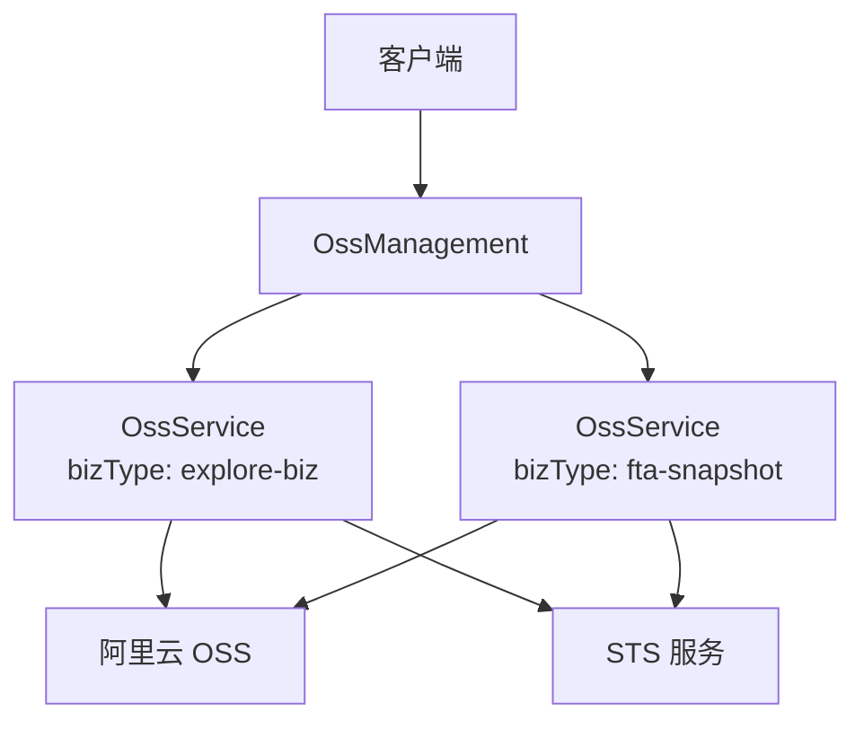
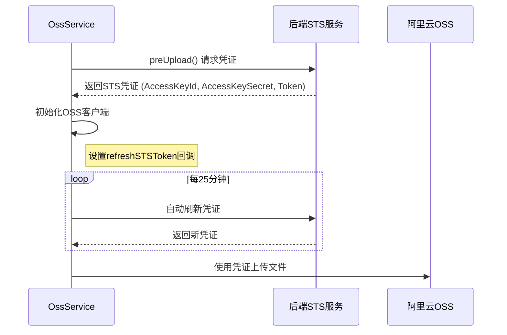
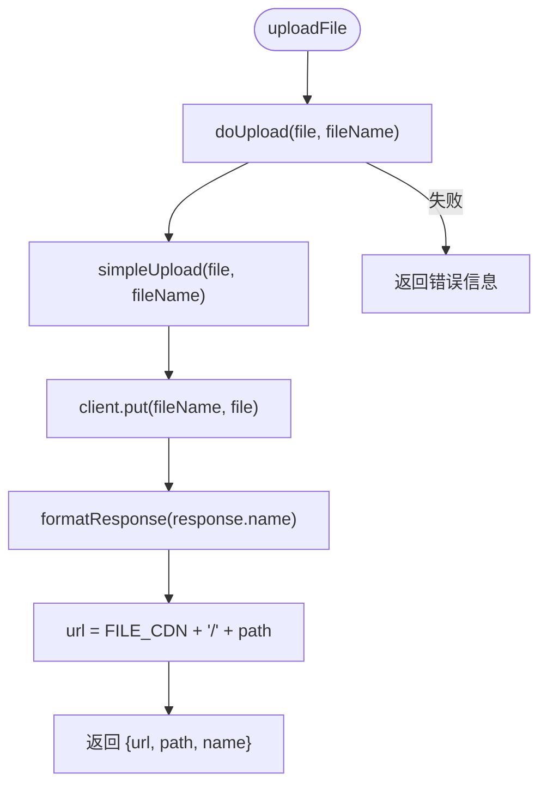

# OSS 文件存储集成

<cite>
**本文档引用的文件**
- [ossService.ts](file://code-agent-backend/src/service/oss/ossService.ts#L1-L138)
- [index.ts](file://code-agent-backend/src/service/oss/index.ts#L1-L21)
- [config.ts](file://code-agent-backend/src/service/oss/config.ts#L1-L3)
- [design-dsl.ts](file://code-agent-backend/src/service/code-agent/design-dsl.ts#L11)
</cite>

## 目录
1. [简介](#简介)
2. [核心组件](#核心组件)
3. [架构概览](#架构概览)
4. [详细组件分析](#详细组件分析)
5. [依赖分析](#依赖分析)
6. [性能考虑](#性能考虑)
7. [故障排除指南](#故障排除指南)
8. [结论](#结论)

## 简介
本文档详细描述了系统中阿里云 OSS（对象存储服务）的集成机制，重点阐述了文件上传与管理的安全实现。文档涵盖了 `OssService` 如何通过 STS 临时凭证进行安全访问，包括 `preUpload` 获取上传权限和 `refreshSTSToken` 自动刷新令牌的实现逻辑。同时，介绍了 `bizType`（如 'explore-biz'、'fta-snapshot'）的作用及多业务隔离设计，以及文件上传 (`uploadFile`) 的完整流程。此外，还解释了 `OssManagement` 类的单例模式和多实例管理机制。

## 核心组件
核心组件包括 `OssService` 和 `OssManagement` 类。`OssService` 负责处理与阿里云 OSS 的具体交互，包括获取临时凭证、初始化 OSS 客户端、执行文件上传等。`OssManagement` 类则采用单例模式管理多个 `OssService` 实例，为不同的业务类型 (`bizType`) 提供隔离的文件存储服务。

**本节来源**
- [ossService.ts](file://code-agent-backend/src/service/oss/ossService.ts#L26-L138)
- [index.ts](file://code-agent-backend/src/service/oss/index.ts#L8-L21)

## 架构概览
系统通过 `OssManagement` 单例类统一管理 OSS 服务。该类在初始化时为预定义的业务类型（`explore-biz` 和 `fta-snapshot`）创建并存储对应的 `OssService` 实例。当需要进行文件操作时，通过 `getOssService(bizType)` 方法获取特定业务的 `OssService` 实例，从而实现业务隔离。

**图表来源**
- [index.ts](file://code-agent-backend/src/service/oss/index.ts#L6-L21)
- [ossService.ts](file://code-agent-backend/src/service/oss/ossService.ts#L26-L138)

## 详细组件分析

### OssService 分析
`OssService` 是与阿里云 OSS 交互的核心类。

#### 初始化与 STS 凭证
`OssService` 在构造函数中调用 `init()` 方法。该方法首先调用 `preUpload()` 向后端服务（`https://boss.amh-group.com/ps-admin-app/file/preUpload`）请求 STS 临时凭证。获取到凭证后，使用 `getOssClient()` 方法初始化 `ali-oss` 客户端。关键的安全特性是 `refreshSTSToken` 回调函数，它会在凭证即将过期时（每25分钟）自动调用 `preUpload()` 获取新的凭证，确保上传操作的持续性。

**图表来源**
- [ossService.ts](file://code-agent-backend/src/service/oss/ossService.ts#L30-L62)

#### 文件上传流程
文件上传流程由 `uploadFile` 方法驱动：
1.  `uploadFile()` 调用 `doUpload()`。
2.  `doUpload()` 调用 `simpleUpload()`，使用 `ali-oss` 客户端的 `put()` 方法将文件（Buffer）上传到 OSS。
3.  上传成功后，`simpleUpload()` 调用 `formatResponse()` 格式化返回结果，将文件路径与 CDN 域名 (`https://imagecdn.ymm56.com`) 拼接生成可访问的 URL。

**图表来源**
- [ossService.ts](file://code-agent-backend/src/service/oss/ossService.ts#L103-L137)

### OssManagement 分析
`OssManagement` 类使用 Midway.js 的 `@Singleton` 装饰器实现单例模式。它在 `@Init()` 方法中初始化一个 `Map`，为每个 `bizType` 创建一个 `OssService` 实例并存储。`getOssService(bizType)` 方法提供了一个无锁的（目前设计）接口来获取对应业务的 `OssService` 实例，实现了多实例的集中管理。

**本节来源**
- [index.ts](file://code-agent-backend/src/service/oss/index.ts#L6-L21)

## 依赖分析
`OssService` 依赖于外部的 STS 服务来获取安全凭证，并依赖 `ali-oss` SDK 与阿里云 OSS 进行通信。`OssManagement` 依赖于 `OssService`。`design-dsl` 服务通过依赖注入使用 `OssManagement` 来执行文件上传任务。

**本节来源**
- [ossService.ts](file://code-agent-backend/src/service/oss/ossService.ts#L1-L2)
- [index.ts](file://code-agent-backend/src/service/oss/index.ts#L2)
- [design-dsl.ts](file://code-agent-backend/src/service/code-agent/design-dsl.ts#L11)

## 性能考虑
- **凭证刷新**：通过 `refreshSTSTokenInterval` 设置为25分钟，提前刷新30分钟有效期的 STS 令牌，避免了因凭证过期导致的上传中断，保证了服务的稳定性。
- **错误处理**：`doUpload()` 方法捕获上传过程中的异常，防止单个文件上传失败导致整个流程崩溃，提高了系统的容错性。
- **安全最佳实践**：使用 STS 临时凭证而非长期密钥，遵循了最小权限原则，即使凭证泄露，其有效期也较短，降低了安全风险。`confidential` 标记可用于区分私有和公开文件。

## 故障排除指南
- **上传失败**：检查后端 STS 服务 (`https://boss.amh-group.com/ps-admin-app/file/preUpload`) 是否正常运行，确保网络可达。查看日志中 `preUpload` 的错误信息。
- **凭证刷新失败**：确认 `refreshSTSToken` 回调逻辑是否正常执行，检查是否有网络问题或 STS 服务返回错误。
- **CDN 链接无法访问**：确认 `FILE_CDN` 配置 (`https://imagecdn.ymm56.com`) 是否正确，检查 OSS 中文件的权限设置。
- **调试日志**：在 `ossService.ts` 的 `preUpload()` 和 `doUpload()` 方法中添加 `console.log` 语句，可以查看请求参数、响应数据和错误堆栈，帮助定位问题。

**本节来源**
- [ossService.ts](file://code-agent-backend/src/service/oss/ossService.ts#L97-L98)
- [ossService.ts](file://code-agent-backend/src/service/oss/ossService.ts#L123-L127)

## 结论
该 OSS 集成方案通过 `OssService` 和 `OssManagement` 的组合，实现了安全、可靠且可扩展的文件存储功能。利用 STS 临时凭证和自动刷新机制保障了访问安全，通过 `bizType` 实现了业务隔离，单例模式的管理类确保了资源的高效利用。该设计为系统的文件上传需求提供了坚实的基础。