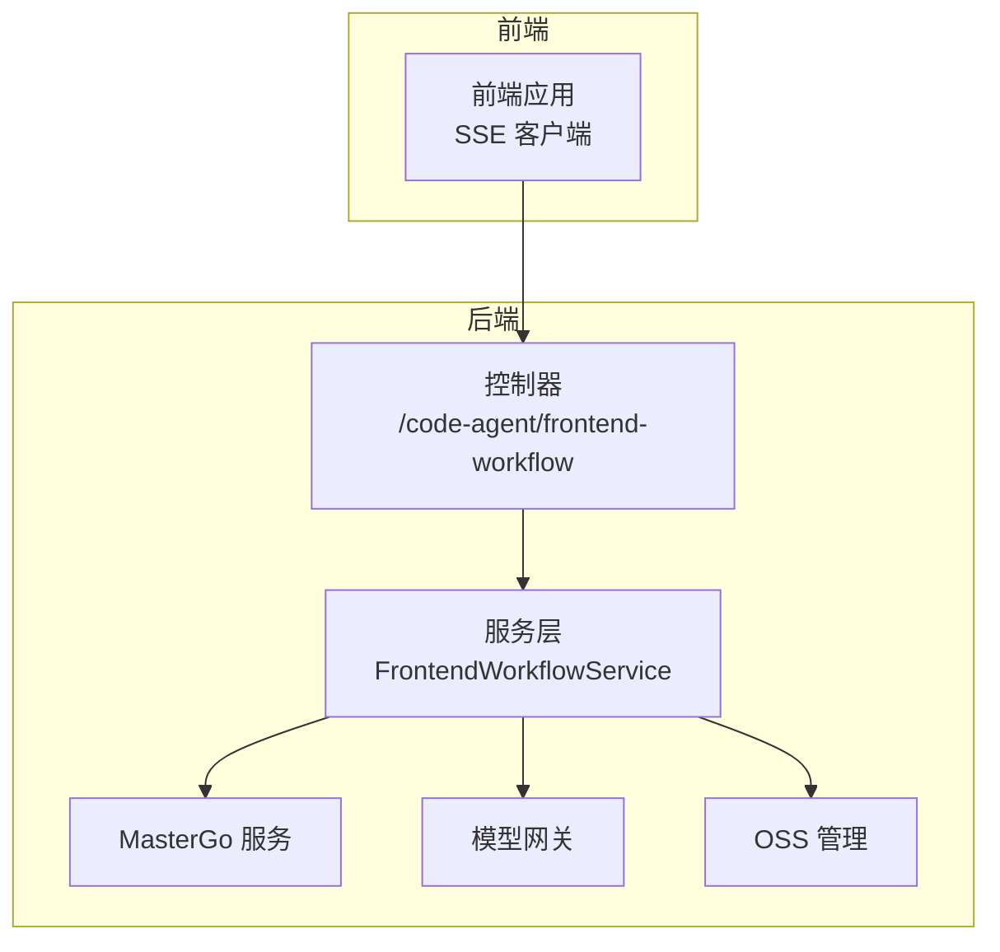
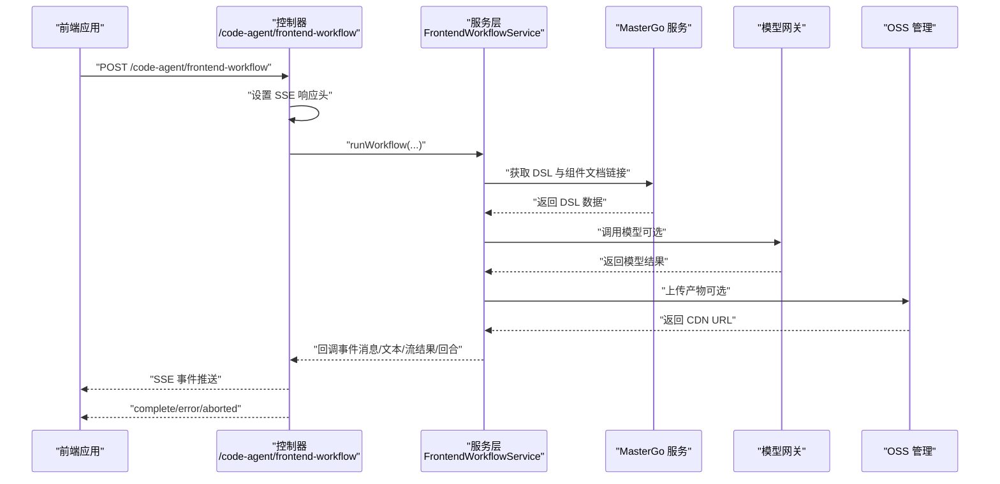
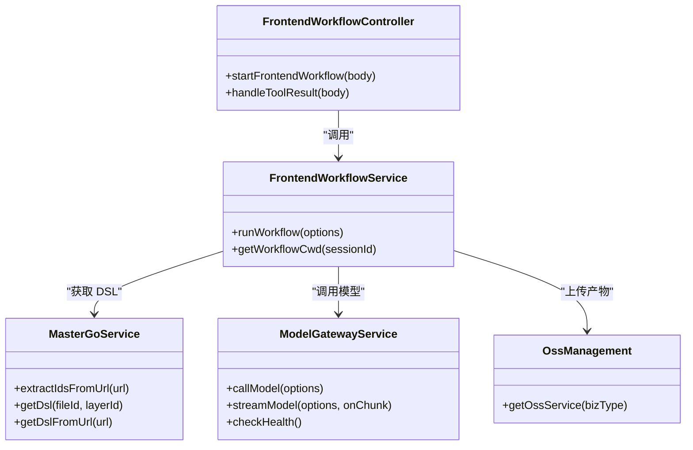

# 集成指南

<cite>
**本文引用的文件列表**
- [mastergo.service.ts](file://code-agent-backend/src/service/design/mastergo.service.ts)
- [model-gateway.ts](file://code-agent-backend/src/service/common/model-gateway.ts)
- [ossService.ts](file://code-agent-backend/src/service/oss/ossService.ts)
- [config.default.ts](file://code-agent-backend/src/config/config.default.ts)
- [frontend-workflow.ts（控制器）](file://code-agent-backend/src/controller/code-agent/frontend-workflow.ts)
- [frontend-workflow.ts（服务）](file://code-agent-backend/src/service/code-agent/frontend-workflow.ts)
- [frontend-workflow.dto.ts](file://code-agent-backend/src/dto/code-agent/frontend-workflow.dto.ts)
- [auth.ts](file://code-agent-backend/src/middleware/auth.ts)
- [oss/index.ts](file://code-agent-backend/src/service/oss/index.ts)
- [oss/config.ts](file://code-agent-backend/src/service/oss/config.ts)
- [frontend-workflow-api.md](file://code-agent-backend/docs/frontend-workflow-api.md)
- [frontend-workflow-service-usage.md](file://code-agent-backend/docs/frontend-workflow-service-usage.md)
</cite>

## 目录
1. [简介](#简介)
2. [项目结构与集成点概览](#项目结构与集成点概览)
3. [核心集成组件](#核心集成组件)
4. [架构总览](#架构总览)
5. [详细集成步骤与配置](#详细集成步骤与配置)
6. [依赖关系分析](#依赖关系分析)
7. [性能与可靠性建议](#性能与可靠性建议)
8. [故障排查与错误处理](#故障排查与错误处理)
9. [结论](#结论)
10. [附录：扩展新集成点指南](#附录扩展新集成点指南)

## 简介
本指南面向需要将系统与外部服务进行集成的开发者与运维人员，重点覆盖以下能力：
- MasterGo 设计稿接入：如何通过 API 获取 DSL 与组件文档链接，支持短链解析与鉴权头注入。
- 模型网关（model-gateway）集成：统一调用多种 LLM 提供商（如 OpenAI、Anthropic 等），支持配置优先级与流式输出。
- 阿里云 OSS 文件存储集成：通过预上传与 STS 临时凭证完成上传、CDN 回显与权限管理。
- 前端工作流（SSE）：通过控制器与服务层实现流式事件推送，便于前端实时交互。
- 安全与错误处理：鉴权中间件、超时控制、流式解析与异常上报。

## 项目结构与集成点概览
系统采用“控制器-服务-配置-中间件”的分层架构，关键集成点如下：
- MasterGo：通过服务类封装 URL 解析、鉴权头与 DSL 获取。
- 模型网关：统一构建请求载荷、发起调用、解析响应与流式输出。
- OSS：通过预上传接口获取 STS 凭证，封装上传与 CDN 回显。
- 前端工作流：控制器负责 SSE 事件推送，服务层负责业务编排与回调包装。
- 鉴权中间件：支持多来源鉴权（Cookie、Header、SSO）与本地开发模式。

图表来源
- [frontend-workflow.ts（控制器）](file://code-agent-backend/src/controller/code-agent/frontend-workflow.ts#L83-L159)
- [frontend-workflow.ts（服务）](file://code-agent-backend/src/service/code-agent/frontend-workflow.ts#L74-L223)
- [mastergo.service.ts](file://code-agent-backend/src/service/design/mastergo.service.ts#L105-L137)
- [model-gateway.ts](file://code-agent-backend/src/service/common/model-gateway.ts#L195-L243)
- [oss/index.ts](file://code-agent-backend/src/service/oss/index.ts#L1-L21)

章节来源
- [frontend-workflow.ts（控制器）](file://code-agent-backend/src/controller/code-agent/frontend-workflow.ts#L83-L159)
- [frontend-workflow.ts（服务）](file://code-agent-backend/src/service/code-agent/frontend-workflow.ts#L74-L223)

## 核心集成组件
- MasterGo 服务：负责从 MasterGo 获取 DSL 与组件文档链接，支持短链跳转与鉴权头注入。
- 模型网关：统一封装 OpenAI 风格与通用格式的请求载荷，支持流式输出与使用量提取。
- OSS 管理：通过预上传接口获取 STS 凭证，封装上传与 CDN 回显。
- 前端工作流：控制器以 SSE 推送事件，服务层编排工作流并回调前端。
- 鉴权中间件：支持多来源鉴权与本地开发模式。

章节来源
- [mastergo.service.ts](file://code-agent-backend/src/service/design/mastergo.service.ts#L105-L137)
- [model-gateway.ts](file://code-agent-backend/src/service/common/model-gateway.ts#L195-L243)
- [oss/index.ts](file://code-agent-backend/src/service/oss/index.ts#L1-L21)
- [ossService.ts](file://code-agent-backend/src/service/oss/ossService.ts#L1-L139)
- [frontend-workflow.ts（控制器）](file://code-agent-backend/src/controller/code-agent/frontend-workflow.ts#L83-L159)
- [frontend-workflow.ts（服务）](file://code-agent-backend/src/service/code-agent/frontend-workflow.ts#L74-L223)
- [auth.ts](file://code-agent-backend/src/middleware/auth.ts#L125-L160)

## 架构总览
下图展示从前端到后端的关键调用链路与集成点。

图表来源
- [frontend-workflow.ts（控制器）](file://code-agent-backend/src/controller/code-agent/frontend-workflow.ts#L83-L159)
- [frontend-workflow.ts（服务）](file://code-agent-backend/src/service/code-agent/frontend-workflow.ts#L74-L223)
- [mastergo.service.ts](file://code-agent-backend/src/service/design/mastergo.service.ts#L105-L137)
- [model-gateway.ts](file://code-agent-backend/src/service/common/model-gateway.ts#L195-L243)
- [oss/index.ts](file://code-agent-backend/src/service/oss/index.ts#L1-L21)

## 详细集成步骤与配置

### 一、MasterGo 设计稿接入
- 目标：从 MasterGo 获取 DSL 与组件文档链接，支持短链解析与鉴权头注入。
- 关键流程：
  - 从 URL 中解析 fileId 与 layerId（支持短链跳转）。
  - 通过基础 URL 与鉴权头调用 DSL 接口。
  - 遍历 DSL 节点提取组件文档链接集合。
- 配置项：
  - 基础 URL 与 Token 来源于配置中心，服务内部构造请求头。
- 安全与错误：
  - URL 格式校验与异常提示。
  - HTTPS Agent 配置与超时控制。
- API 与 DTO：
  - 控制器接收设计文档 ID，服务层组合 DSL 与标注摘要，驱动工作流。

章节来源
- [mastergo.service.ts](file://code-agent-backend/src/service/design/mastergo.service.ts#L105-L137)
- [config.default.ts](file://code-agent-backend/src/config/config.default.ts#L206-L213)
- [frontend-workflow.ts（服务）](file://code-agent-backend/src/service/code-agent/frontend-workflow.ts#L100-L125)

### 二、模型网关（通过 model-gateway）集成
- 目标：统一调用多种 LLM 提供商（OpenAI、Anthropic 等），支持流式输出与使用量提取。
- 关键流程：
  - 构建请求载荷（OpenAI 风格 messages 或通用 prompt/input）。
  - 发起 POST /chat/completions，添加 Bearer 认证头。
  - 解析响应内容与使用量，支持流式事件解析。
- 配置优先级：
  - 优先使用请求参数（apiKey/baseURL/model），其次使用配置中心。
- 错误处理：
  - 统一捕获异常并返回结构化错误信息。
- 流式输出：
  - 通过 SSE 事件推送文本片段与回合统计。

章节来源
- [model-gateway.ts](file://code-agent-backend/src/service/common/model-gateway.ts#L195-L243)
- [model-gateway.ts](file://code-agent-backend/src/service/common/model-gateway.ts#L301-L412)
- [frontend-workflow.ts（服务）](file://code-agent-backend/src/service/code-agent/frontend-workflow.ts#L74-L120)
- [frontend-workflow.ts（控制器）](file://code-agent-backend/src/controller/code-agent/frontend-workflow.ts#L196-L257)
- [config.default.ts](file://code-agent-backend/src/config/config.default.ts#L214-L229)

### 三、阿里云 OSS 文件存储集成
- 目标：通过预上传接口获取 STS 临时凭证，完成上传与 CDN 回显。
- 关键流程：
  - 预上传：向内部接口申请上传准备信息与 STS 凭证。
  - 初始化 OSS 客户端：基于 STS 凭证与 Endpoint。
  - 上传：将 Buffer 写入 OSS，返回 CDN URL 与文件名。
  - 刷新：当 STS 过期时自动刷新。
- 权限与安全：
  - 仅使用临时凭证，限制过期时间与刷新周期。
  - CDN 域名与主机域名在配置中集中管理。
- 管理与扩展：
  - OSS 管理器按业务类型维护多个服务实例，便于扩展新业务域。

章节来源
- [ossService.ts](file://code-agent-backend/src/service/oss/ossService.ts#L1-L139)
- [oss/index.ts](file://code-agent-backend/src/service/oss/index.ts#L1-L21)
- [oss/config.ts](file://code-agent-backend/src/service/oss/config.ts#L1-L3)

### 四、前端工作流（SSE）集成
- 目标：通过 SSE 将工作流事件推送到前端，支持中断、错误与完成事件。
- 关键流程：
  - 控制器设置 SSE 响应头，注册事件回调。
  - 服务层在执行过程中通过回调推送消息、文本片段、流式结果与回合统计。
  - 前端通过 EventSource 或 fetch-event-source 订阅事件。
- 中断与清理：
  - 基于 AbortController 监听客户端断开，清理待处理工具调用与会话映射。

章节来源
- [frontend-workflow.ts（控制器）](file://code-agent-backend/src/controller/code-agent/frontend-workflow.ts#L83-L159)
- [frontend-workflow.ts（控制器）](file://code-agent-backend/src/controller/code-agent/frontend-workflow.ts#L196-L367)
- [frontend-workflow.ts（服务）](file://code-agent-backend/src/service/code-agent/frontend-workflow.ts#L170-L223)
- [frontend-workflow-api.md](file://code-agent-backend/docs/frontend-workflow-api.md#L83-L161)

### 五、鉴权与安全
- 鉴权来源：
  - 自定义 Header（x-user-cookies）解析 Cookie JSON。
  - Cookie 中的 passport。
  - SSO 校验（不同环境对应不同 Host）。
  - 本地开发模式（NODE_ENV=local）。
- 中间件行为：
  - 匹配路由规则启用中间件；未通过验证抛出 401。
  - 将用户信息写入 ctx.state，并透传 user-id 到下游。

章节来源
- [auth.ts](file://code-agent-backend/src/middleware/auth.ts#L125-L160)
- [auth.ts](file://code-agent-backend/src/middleware/auth.ts#L162-L194)
- [config.default.ts](file://code-agent-backend/src/config/config.default.ts#L123-L149)

## 依赖关系分析
- 控制器依赖服务层，服务层依赖 MasterGo、模型网关与 OSS 管理器。
- 配置中心提供模型网关与 MasterGo 的基础配置。
- 鉴权中间件在控制器之前生效，保证下游安全。

图表来源
- [frontend-workflow.ts（控制器）](file://code-agent-backend/src/controller/code-agent/frontend-workflow.ts#L83-L159)
- [frontend-workflow.ts（服务）](file://code-agent-backend/src/service/code-agent/frontend-workflow.ts#L74-L223)
- [mastergo.service.ts](file://code-agent-backend/src/service/design/mastergo.service.ts#L105-L137)
- [model-gateway.ts](file://code-agent-backend/src/service/common/model-gateway.ts#L195-L243)
- [oss/index.ts](file://code-agent-backend/src/service/oss/index.ts#L1-L21)

## 性能与可靠性建议
- 超时与重试
  - 模型网关与 MasterGo 请求均设置超时，避免阻塞。
  - OSS 上传失败时返回错误对象，便于前端重试与降级。
- 流式处理
  - SSE 事件按需推送，减少前端等待；流式模型输出按块解析，降低延迟。
- 缓存与并发
  - 设计模块配置包含缓存 TTL 与并发控制，建议结合实际负载调优。
- STS 刷新
  - OSS 客户端内置 STS 刷新逻辑，建议保持合理的刷新间隔以平衡安全性与稳定性。

章节来源
- [model-gateway.ts](file://code-agent-backend/src/service/common/model-gateway.ts#L195-L243)
- [mastergo.service.ts](file://code-agent-backend/src/service/design/mastergo.service.ts#L105-L137)
- [ossService.ts](file://code-agent-backend/src/service/oss/ossService.ts#L1-L139)
- [config.default.ts](file://code-agent-backend/src/config/config.default.ts#L192-L205)

## 故障排查与错误处理
- 常见错误类型
  - 缺少模型配置参数（apiKey/baseURL）：服务层返回结构化错误。
  - 设计文档不存在或 DSL 缺失：返回错误信息与名称。
  - SSE 客户端断开：触发中断事件并清理会话。
  - 模型调用失败：统一捕获异常并返回错误信息。
- 建议排查步骤
  - 确认鉴权中间件已启用且用户信息可获取。
  - 检查模型网关配置（baseURL、apiKey、model）与环境变量。
  - 校验 MasterGo URL 与 Token，确认短链跳转与鉴权头。
  - 查看 OSS 预上传接口返回与 STS 凭证有效性。
  - 通过 SSE 事件查看 onText/onStreamResult/onTurn 等阶段输出定位问题。

章节来源
- [frontend-workflow.ts（服务）](file://code-agent-backend/src/service/code-agent/frontend-workflow.ts#L74-L120)
- [frontend-workflow.ts（服务）](file://code-agent-backend/src/service/code-agent/frontend-workflow.ts#L224-L279)
- [frontend-workflow.ts（控制器）](file://code-agent-backend/src/controller/code-agent/frontend-workflow.ts#L290-L367)
- [model-gateway.ts](file://code-agent-backend/src/service/common/model-gateway.ts#L244-L259)
- [ossService.ts](file://code-agent-backend/src/service/oss/ossService.ts#L65-L100)

## 结论
本指南提供了从 MasterGo、模型网关到 OSS 与前端工作流的完整集成路径。通过统一的配置中心、中间件与服务层封装，系统实现了跨提供商的 LLM 调用、安全的文件上传与可靠的流式事件推送。建议在生产环境中严格管理密钥与 STS 凭证，合理设置超时与并发，并通过 SSE 事件完善可观测性与用户体验。

## 附录：扩展新集成点指南
- 新增模型提供商适配器
  - 步骤：
    - 在模型网关中新增构建载荷与解析响应的分支（参考现有 OpenAI 风格与通用格式）。
    - 在配置中心增加新提供商的 baseURL、apiKey 等字段。
    - 在控制器或服务层支持通过请求参数覆盖默认配置。
  - 参考位置：
    - 请求载荷构建与响应解析：[model-gateway.ts](file://code-agent-backend/src/service/common/model-gateway.ts#L142-L190)
    - 响应内容与使用量提取：[model-gateway.ts](file://code-agent-backend/src/service/common/model-gateway.ts#L46-L111)
    - 配置优先级与环境变量：[config.default.ts](file://code-agent-backend/src/config/config.default.ts#L214-L229)
- 新增外部存储集成
  - 步骤：
    - 实现与目标存储的预授权与上传逻辑。
    - 在 OSS 管理器中注册新的业务类型实例。
    - 在服务层按需调用上传方法并回显 URL。
  - 参考位置：
    - 预上传与 STS 刷新：[ossService.ts](file://code-agent-backend/src/service/oss/ossService.ts#L65-L100)
    - 管理器注册与获取：[oss/index.ts](file://code-agent-backend/src/service/oss/index.ts#L1-L21)
- 新增前端工作流事件
  - 步骤：
    - 在控制器中扩展 SSE 事件类型与数据结构。
    - 在服务层回调中推送新事件。
    - 在前端侧订阅并处理新事件。
  - 参考位置：
    - SSE 事件推送与回调：[frontend-workflow.ts（控制器）](file://code-agent-backend/src/controller/code-agent/frontend-workflow.ts#L196-L257)
    - 服务层回调包装与中断处理：[frontend-workflow.ts（服务）](file://code-agent-backend/src/service/code-agent/frontend-workflow.ts#L170-L223)