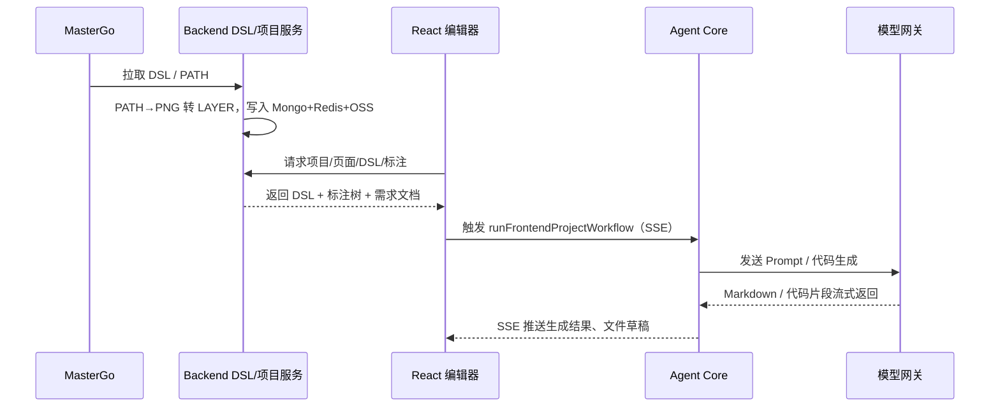

# FTA MasterGo-to-App Platform

面向企业的「设计稿 → 代码」一体化平台：涵盖 Midway 后端、React 工作台、对话回放 CLI，以及可复用的 Agent Runtime 与共享类型定义，实现设计稿接入、标注/需求文档生成、代码生成与多端协作。

---

## 项目概览

- **code-agent-backend**：Midway 3 服务，串联 MasterGo 设计稿、DSL 归一化（PATH → PNG/LAYER 缓存）、需求文档/代码生成（模型网关）、项目/页面/文档中心、Redis/Mongo/OSS 等。
- **fta-layout-design**：React 19 + Vite 工作台，内置项目绑定、组件检测编辑器（标注树、DSL 渲染、3D Inspect、PRD/OpenAPI 面板、代码生成抽屉等）及营销/演示页面。
- **fta-agent-core (@fta/agent-core)**：TypeScript Agent 运行时，暴露 `createAgentService` / `runFrontendProjectWorkflow`，提供 todo/file-draft/component-doc 等工具、前端项目工作流及 AI SDK LLM 适配。
- **shared-types (@fta/shared-types)**：DSL/标注/模型指标等共享类型，被前后端与 Agent Core 共用。
- **messages-replayer**：Node CLI，解析/回放 `messages.log`，可本地复刻或推送至 OpenAI 兼容端点。

### 架构关系

```mermaid
graph TD
  MG[MasterGo 设计稿] -->|DSL / PATH| Backend[code-agent-backend]
  Backend -->|模型网关调用&#10;SSE| LLM[LLM / OpenAI 兼容端点]
  Backend -->|项目/DSL/标注 API| Frontend[fta-layout-design 工作台]
  Backend -->|Agent 工具| Agent[@fta/agent-core]
  Backend -->|缓存/指标| Redis[(Redis)]
  Backend -->|持久化| Mongo[(MongoDB)]
  Backend -->|PNG/ZIP 输出| OSS[OSS / files-cache]
  Frontend -->|SSE / HTTP| Backend
  CLI[messages-replayer] -->|回放| LLM
  Shared[[shared-types]] --> Backend
  Shared --> Frontend
  Shared --> Agent
```

### 关键流程（设计稿到代码）



---

## 核心能力

- **设计稿治理**：MasterGo 短链解析、DSL 归一化、PATH→PNG/LAYER 转换，Redis/Mongo 双写缓存，OSS 持久化。
- **标注与版本**：标注树存储与 diff（活跃版本缓存 Redis），DSL 摘要校验、跨版本冲突检测。
- **需求 & 代码生成**：模型网关流式/非流式生成 Markdown PRD；Bull 队列 `design:code-generation` 生成代码 ZIP，`/filesCache/**` 提供下载。
- **项目/文档中心**：项目、页面、设计文档 CRUD，同步设计 DSL，状态流转管理。
- **前端工作台**：项目绑定（支持 VSCode connector/dev fallback）、DSL 可视化、3D Inspect、PRD/OpenAPI 面板、代码生成抽屉、Mock/实流切换。
- **Agent 运行时**：todo/file-draft/component-doc/file ops/LLM 调用工具集，前端项目工作流，JSONL 日志（`dist`）输出。
- **对话回放**：`messages-replayer` 解析/重放 `messages.log`，可直连任意 OpenAI 兼容端点。

---

## 仓库结构

```
amh_code_agent/
├── AGENTS.md / CLAUDE.md           # 作业规范与指南
├── README.md                       # 本文件
├── shared-types/                   # DSL/标注/模型指标类型
├── code-agent-backend/             # Midway 后端服务 (controller/service/queue/config)
├── fta-layout-design/              # React + Vite 工作台 (pages/contexts/services/utils)
├── fta-agent-core/                 # Agent runtime (prompts/tools/tests)
├── messages-replayer/              # 日志回放 CLI
├── MasterGoDSL.md                  # DSL 归一化讨论与范式
└── yarn.lock / package.json        # Yarn workspaces 根配置
```

---

## 快速开始

1. **安装依赖（根目录）**

```bash
yarn install
```

2. **启动后端**

```bash
cd code-agent-backend
npm run dev      # http://localhost:7001
```

3. **启动前端（新终端）**

```bash
cd fta-layout-design
npm run dev      # http://localhost:5173，代理到 7001
```

4. **使用 CLI（可选）**

```bash
cd messages-replayer
npm run parse
npm run replay           # 本地回放
npm run replay:live      # 需配置 MODEL_* 或 CLI 参数
```

5. **Agent Core（库模式）**

```bash
cd fta-agent-core
yarn build        # 输出 dist，可被 backend/其他项目引用
yarn typecheck
```

---

## 环境变量速览

- **Backend (`code-agent-backend`)**
  - 模型：`MODEL_ENDPOINT` / `MODEL_API_KEY` / `MODEL_NAME` / `MODEL_TIMEOUT` / `MODEL_TEMPERATURE`
  - 数据源：`MONGODB_URI`、`REDIS_HOST/PORT/DB`
  - MasterGo：`MASTERGO_BASE_URL` / `MASTERGO_TOKEN`
  - 其他：`OSS_*`、`YMM_GLOBAL_PORT`（默认 7001）
- **Frontend (`fta-layout-design`)**
  - `VITE_API_BASE_URL`（开发常用 `http://127.0.0.1:7001`）
  - `VITE_REQUEST_TIMEOUT`、`VITE_ENABLE_MOCK`
  - 可选：`VITE_DEV_WORKSPACE_INFO`、`VITE_DEV_USER_INFO`
- **Messages Replayer**
  - 复用 `MODEL_*`，或通过 `--api-url --api-key --model-name --api-timeout` 覆盖

---

## 常用命令

| 包                   | 开发/运行                                           | 质量/测试                                                                                 |
| -------------------- | --------------------------------------------------- | ----------------------------------------------------------------------------------------- |
| `code-agent-backend` | `npm run dev` / `npm run build && npm start`        | `npm run lint` / `npm run lint:fix` / `npm run prettier` / `npm run test` / `npm run cov` |
| `fta-layout-design`  | `npm run dev` / `npm run build` / `npm run preview` | （默认手测；涉逻辑可加 Vitest/RTL）                                                       |
| `fta-agent-core`     | `yarn build`                                        | `yarn typecheck`，`npx vitest`（按需）                                                    |
| `messages-replayer`  | `npm run replay` / `replay:live`                    | `npm run parse`                                                                           |

> 建议在 CLI 设置 `workdir` 为对应包目录执行命令。

---

## 开发要点

- **Backend**
  - 控制器：`/model-gateway` & `/model-gateway-sync`（模型网关 SSE/缓冲）；`/code-agent/dsl`（PATH→PNG→LAYER + Redis/Mongo 缓存）；`/code-agent/project/*`、`/code-agent/interface-data-model/*` 等 CRUD；`/code-agent/frontend-workflow` 透传 `runFrontendProjectWorkflow` SSE。
  - 服务：`mastergo.service`（短链解析）、`requirement-spec-model.service`（PRD Prompt/回退）、`design-dsl`（图片生成上传）、`design-code-generation-task.service`（Bull 队列），Redis 记录指标锁。
  - I/O：`files-cache/design/requirement-docs/`、`files-cache/design/codegen/`、`/filesCache/**` 静态访问。
- **Frontend**
  - 路由：`src/config/routes.tsx`（默认 InternalProjectPage）。
  - 状态：Valtio contexts（`ProjectContext`、`EditorPageContext`、`DesignDetectionContext`、`DSLDataContext`、`CodeGenerationContext`、`RequirementDocContext`）。
  - 网络：`src/utils/apiService.ts` 自动附加 `X-User-Cookies`，支持 `VITE_ENABLE_MOCK`。
- **Agent Core**
  - 提供工具：todo/file-draft/edit/bash/ls/grep/glob/fetch/specReader/componentDocReader 等。
  - 流程：`runFrontendProjectWorkflow` 结合项目/会话/背景任务管理，prompt 位于 `src/prompts/*`，日志 JSONL 写入 `dist`。
- **Shared Types**
  - DSL/标注/模型指标接口定义，保持前后端与 Agent 一致性。

---

## 测试与验证

- 后端：Jest/Midway，`npm run cov` 合并前必跑，重点关注 DSL/标注缓存、需求文档 SSE、Bull 队列回调、`/neo/send` 生命周期。
- 前端：默认手动走查（项目绑定、编辑器加载、需求/技术页）；新增逻辑可加 Vitest/RTL。
- Agent Core：`yarn typecheck`；按需 `npx vitest`（工具与执行器测试位于 `src/*/*.test.ts`）。
- CLI：改动后跑 `npm run parse` + `npm run replay`；`replay:live` 需真实端点。

---

## 安全与提交

- 不要提交 `files-cache/`、`run/*.json`、`logs/` 等生成物；敏感凭证务必通过环境变量注入。
- 遵循 Angular Conventional Commit（中文祈使句），示例：`feat(editor): 支持 PATH 节点转 PNG 后缓存`。
- 修改实体/装饰器后，可用 `npx midway-bin dev --ts` 刷新 Midway typings；调试 PATH→LAYER 可能写入临时图片/ZIP，记得清理。

---

## 参考资料

- `AGENTS.md`：作业规范、命令建议。
- `CLAUDE.md`：Claude Code 深度指南。
- `MasterGoDSL.md`：DSL 归一化讨论与类型定义范式。
