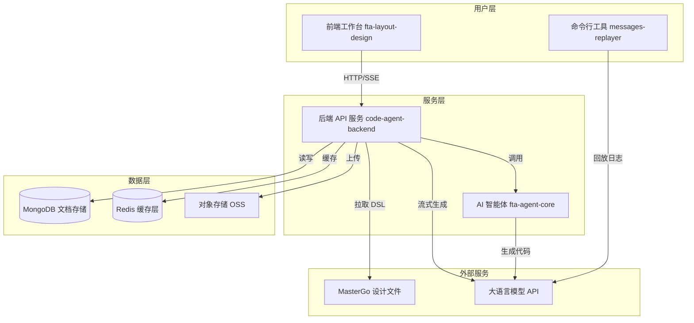
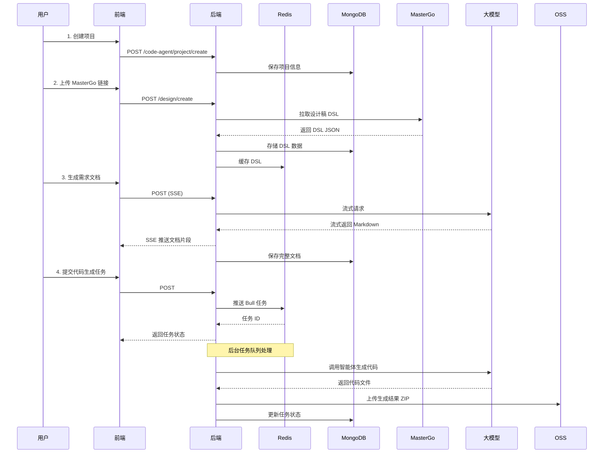
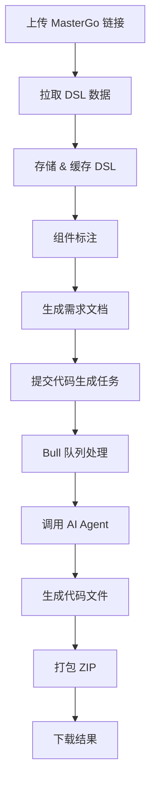

# AMH Code Agent - 完整项目 Wiki 文档

## 目录

1. [项目简介](#1-项目简介)
2. [整体架构](#2-整体架构)
3. [子项目文档](#3-子项目文档)
4. [模块职责与边界](#4-模块职责与边界)
5. [核心流程](#5-核心流程)
6. [代码目录结构](#6-代码目录结构)
7. [依赖关系说明](#7-依赖关系说明)
8. [配置与运行方式](#8-配置与运行方式)
9. [开发指南](#9-开发指南)
10. [测试规范](#10-测试规范)
11. [部署文档](#11-部署文档)
12. [FAQ](#12-faq)
13. [附录](#13-附录)

---

## 1. 项目简介

### 1.1 项目概述

**AMH Code Agent** 是一个企业级「设计稿 → 代码」转换平台，提供从设计文件到可运行代码的完整工作流。平台包含四个核心模块：

- **后端服务** (`code-agent-backend`) - 基于 Midway 3 + Egg.js 的 API 服务
- **前端应用** (`fta-layout-design`) - 基于 React 19 + Vite 的可视化工作台  
- **智能体核心** (`fta-agent-core`) - AI 驱动的代码生成引擎
- **消息回放工具** (`messages-replayer`) - 对话日志调试与回放 CLI

### 1.2 核心能力

| 能力 | 说明 |
|------|------|
| **设计稿管理** | 从 MasterGo 拉取设计数据，转换为 DSL（领域特定语言），支持版本控制与缓存 |
| **组件标注** | 可视化标注系统，支持树形结构、版本对比、多人协作 |
| **需求文档生成** | 基于大模型自动生成 PRD（产品需求文档），支持流式输出和多格式导出 |
| **代码生成** | 异步任务队列驱动，从设计稿和需求文档生成前端组件代码 |
| **项目管理** | 完整的项目/页面/文档生命周期管理，支持状态追踪和权限控制 |
| **3D 检视** | Three.js 驱动的 3D 组件层级可视化 |

### 1.3 技术亮点

- ⚡ **高性能缓存**: Redis 多层缓存 + MongoDB 持久化
- 🔄 **流式处理**: SSE（Server-Sent Events）实时推送
- 📦 **异步队列**: Bull 任务队列处理耗时操作
- 🤖 **AI 集成**: 大模型驱动的智能生成能力
- 🎨 **可视化编辑**: 3D 检视 + 实时预览
- 🔌 **可扩展架构**: IoC 容器 + 插件式工具系统

---

## 2. 整体架构

### 2.1 系统架构图



### 2.2 数据流图



### 2.3 模块交互关系

| 模块 A | 模块 B | 交互方式 | 数据格式 |
|--------|--------|----------|----------|
| fta-layout-design | code-agent-backend | HTTP REST API | JSON |
| fta-layout-design | code-agent-backend | SSE 流式连接 | text/event-stream |
| code-agent-backend | fta-agent-core | 函数调用 | TypeScript 接口 |
| code-agent-backend | MongoDB | Mongoose ODM | BSON |
| code-agent-backend | Redis | ioredis | 字符串/哈希/列表 |
| code-agent-backend | MasterGo API | HTTP | JSON |
| messages-replayer | 大模型 API | HTTP POST | JSON (OpenAI 格式) |

---

## 3. 子项目文档

### 3.1 code-agent-backend

#### 3.1.1 项目概述

基于 **Midway 3** 框架的企业级 Node.js 后端服务，提供设计稿管理、需求文档生成、组件标注、代码生成等核心 API。

#### 3.1.2 技术栈

| 技术 | 版本 | 用途 |
|------|------|------|
| Node.js | 20.19.5 | 运行时环境 |
| Midway.js | 3.11.15 | 企业级应用框架 |
| TypeScript | 4.9.4 | 类型安全 |
| MongoDB | 5.13+ | 主数据库 |
| Mongoose + Typegoose | - | ODM 框架 |
| Redis | 4.28+ | 缓存与队列 |
| Bull | 4.10.0 | 任务队列 |
| Egg.js | 2.37.0 | 底层 Web 框架 |

#### 3.1.3 目录结构

```
code-agent-backend/
├── src/
│   ├── controller/           # 控制器层
│   │   ├── design/          # 设计稿相关 API
│   │   ├── code-agent/      # 项目管理 & DSL 工具
│   │   └── neovate/         # AI 智能体端点
│   ├── service/             # 业务逻辑层
│   │   ├── design/          # 设计稿、标注、需求文档
│   │   ├── code-agent/      # 项目、DSL、文档管理
│   │   ├── common/          # 通用服务
│   │   ├── oss/             # 对象存储
│   │   └── neovate-code/    # AI 智能体服务
│   ├── entity/              # 数据模型
│   ├── dto/                 # 数据传输对象
│   ├── queue/               # 任务队列处理器
│   ├── middleware/          # 中间件
│   ├── utils/               # 工具函数
│   ├── types/               # TypeScript 类型定义
│   └── config/              # 配置文件
├── test/                    # 测试文件
├── bootstrap.js             # 启动入口
├── start.sh                 # 启动脚本
└── package.json
```

#### 3.1.4 核心服务说明

**DesignDocumentService** - 设计稿文档管理服务
**DesignComponentAnnotationService** - 组件标注服务
**DesignRequirementDocumentService** - 需求文档生成服务
**DesignCodeGenerationTaskService** - 代码生成任务服务
**DesignDSLService** - DSL 处理工具服务
**ProjectService** - 项目管理服务

#### 3.1.5 主要 API 端点

| 端点 | 方法 | 功能 |
|------|------|------|
| /design/list | GET | 获取设计稿列表 |
| /design/create | POST | 创建设计稿 |
| /design/:id/annotations | GET/POST | 组件标注管理 |
| /design/:id/requirement-docs | POST | 生成需求文档（SSE） |
| /design/:id/code-generation | POST | 提交代码生成任务 |
| /code-agent/project/* | CRUD | 项目管理 |
| /neo/send | POST | AI 智能体端点（SSE） |

---

### 3.2 fta-layout-design

#### 3.2.1 项目概述

基于 **React 19** 和 **Vite 5** 的现代化前端应用，提供设计稿可视化编辑、组件检测、3D 检视等功能。

#### 3.2.2 技术栈

| 技术 | 版本 | 用途 |
|------|------|------|
| React | 19 | UI 框架 |
| TypeScript | 5.5.3 | 类型安全 |
| Vite | 5.4.0 | 构建工具 |
| Ant Design | 5.12.0 | UI 组件库 |
| Valtio | 1.13.0 | 状态管理 |
| Three.js | 0.180.0 | 3D 渲染 |
| React Router | 7.9.1 | 路由管理 |
| Lexical | 0.35.0 | 富文本编辑器 |

#### 3.2.3 目录结构

```
fta-layout-design/
├── src/
│   ├── pages/               # 页面组件
│   │   ├── HomePage/        # 首页仪表盘
│   │   ├── RequirementPage/ # 需求分析页
│   │   ├── TechnicalPage/   # 技术架构页
│   │   └── EditorPage/      # 组件检测编辑器
│   ├── components/          # 通用组件
│   ├── contexts/            # Context 状态
│   ├── services/            # API 服务层
│   ├── hooks/               # 自定义 Hooks
│   ├── utils/               # 工具函数
│   ├── types/               # TypeScript 类型
│   └── config/              # 配置文件
├── docs/                    # 文档
├── public/                  # 静态资源
├── vite.config.ts           # Vite 配置
└── package.json
```

#### 3.2.4 核心页面

**HomePage** - 项目管理仪表盘，支持项目 CRUD 操作
**EditorPage** - 组件检测编辑器，集成 DSL 渲染、标注树、3D 检视、PRD 编辑、代码生成抽屉
**RequirementPage/TechnicalPage** - 方案展示页面

#### 3.2.5 状态管理

使用 **Valtio** 进行状态管理：

- `ProjectContext` - 项目/页面/文档状态
- `EditorPageContext` - 编辑器页面状态
- `DesignDetectionContext` - 组件检测状态
- `DSLDataContext` - DSL 节点可见性
- `CodeGenerationContext` - 代码生成抽屉状态

---

### 3.3 fta-agent-core

#### 3.3.1 项目概述

AI 智能体核心库，提供对话式代码生成能力，支持工具调用、上下文管理、会话恢复等功能。

#### 3.3.2 核心组件

| 组件 | 职责 |
|------|------|
| AgentService | 封装 Context 与 Project，提供 send/plan API |
| Context | 汇聚运行态依赖：配置、路径、MCP、后台任务等 |
| Project | 绑定 Session，统一执行流程 |
| runLoop | 驱动 LLM 流式对话、工具调用、历史记录压缩 |
| Tools | 工具集合（read、write、edit、bash 等） |
| Session/History | 维护消息、用量、压缩、会话恢复 |
| MCPManager | 连接 MCP 服务器并注入工具 |

#### 3.3.3 工作流程

1. 创建 Context 和 Session
2. 加载工具集合和系统提示词
3. 启动 runLoop 进行流式对话
4. LLM 输出 tool-call 时触发工具审批
5. 执行工具并将结果返回给 LLM
6. 更新历史记录并持久化

#### 3.3.4 前端项目生成

提供 `runFrontendProjectWorkflow` 函数，专门用于前端项目骨架生成：

- 输入需求文档和规范文件
- 使用受限工具集（todo、spec_reader、propose_file）
- 输出文件草稿供外部落盘

---

### 3.4 messages-replayer

#### 3.4.1 项目概述

轻量级 Node.js CLI 工具，用于回放 `messages.log` 会话记录。

#### 3.4.2 功能

- **解析模式** (`npm run parse`) - 输出会话统计信息
- **回放模式** (`npm run replay`) - 100% 复刻原始日志
- **实时模式** (`npm run replay:live`) - 将请求发送到真实 LLM 端点

#### 3.4.3 核心文件

- `src/parser.js` - 日志解析逻辑
- `src/replayer.js` - 回放控制逻辑
- `src/llmClient.js` - HTTP 客户端封装
- `src/config.js` - 配置管理

---

## 4. 模块职责与边界

### 4.1 职责划分

| 模块 | 核心职责 | 不负责 |
|------|----------|---------|
| code-agent-backend | API 服务、数据持久化、任务调度 | UI 渲染、前端路由 |
| fta-layout-design | UI 交互、可视化编辑、用户体验 | 数据存储、业务逻辑 |
| fta-agent-core | AI 对话、代码生成、工具执行 | HTTP 服务、数据库操作 |
| messages-replayer | 日志解析、会话回放、调试 | 生产环境部署 |

### 4.2 模块边界

**清晰边界**：
- 前后端通过 HTTP/SSE 通信，不共享代码
- Agent 核心作为库被后端调用，不直接对外暴露
- 回放工具独立运行，不依赖其他模块

**共享资源**：
- MongoDB - 后端独占
- Redis - 后端独占
- 配置文件 - 各模块独立维护

---

## 5. 核心流程

### 5.1 设计稿到代码完整流程



### 5.2 SSE 流式生成流程

1. 前端发起 POST 请求到后端 SSE 端点
2. 后端创建 EventSource 连接
3. 调用大模型 API 获取流式响应
4. 将 text-delta 事件推送到前端
5. 前端实时渲染生成内容
6. 完成后关闭连接并保存结果

### 5.3 任务队列处理流程

1. 用户提交任务 → 后端创建任务记录
2. 推送到 Bull 队列（存储在 Redis）
3. Worker 进程拉取任务
4. 执行代码生成逻辑
5. 更新任务状态和日志
6. 失败时自动重试（指数退避）
7. 完成后通知前端

---

## 6. 代码目录结构

### 6.1 整体目录

```
AMH-Code-Agent/
├── AGENTS.md                # 快速作业规范
├── CLAUDE.md                # Claude Code 深度指南
├── README.md                # 项目总览
├── RepoWiki.md              # 本文档
├── code-agent-backend/      # 后端服务
├── fta-layout-design/       # 前端应用
├── fta-agent-core/          # AI 核心库
├── messages-replayer/       # 回放工具
├── context.ts               # 上下文配置（根目录）
├── .gitignore
├── .prettierrc
└── .eslintrc.json
```

### 6.2 后端关键目录

```
code-agent-backend/src/
├── controller/
│   ├── design/
│   │   ├── document.ts              # 设计稿 CRUD
│   │   ├── annotation.ts            # 组件标注
│   │   ├── requirement.ts           # 需求文档
│   │   └── code-generation.ts       # 代码生成
│   ├── code-agent/
│   │   ├── project.ts               # 项目管理
│   │   └── design-dsl.ts            # DSL 工具
│   └── neovate/
│       └── index.ts                 # AI 智能体端点
├── service/
│   ├── design/
│   │   ├── design-document.service.ts
│   │   ├── design-component-annotation.service.ts
│   │   ├── design-requirement-document.service.ts
│   │   ├── design-code-generation-task.service.ts
│   │   ├── mastergo.service.ts
│   │   └── requirement-spec-model.service.ts
│   ├── code-agent/
│   │   ├── project.service.ts
│   │   ├── design-dsl.service.ts
│   │   └── mastergo-v1.service.ts
│   ├── common/
│   │   └── model-gateway.service.ts
│   ├── oss/
│   └── neovate-code/
├── entity/
│   ├── design-document.entity.ts
│   ├── design-path-asset.entity.ts
│   ├── project.entity.ts
│   └── ...
├── dto/
│   ├── design.dto.ts
│   ├── project.dto.ts
│   └── ...
└── queue/
    └── design/
        └── code-generation.processor.ts
```

### 6.3 前端关键目录

```
fta-layout-design/src/
├── pages/
│   ├── HomePage/
│   │   ├── index.tsx
│   │   ├── ProjectManagement.tsx
│   │   └── AssetManagement.tsx
│   ├── EditorPage/
│   │   ├── EditorPageComponentDetect.tsx    # 主编辑器
│   │   ├── components/
│   │   │   ├── DetectionCanvas.tsx          # 检测画布
│   │   │   ├── LayerTree.tsx                # 图层树
│   │   │   ├── PropertyPanel.tsx            # 属性面板
│   │   │   ├── PRDPanel.tsx                 # PRD 面板
│   │   │   ├── OpenAPIPanel.tsx             # OpenAPI 面板
│   │   │   ├── Component3DInspectModal.tsx  # 3D 检视
│   │   │   └── CodeGenerationDrawer.tsx     # 代码生成抽屉
│   │   ├── contexts/
│   │   │   ├── EditorPageContext.tsx
│   │   │   ├── DesignDetectionContext.tsx
│   │   │   ├── DSLDataContext.tsx
│   │   │   └── CodeGenerationContext.tsx
│   │   └── utils/
│   ├── RequirementPage.tsx
│   └── TechnicalPage.tsx
├── components/
│   ├── DSLElement.tsx
│   ├── LayoutTree.tsx
│   └── LayoutPreview.tsx
├── contexts/
│   └── ProjectContext.tsx
├── services/
│   ├── projectService.ts
│   ├── requirementService.ts
│   └── componentService.ts
└── utils/
    ├── apiService.ts
    └── dslParser.ts
```

---

## 7. 依赖关系说明

### 7.1 外部依赖

**后端核心依赖**：
```json
{
  "@midwayjs/core": "^3.11.15",
  "@midwayjs/bull": "队列集成",
  "@typegoose/typegoose": "MongoDB ODM",
  "ioredis": "Redis 客户端",
  "bull": "任务队列",
  "sharp": "图像处理"
}
```

**前端核心依赖**：
```json
{
  "react": "^19.0.0",
  "vite": "^5.4.0",
  "antd": "^5.12.0",
  "valtio": "^1.13.0",
  "three": "^0.180.0",
  "@lexical/react": "^0.35.0"
}
```

**Agent 核心依赖**：
```json
{
  "@ai-sdk/anthropic": "AI 模型集成",
  "@ai-sdk/openai": "OpenAI 集成",
  "zod": "Schema 验证",
  "vitest": "测试框架"
}
```

### 7.2 内部依赖

- `fta-layout-design` → `code-agent-backend` (HTTP API)
- `code-agent-backend` → `fta-agent-core` (函数调用)
- `messages-replayer` → 独立运行（无依赖）

### 7.3 数据库依赖

**MongoDB 集合**：
- `design_documents` - 设计稿文档
- `design_component_annotations` - 组件标注
- `design_requirement_documents` - 需求文档
- `design_code_generation_tasks` - 代码生成任务
- `design_path_assets` - PATH 节点转换资产
- `projects` - 项目信息
- `pages` - 页面信息
- `documents` - 文档引用

**Redis 键空间**：
- `design:dsl:<id>[:revision]` - DSL 缓存
- `design:annotations:<id>:<version>` - 标注缓存
- `bull:code-generation:*` - Bull 队列

---

## 8. 配置与运行方式

### 8.1 环境变量

#### 后端环境变量

```bash
# 模型配置
MODEL_ENDPOINT=https://api.example.com/v1/chat/completions
MODEL_API_KEY=sk-xxxx
MODEL_NAME=gpt-4
MODEL_TIMEOUT=60000
MODEL_TEMPERATURE=0.7

# 数据库配置
MONGODB_URI=mongodb://localhost:27017/fta
REDIS_HOST=localhost
REDIS_PORT=6379
REDIS_DB=0

# MasterGo 配置
MASTERGO_BASE_URL=https://mastergo.com/api
MASTERGO_TOKEN=your-token

# OSS 配置
OSS_REGION=oss-cn-hangzhou
OSS_BUCKET=fta-bucket
OSS_ACCESS_KEY_ID=your-key
OSS_ACCESS_KEY_SECRET=your-secret

# 服务配置
YMM_GLOBAL_PORT=7001
```

#### 前端环境变量

```bash
# .env.development
VITE_API_BASE_URL=http://localhost:7001
VITE_REQUEST_TIMEOUT=30000
VITE_ENABLE_MOCK=false

# .env.production
VITE_API_BASE_URL=https://api.production.com
VITE_REQUEST_TIMEOUT=30000
VITE_ENABLE_MOCK=false
```

#### Messages Replayer 环境变量

```bash
MODEL_ENDPOINT=https://api.example.com
MODEL_API_KEY=sk-xxxx
MODEL_NAME=gpt-4
MODEL_TEMPERATURE=0.2
MODEL_TIMEOUT=60000
```

### 8.2 安装与启动

#### 全局安装

```bash
# 克隆仓库
git clone <repo_url>
cd AMH-Code-Agent

# 安装所有依赖
(cd code-agent-backend && npm install)
(cd fta-layout-design && npm install)
(cd fta-agent-core && npm install)
(cd messages-replayer && npm install)
```

#### 后端启动

```bash
cd code-agent-backend

# 开发模式（热重载）
npm run dev

# 生产模式
npm run build
npm start

# 或使用启动脚本
./start.sh 7001
```

#### 前端启动

```bash
cd fta-layout-design

# 开发模式
npm run dev

# 构建生产版本
npm run build

# 预览构建结果
npm run preview
```

#### Messages Replayer 使用

```bash
cd messages-replayer

# 解析日志
npm run parse

# 回放日志
npm run replay

# 实时模式
npm run replay:live
```

### 8.3 开发环境配置

**推荐环境**：
- Node.js: 20.19.5 （后端和前端）
- Node.js: 18+ （messages-replayer）
- MongoDB: 5.13+
- Redis: 4.28+
- 操作系统: macOS / Linux / Windows (WSL2)

**IDE 配置**：
- VS Code + ESLint + Prettier
- 推荐插件: TypeScript, Vite, Tailwind CSS IntelliSense

---

## 9. 开发指南

### 9.1 代码规范

#### 后端代码规范

- 遵循 **MWTS** (Midway TypeScript Style)
- 2 空格缩进，单引号
- 装饰器独占一行
- 使用 `@Provide()`, `@Inject()`, `@InjectEntityModel()` 等装饰器
- 控制器、服务、实体分层清晰

```typescript
// ✅ 正确示例
@Provide()
export class DesignService {
  @InjectEntityModel(DesignDocumentEntity)
  designModel: ReturnModelType<typeof DesignDocumentEntity>;

  async create(dto: CreateDesignDto): Promise<DesignDocumentEntity> {
    const design = new this.designModel(dto);
    return await design.save();
  }
}
```

#### 前端代码规范

- 2 空格缩进，单引号（除 JSX 属性）
- PascalCase: 组件、Context
- camelCase: 函数、变量、Hooks
- UPPER_SNAKE_CASE: 常量
- 使用 TypeScript 严格模式

```typescript
// ✅ 正确示例
interface ComponentProps {
  title: string;
  onSubmit: (data: FormData) => void;
}

const Component: React.FC<ComponentProps> = ({ title, onSubmit }) => {
  const [loading, setLoading] = useState(false);

  const handleSubmit = useCallback((data: FormData) => {
    setLoading(true);
    onSubmit(data).finally(() => setLoading(false));
  }, [onSubmit]);

  return <div>{title}</div>;
};
```

### 9.2 Git 工作流

**分支策略**：
- `main` - 生产分支
- `develop` - 开发分支
- `feature/*` - 功能分支
- `fix/*` - 修复分支

**提交信息规范**：
```
<type>(<scope>): <subject>

<body>

<footer>
```

类型：
- `feat` - 新功能
- `fix` - 修复
- `docs` - 文档
- `style` - 格式
- `refactor` - 重构
- `test` - 测试
- `chore` - 构建/工具

示例：
```
feat(API): 新增代码生成任务管理接口

- 新增代码生成任务提交和状态查询接口
- 集成 Bull 队列处理异步任务
- 添加任务结果打包和下载功能

Closes #123
```

### 9.3 调试技巧

#### 后端调试

```bash
# 启用详细日志
DEBUG=* npm run dev

# 使用 VS Code 调试器
# .vscode/launch.json
{
  "type": "node",
  "request": "launch",
  "name": "Debug Backend",
  "runtimeExecutable": "npm",
  "runtimeArgs": ["run", "dev"],
  "cwd": "${workspaceFolder}/code-agent-backend"
}
```

#### 前端调试

- React DevTools - 组件树和状态检查
- Network 面板 - API 调用监控
- Console - 错误和日志输出
- Performance - 性能分析

#### Agent 调试

```bash
# 查看会话日志
cat ~/.neovate/projects/<repo>/<sessionId>.jsonl

# 查看请求日志
cat ~/.neovate/projects/<repo>/requests/<requestId>.jsonl
```

---

## 10. 测试规范

### 10.1 后端测试

#### 单元测试

使用 **Jest** + **@midwayjs/mock**：

```typescript
import { createApp, close, createHttpRequest } from '@midwayjs/mock';
import { Framework } from '@midwayjs/koa';

describe('test/controller/design.test.ts', () => {
  let app: Application;

  beforeAll(async () => {
    app = await createApp<Framework>();
  });

  afterAll(async () => {
    await close(app);
  });

  it('should POST /design/create', async () => {
    const result = await createHttpRequest(app)
      .post('/design/create')
      .send({
        name: '测试设计稿',
        dslData: { styles: {}, nodes: [] },
      });

    expect(result.status).toBe(200);
    expect(result.body.code).toBe(200);
  });
});
```

#### 运行测试

```bash
cd code-agent-backend

# 运行所有测试
npm test

# 测试覆盖率
npm run cov

# 监听模式
npm run test:watch
```

#### 测试覆盖率要求

- 核心业务逻辑: 80%+
- 控制器层: 70%+
- 工具函数: 90%+

### 10.2 前端测试

目前采用 **手动验证**，未来计划引入 Vitest + React Testing Library。

**验证清单**：
- [ ] 项目创建和列表展示
- [ ] 设计稿上传和 DSL 渲染
- [ ] 组件标注和保存
- [ ] 需求文档生成（SSE 流式）
- [ ] 代码生成任务提交和状态查询
- [ ] 3D 检视功能
- [ ] 响应式布局适配

### 10.3 集成测试

**测试场景**：
1. 完整工作流测试：创建项目 → 上传设计稿 → 生成需求 → 生成代码
2. SSE 连接测试：确保流式推送正常工作
3. 任务队列测试：验证 Bull 队列处理逻辑
4. 缓存测试：验证 Redis 缓存命中率

---

## 11. 部署文档

### 11.1 Docker 部署

#### 后端 Dockerfile

```dockerfile
FROM node:20.19.5-alpine

WORKDIR /app

COPY package*.json ./
RUN npm ci --only=production

COPY . .
RUN npm run build

EXPOSE 7001

CMD ["npm", "start"]
```

#### 前端 Dockerfile

```dockerfile
FROM node:20.19.5-alpine AS builder

WORKDIR /app

COPY package*.json ./
RUN npm ci

COPY . .
RUN npm run build

FROM nginx:alpine

COPY --from=builder /app/dist /usr/share/nginx/html
COPY nginx.conf /etc/nginx/nginx.conf

EXPOSE 80

CMD ["nginx", "-g", "daemon off;"]
```

### 11.2 Docker Compose

```yaml
version: '3.8'

services:
  backend:
    build: ./code-agent-backend
    ports:
      - "7001:7001"
    environment:
      - NODE_ENV=production
      - MONGODB_URI=mongodb://mongo:27017/fta
      - REDIS_HOST=redis
      - REDIS_PORT=6379
    depends_on:
      - mongo
      - redis
    volumes:
      - ./files-cache:/app/files-cache

  frontend:
    build: ./fta-layout-design
    ports:
      - "80:80"
    depends_on:
      - backend

  mongo:
    image: mongo:5.13
    volumes:
      - mongo_data:/data/db
    ports:
      - "27017:27017"

  redis:
    image: redis:7-alpine
    volumes:
      - redis_data:/data
    ports:
      - "6379:6379"

volumes:
  mongo_data:
  redis_data:
```

### 11.3 生产环境配置

#### 系统要求

- **CPU**: 4 核及以上
- **内存**: 8GB 及以上
- **磁盘**: 100GB 及以上（SSD 推荐）
- **网络**: 稳定的外网连接（访问大模型 API）

#### 性能优化

**后端优化**：
- 启用 Redis 集群
- 配置 MongoDB 副本集
- 调整 Bull 并发数
- 启用 PM2 集群模式

**前端优化**：
- CDN 加速静态资源
- 启用 Gzip/Brotli 压缩
- 配置浏览器缓存
- 使用 HTTP/2

#### 监控与日志

**日志配置**：
```typescript
// 后端日志
export const logger = {
  level: 'info',
  transports: [
    new winston.transports.File({
      filename: '/var/log/fta/error.log',
      level: 'error',
    }),
    new winston.transports.File({
      filename: '/var/log/fta/combined.log',
    }),
  ],
};
```

**监控指标**：
- API 响应时间
- 数据库查询性能
- Redis 缓存命中率
- Bull 队列积压情况
- 内存和 CPU 使用率

### 11.4 备份策略

**数据库备份**：
```bash
# MongoDB 每日备份
mongodump --uri="mongodb://localhost:27017/fta" --out=/backup/$(date +%Y%m%d)

# Redis 持久化
# 在 redis.conf 中配置
save 900 1
save 300 10
save 60 10000
```

**代码备份**：
- Git 仓库定期推送到远程
- 重要分支保护设置
- 定期代码审查

---

## 12. FAQ

### 12.1 常见问题

#### Q: 后端启动失败，提示连接 MongoDB 失败？

**A**: 检查以下项目：
1. MongoDB 服务是否启动：`systemctl status mongod`
2. 配置文件中的 `MONGODB_URI` 是否正确
3. MongoDB 是否允许远程连接（检查 `bind_ip` 配置）
4. 防火墙是否开放 27017 端口

#### Q: 前端无法连接后端 API？

**A**: 检查：
1. 后端服务是否正常运行（访问 `http://localhost:7001`）
2. 前端 `.env` 文件中的 `VITE_API_BASE_URL` 是否正确
3. 是否存在 CORS 跨域问题（检查后端 CORS 中间件配置）
4. 浏览器 Network 面板查看具体错误信息

#### Q: 代码生成任务一直处于 pending 状态？

**A**: 可能原因：
1. Bull Worker 未启动（检查后端日志）
2. Redis 连接失败（检查 Redis 服务状态）
3. 模型 API 超时或失败（检查 `MODEL_ENDPOINT` 配置）
4. 任务队列积压（查看 Bull Dashboard）

#### Q: SSE 连接断开或无响应？

**A**: 排查步骤：
1. 检查 Nginx 配置是否支持 SSE（需要禁用缓冲）
2. 确认模型 API 是否支持流式输出
3. 检查网络超时设置（通常需要 60s+）
4. 查看后端日志是否有异常

#### Q: DSL 数据无法正确渲染？

**A**: 检查：
1. MasterGo API Token 是否有效
2. 设计稿链接是否正确（包含 fileId 和 layerId）
3. DSL 数据结构是否完整（查看 MongoDB 存储）
4. 浏览器控制台是否有 JavaScript 错误

#### Q: 如何清理缓存数据？

**A**: 执行以下命令：
```bash
# 清理 Redis 缓存
redis-cli FLUSHDB

# 清理文件缓存
rm -rf code-agent-backend/files-cache/*

# 重启服务
npm restart
```

### 12.2 性能问题

#### Q: API 响应慢？

**A**: 优化方案：
1. 启用 Redis 缓存（确认缓存命中率）
2. 为 MongoDB 添加合适的索引
3. 使用 CDN 加速静态资源
4. 开启 Gzip 压缩
5. 考虑使用负载均衡

#### Q: 内存占用过高？

**A**: 解决方案：
1. 检查是否有内存泄漏（使用 Node.js Profiler）
2. 限制 Bull 并发任务数
3. 配置 Node.js 内存上限：`node --max-old-space-size=4096`
4. 定期重启服务（使用 PM2 自动重启）

### 12.3 开发问题

#### Q: 如何添加新的 API 端点？

**A**: 步骤：
1. 在 `src/controller/` 创建控制器
2. 在 `src/service/` 创建服务
3. 在 `src/dto/` 定义 DTO
4. 添加路由和权限配置
5. 编写单元测试

#### Q: 如何自定义 AI Prompt？

**A**: 修改文件：
- 后端：`code-agent-backend/src/service/design/prompt.md`
- Agent：`fta-agent-core/src/prompts/*.ts`

#### Q: 如何调试 Messages Replayer？

**A**: 使用以下命令：
```bash
# 解析日志查看会话结构
npm run parse

# 逐条回放查看具体请求
npm run replay

# 连接实际模型测试
npm run replay:live -- --api-url=<url> --api-key=<key>
```

---

## 13. 附录

### 13.1 相关文档

- [AGENTS.md](./AGENTS.md) - 快速作业规范
- [CLAUDE.md](./CLAUDE.md) - Claude Code 深度指南
- [code-agent-backend/README.md](./code-agent-backend/README.md) - 后端详细文档
- [fta-layout-design/README.md](./fta-layout-design/README.md) - 前端详细文档
- [messages-replayer/README.md](./messages-replayer/README.md) - 回放工具文档
- [fta-agent-core/docs/](./fta-agent-core/docs/) - Agent 核心文档

### 13.2 技术栈文档

**后端相关**：
- [Midway.js 官方文档](https://midwayjs.org)
- [Egg.js 官方文档](https://eggjs.org)
- [Mongoose 文档](https://mongoosejs.com)
- [Bull 文档](https://docs.bullmq.io)

**前端相关**：
- [React 官方文档](https://react.dev)
- [Vite 官方文档](https://vitejs.dev)
- [Ant Design 文档](https://ant.design)
- [Valtio 文档](https://valtio.pmnd.rs)
- [Three.js 文档](https://threejs.org)

**AI 相关**：
- [OpenAI API 文档](https://platform.openai.com/docs)
- [Anthropic Claude API](https://docs.anthropic.com)

### 13.3 贡献指南

欢迎贡献！请遵循以下步骤：

1. Fork 项目到您的账号
2. 创建功能分支：`git checkout -b feature/amazing-feature`
3. 提交更改：`git commit -m 'feat: 添加某功能'`
4. 推送到分支：`git push origin feature/amazing-feature`
5. 创建 Pull Request

**代码审查要点**：
- 代码质量和风格一致性
- 测试覆盖率
- 文档完整性
- 性能影响
- 安全性考虑

### 13.4 版本历史

- **v1.0.0** (2024-Q1) - 初始版本，基础功能完成
- **v1.1.0** (2024-Q2) - 新增 3D 检视功能
- **v1.2.0** (2024-Q3) - 优化代码生成质量
- **v2.0.0** (2024-Q4) - 重构 Agent 核心架构

### 13.5 许可证

本项目采用 MIT 许可证。详见 [LICENSE](./LICENSE) 文件。

### 13.6 联系方式

- **开发团队**: dev-team@company.com
- **技术支持**: support@company.com
- **问题反馈**: [GitHub Issues](https://github.com/your-org/AMH-Code-Agent/issues)
- **技术讨论**: [GitHub Discussions](https://github.com/your-org/AMH-Code-Agent/discussions)

---

<div align="center">

**[⬆ 回到顶部](#amh-code-agent---完整项目-wiki-文档)**

Made with ❤️ by FTA Team

</div>
