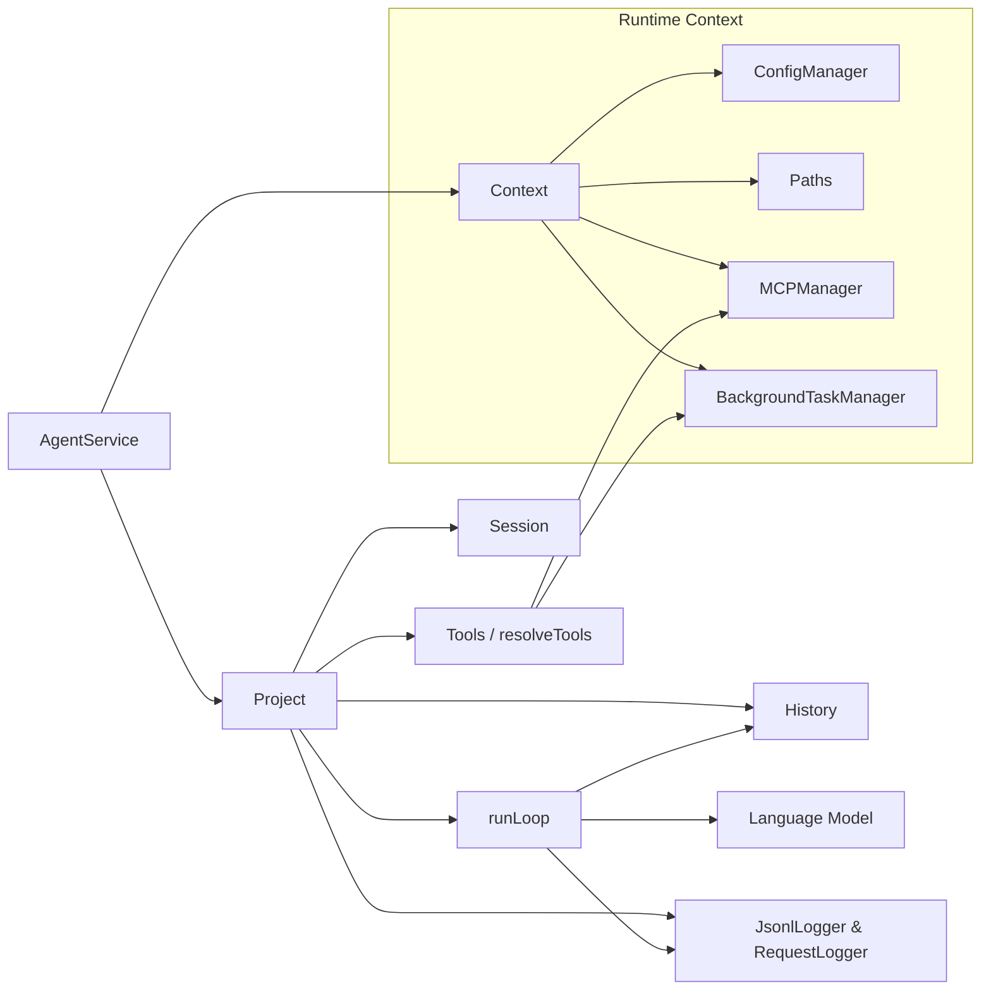

# AgentService 全生命周期技术白皮书

> 适用范围：`/src/agentService.ts` 及其协作模块（`Context`、`Project`、`runLoop`、工具体系、日志系统、MCP、背景任务管理等）。本文以 **NEOVATE CLI Agent** 为例，以中文全面说明 Agent 的组成、调用链、流程与架构。

---

## 1. 顶层概览

- **入口**：`createAgentService(opts)` (`src/agentService.ts:24-44`)
- **核心职责**：封装 Context、Project、Session，使调用方只需持有 `send()` / `plan()` 与 `destroy()` 即可驱动完整 Agent 生命周期。
- **模式**：
  - `send` —— 执行模式，可读可写，允许调用工具并修改仓库。
  - `plan` —— 规划模式，读写受限，所有工具调用自动批准，但仅限读操作。

---

## 2. 核心组件一览

| 组件                            | 职责                                                       | 关键文件/行                                    |
| ------------------------------- | ---------------------------------------------------------- | ---------------------------------------------- |
| `AgentService`                  | 将 Context 与 Project 封装成简洁 API。                     | `src/agentService.ts:6-44`                     |
| `Context`                       | 汇聚运行态依赖：配置、路径、MCP、背景任务等。              | `src/context.ts:26-80`                         |
| `Project`                       | 绑定 `Session`，对外暴露 `send/plan`，内部统一执行流程。   | `src/project.ts:14-304`                        |
| `resolveTools` / `Tools`        | 初始化工具集合并负责实际调用。                             | `src/tool.ts:24-200`                           |
| `runLoop`                       | 驱动 LLM 流式对话、工具调用、历史记录、压缩、重试。        | `src/loop.ts:1-476`                            |
| `Session` / `History`           | 维护消息、用量、压缩、会话恢复。                           | `src/session.ts:1-118`, `src/history.ts:1-210` |
| `JsonlLogger` / `RequestLogger` | 持久化消息、流式请求数据，支撑回放与审计。                 | `src/jsonl.ts:1-74`                            |
| `BackgroundTaskManager`         | 管理 Bash 后台任务，供 Bash/BashOutput/KillBash 工具使用。 | `src/backgroundTaskManager.ts:1-110`           |
| `MCPManager`                    | 连接 MCP 服务器并注入其工具。                              | `src/mcp.ts:1-205`                             |
| Prompt 模块                     | 系统提示词、规划提示词、压缩提示词、Fetch 提示词。         | `src/prompts/*.ts`                             |

---

## 3. 生命周期分解

### 阶段 A：服务初始化

1. **创建 Context** (`Context.create`):
   - 构建 `Paths`（定位 `~/.<product>/projects/...` 等路径）。
   - `ConfigManager` 读取全局 / 项目 / CLI 覆写配置，合并得到最终 `Config`。
   - 初始化 `MCPManager`（惰性连接 MCP 服务器）。
   - 建立 `BackgroundTaskManager`。
2. **绑定 Project**：
   - 若传入 `sessionId` 则 `Session.resume`，否则 `Session.create`。
   - `Session` 内部封装 `History`（可被 runLoop 更新）。

> ✅ 完成后，`AgentService` 返回：`{ sessionId, context, send, plan, destroy }`。

### 阶段 B：任务环境解析 (`resolveTaskEnvironment`)

1. 判断 `kind`：
   - `plan`：只加载读/查询类工具，使用 `generatePlanSystemPrompt`，默认 `autoApproveTools=true`，模型为 `planModel`。
   - `send`：开启写入、todo、后台任务工具，使用运行系统提示词，模型为 `config.model`。
2. `resolveTools` 细节：
   - 只读工具：`read`/`ls`/`glob`/`grep`/`fetch`。
   - 写入工具（send 模式）：`write`、`edit`、`bash`（含后台任务支持）。
   - 背景辅助：`bash_output`、`kill_bash`。
   - 待办工具（send 模式且配置允许）。
   - MCP 工具：`mcp__<server>__<tool>` 前缀。

### 阶段 C：执行准备 (`runWithResolvedEnvironment`)

1. **日志器**：`JsonlLogger`（会话日志）、`RequestLogger`（按请求记录 chunks/metadata）。
2. **模型解析**：`resolveModelWithContext` -> `createOpenAI` -> `LanguageModelV2`（`opts.model`）。
3. **上下文注入**：`LlmsContext.create` 采集：
   - `git status`（经 `getLlmGitStatus` 转为摘要）。
   - 目录结构（借助 `ls` 工具）。
   - 规则文档（`AGENTS.md`、`CLAUDE.md`、`${PRODUCT}.md`）。
   - `README.md` 内容。
4. **用户消息入队**：
   - 组装 `NormalizedMessage`（文本 + 附件），写入 `History` & JSONL。
   - 支持 `parentUuid`，便于线程式上下文。

### 阶段 D：LLM 回路 (`runLoop`)

1. **Prompt 组装**：系统提示词 + LLMS Context + `History`（可包含 tool 结果）。
2. **@ 文件扩展**：`At.normalizeLanguageV2Prompt` 扫描用户输入的 `@path` 并内联文件/目录内容（限制行数/大小）。
3. **流式交互**：
   - `m.doStream` 返回 `text-delta` / `reasoning-delta` / `tool-call` / `finish` / `error` 等 chunk。
   - `onChunk`、`onTextDelta`、`onReasoning`、`onStreamResult` 等回调实时触发。
   - `Usage` 累加 Token，用于压缩与统计。
4. **自动压缩**：若 `autoCompact=true` 且 Token 趋近阈值，`History.compress` 调用 `compact()`（`src/prompts/compact.ts` 提供系统提示词）生成摘要并替换历史。
5. **工具调用链**：
   - LLM 发出 `tool-call` chunk -> `handleToolApproval` 决策 -> 通过 `Tools.invoke` 执行。
   - 若拒绝：立即写入 `tool` 消息并以 `tool_denied` 错误结束。
   - 若批准：执行结果写入 `History`，下一轮对话可读取。
   - Send 模式下 write/command 工具默认需人工批准（受 `approvalMode` + `SessionConfig` 影响）；Plan 模式自动批准。
6. **重试与退出**：
   - `DEFAULT_MAX_TURNS=50`，`errorRetryTurns=10`（指数退避）。
   - 接收取消信号（`AbortController`）可随时中断并返回 `canceled`。

### 阶段 E：收尾

1. runLoop 成功：`Session.updateHistory()` 持久化最新历史，返回 `{ success: true, data: { text, history, usage }, metadata }`。
2. runLoop 失败：返回 `{ success: false, error: { type, message, details } }`；日志已经记录上下文，便于排查。
3. `AgentService.destroy()`：转调 `Context.destroy()`，目前负责清理 MCP 连接（未来可以挂载更多资源销毁逻辑）。

---

## 4. 关键调用链 (Call Chains)

### 4.1 `send()` 全链路

```
createAgentService
  └─ Context.create
  └─ Project (Session.create / Session.resume)
      └─ send(message, callbacks)
          └─ executeProjectTask(kind='send')
              └─ resolveTaskEnvironment(write+todo工具, systemPrompt)
              └─ runWithResolvedEnvironment
                  ├─ JsonlLogger + RequestLogger
                  ├─ resolveModelWithContext
                  ├─ LlmsContext.create
                  ├─ History.append(user)
                  └─ runLoop (多轮对话 + 工具调用)
                      └─ handleToolApproval -> Tools.invoke -> History.append(tool)
                      └─ Session.updateHistory
```

### 4.2 `plan()` 调用链差异

- 仅差异项：
  - `resolveTaskEnvironment` 中 `write=false`, `todo=false`, `autoApproveTools=true`, 使用 `planModel` + `generatePlanSystemPrompt`。
  - 其余流程与 `send()` 一致，仍会写入 JSONL 日志，但不会对仓库产生副作用。

### 4.3 工具调用链细节

```
LLM 输出 tool-call chunk
  └─ runLoop 捕获 -> 构建 ToolUse
      └─ handleToolApproval
          ├─ Plan 模式? 是 -> auto approve
          ├─ approvalMode === 'yolo'? 是 -> auto approve
          ├─ tool.approval.category === 'read'? 是 -> auto approve
          ├─ tool.approval.needsApproval? -> 执行自定义逻辑
          ├─ sessionConfig.approvalMode === 'autoEdit' 且为写操作? -> auto approve
          └─ 以上无 -> 触发 `callbacks.onToolApprove`
      └─ Approved -> Tools.invoke -> 写入 tool 消息
      └─ Rejected -> 写入错误消息并返回 `tool_denied`
```

### 4.4 自动压缩调用链

```
runLoop 每轮
  └─ if config.autoCompact
      └─ history.compress(model)
          ├─ 依据 Usage 与模型 token 限制判定
          ├─ 触发 compact()
              └─ query({ userPrompt: COMPACT_USER_PROMPT, systemPrompt: COMPACT_SYSTEM_PROMPT })
          └─ 用摘要替换历史
```

---

## 5. 流程与序列图

### 5.1 Agent 初始化流程图

```mermaid
flowchart TD
    A[调用 createAgentService] --> B[Context.create]
    B --> B1[Paths / ConfigManager]
    B --> B2[MCPManager]
    B --> B3[BackgroundTaskManager]
    B --> C[构造 Context 实例]
    C --> D[Project(session + context)]
    D --> E{sessionId?}
    E -->|是| E1[Session.resume]
    E -->|否| E2[Session.create]
    E1 --> F[返回 AgentService API]
    E2 --> F
```

### 5.2 send/plan 执行流程图


### 5.3 工具调用序列图


### 5.4 全局架构图



---

## 6. 观测、状态与安全策略

1. **日志与回放**：
   - `JsonlLogger`：每条消息（含 tool 结果）都写入 `~/.<product>/projects/<repo>/<session>.jsonl`，便于 `Session.resume` 与 CLI 回放。
   - `RequestLogger`：将一次流式请求的元数据、chunk、错误写入 `requests/<requestId>.jsonl`，支持问题定位。
2. **背景任务**：
   - `createBashTool` 可将长命令放到后台（`run_in_background`），生成 `task_id`；`bash_output` / `kill_bash` 依赖 `BackgroundTaskManager` 查询输出或终止命令。
3. **MCP 扩展**：
   - `MCPManager` 惰性连接，在 `resolveTools` 调用 `getAllTools()` 时才真正发起；失败时仅记录 warning，不影响本地工具。
4. **批准策略**：
   - `approvalMode`：`default`（需人工批准写操作）、`autoEdit`（自动批准写）、`yolo`（全部自动通过）。
   - `SessionConfig`：可为当前 session 记住 `approvalMode` 及白名单工具。
   - 回调 `onToolApprove`：允许宿主 UI/CLI 自行处理交互批准。
5. **思维链 / Reasoning**：
   - `runLoop` 支持 `thinking` 配置，通过 `getThinkingConfig` 为具备 reasoning 的模型注入 `anthropic.thinking` 等 provider options。
6. **错误恢复**：
   - 流程中任何 `Error` 都会附带 `retriesAttempted`、`statusCode`、`usage` 等细节，便于观测。
   - 工具拒绝 (`tool_denied`) 会携带具体 `toolUse` 信息，方便追踪是谁拒绝了什么。

---

## 7. 配置、持久化与扩展

- **配置层级**：CLI 参数 > 项目 `.<product>/config.local.json` > 项目 `config.json` > 全局 `~/.<product>/config.json` > 默认值（`src/config.ts:100-133`）。新增配置项需加入 `VALID_CONFIG_KEYS`。
- **持久化路径**：
  - Session 日志：`~/.<product>/projects/<pathified_repo>/<sessionId>.jsonl`
  - Request 日志：`~/.<product>/projects/<pathified_repo>/requests/<requestId>.jsonl`
  - Todo：`~/.<product>/todos/<sessionId>.json`
- **扩展点**：
  1. **新增工具**：在 `resolveTools` 注册，指定 `approval.category` 与 `needsApproval` 逻辑。
  2. **自定义 Prompt**：在 `src/prompts` 中新增模块，并在 `Project` 装配时引用。
  3. **额外上下文**：扩展 `LlmsContext.create`，例如注入更多仓库元数据。
  4. **自定义模型**：扩充 `BUILTIN_MODELS`，或通过配置 `model/planModel` 指向任意 OpenAI 兼容模型。

---

## 8. 测试与验证

- `src/agentService.test.ts:17-79`：端到端集成测试，搭建临时仓库 + HOME 目录，调用 `send` 与 `plan`，并确保所有回调被触发。可将其作为新增功能的回归依据。
- 推荐在引入新工具 / 扩展 runLoop 行为时补充 Vitest / 集成测试，并记录需要的 CLI 手动验证步骤。

---

## 9. 结论

## 通过以上拆解，可以清晰看到 AgentService 从初始化、配置合并、上下文注入、流式对话直到日志落地的全过程。无论是要扩展工具、调整 Prompt、还是引入新的审批策略，只需在相应组件（`resolveTools`、`prompts`、`handleToolApproval` 等）内扩展即可，整体架构具备良好的可插拔性与可观测性。欢迎在此文档基础上继续沉淀更细的用例或最佳实践。

## 10. 前端项目生成函数（新增能力）

为满足“服务端接口调用、不可直接执行 Bash/写入”的场景，新增 `runFrontendProjectWorkflow(opts)`（`src/frontendProjectService.ts:1-118`）。它基于 AgentService 架构，但做了以下专用化处理：

### 10.1 输入 / 输出

| 字段                      | 说明                                                                                                                                 |
| ------------------------- | ------------------------------------------------------------------------------------------------------------------------------------ |
| `requirementDoc`          | 原始需求文档，作为唯一用户输入。                                                                                                     |
| `specFiles: SpecRegistry` | 规范名称与文件路径的映射（如 `directory`、`state`、`page`、`service` 等），函数会在运行时校验路径并提供给 `read_spec` 工具。         |
| `configOverrides`         | 可选配置覆写，与 `createAgentService` 一致。                                                                                         |
| 输出                      | `success` 标记、`FileDraftStore.drafts`（文件/目录草稿数组）、`loopResult`（成功时）或错误信息。调用方可遍历 `drafts` 真正写入文件。 |

### 10.2 固定执行流程

系统提示词（`src/prompts/frontendProject.ts`）强制以下阶段顺序：

1. **需求洞察** – 解构需求、记录约束、必要时提出澄清点。
2. **任务拆解** – 使用 `todoWrite/todoRead` 建立任务清单，覆盖需求分析、目录/状态/页面/服务端设计、测试校验等环节。
3. **规范必读** – 每当需要决策目录架构、状态管理、页面架构、服务端协作等内容时，必须先调用 `read_spec` 读取对应规范，并在回复中说明遵循的规范名称、要点。
4. **执行循环** – 按 TODO 推进，每完成一个阶段更新任务状态，如需更多信息继续读取规范。
5. **产出文件草稿** – 使用 `propose_file` 记录所有目录/文件。禁止直接写真实文件；草稿包含 `path`、`kind`、`description`、`content`、`tags`。
6. **质量校验** – 会话末尾自查覆盖面，若有缺漏更新 TODO 或继续追加草稿。

### 10.3 限定工具集

| 工具                                      | 说明                                                                                          |
| ----------------------------------------- | --------------------------------------------------------------------------------------------- |
| `todoWrite` / `todoRead`                  | 需求拆解与进度管理，文件路径为 `~/.<product>/todos/<sessionId>-frontend.json`。               |
| `read_spec` (`src/tools/specReader.ts`)   | 读取调用方注册的规范。若规范缺失或文件不存在，会返回错误提示，提醒调用方补充。                |
| `propose_file` (`src/tools/fileDraft.ts`) | 仅登记计划生成的目录/文件，支持重复覆盖。LLM 无法直接修改仓库，所有产出由调用方审查后再落地。 |

> ⚠️ 该函数不会加载 `bash`、`read`、`write`、`edit` 等高权限工具，确保服务端接口调用安全。

### 10.4 执行流程图

```mermaid
flowchart TD
    A[runFrontendProjectWorkflow] --> B[Context.create + Session.create]
    B --> C[装配工具: todo/spec/fileDraft]
    C --> D[生成前端专用 System Prompt]
    D --> E[runLoop(禁用高危工具)]
    E --> F{LLM 输出}
    F -->|todoWrite/Read| G[更新任务]
    F -->|read_spec| H[加载规范]
    F -->|propose_file| I[记录文件草稿]
    F -->|完成| J[返回 drafts + loopResult]
```

### 10.5 使用建议

- 调用方在发起函数前准备好规范映射（如 `specFiles: { directory: 'docs/specs/directory.md', ... }`），确保 Agent 能查阅。
- 会话结束后遍历 `files`，按照 `kind`/`path` 将目录与文件真实创建；若内容需要再加工，可基于 `description` 或 `tags` 做进一步处理。
- 若需求变化，可重新调用该函数（新的 Session），或在外层将补充需求合并进新的 `requirementDoc`。

借助该函数，服务端可以安全地把“需求 → 前端项目骨架”流程封装成接口，既继承 AgentService 的对话/上下文优势，又避免高风险文件操作。
